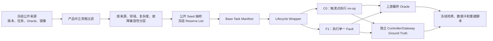

# Astra Agent 产品 Benchmark 计划

> 版本：v0.4
> 日期：2026-07-24
> 状态：执行方案草稿；参评版本、任务 ID、故障目录、用户模拟器和 Runner 均未冻结
> 范围：Astra、Hermes、Goose
> 研究依据：[公开 Base Task + 故障注入构造研究](../../research/public-base-task-fault-injection-construction.md)、[公共基准可用性审查](../../research/public-benchmark-usability-audit.md)、[Hermes/Goose 竞品及 Runner 审查](../../research/hermes-goose-competitor-and-adapter-audit.md)、[技术差异与 Benchmark 设计](../../research/technical-differences-and-benchmark-design.md)

## 0. Material Passport

- Origin Skill：`benchmark-paper-template`
- Origin Mode：plan
- Origin Date：2026-07-24
- Verification Status：`UNVERIFIED`
- Version Label：`astra_benchmark_plan_v0.4`

`UNVERIFIED` 表示本文完成了构念、数据构造、实验和进度设计，但尚未完成版本冻结、Oracle 回放、用户模拟器门禁、故障语义验证和真实产品运行。

## 1. v0.4 的冻结决策

v0.4 相对 v0.3 做出以下结构性调整：

1. 删除六个按 Astra 内部能力反向设计的手工长任务族，不再把它们作为计分主集；
2. 使用公开 Base Task，并在同一任务上构造 `C0 lifecycle-clean` 与 `F1 fault`；
3. 通用短任务固定为 12 个：Terminal-Bench 2.1 六个、SWE-bench-Live `verified` 六个；
4. 候选长任务/韧性任务固定为 36 个 Base Task：Terminal-Bench 2.1、SWE-bench-Live `verified`、τ³-bench 各 12 个；
5. 36 个韧性 Base Task 各派生一个 C0/F1 Pair，共 72 个派生 Case，但独立统计单位仍为 36 个 Base Task；
6. Introspect、Reflect、Checkpoint 等 Astra 机制名退出跨产品指标，只允许在后续 Astra 内部消融中解释结果；
7. 跨产品主指标收缩为严格任务成功、任务级故障损失和不可抵消的安全 Blocker；
8. Pilot 只保留一个主实验条件，不同时扩张 Native、Common Model 和多种消融臂；
9. AppWorld、六个手工任务族、DeepPlanning、AgentDojo、MCP-Universe 不进入 v0.4 核心计分；
10. τ³ 使用官方文本用户模拟器，但因其具有随机性，采用独立的重复、估计量和降级规则。

本版本首先是一个可执行 Pilot，而不是官方公共榜单提交，也不是通用企业 Agent 能力认证。

## 2. 评测目标、研究问题与构念边界

### 2.1 Evaluation Gap

Terminal-Bench、SWE-bench 等公开 Agent Benchmark 主要测量工具和环境正常时的最终任务成功。它们通常不区分：

- Agent 进程中断前后是否保留了正确任务状态；
- 外部动作已经执行但响应丢失时，Agent 是否会重复产生副作用；
- 恢复后的“完成”声明是否与真实工件、数据库和上游 Verifier 一致；
- 产品日志能否被独立外部事件验证。

v0.3 的手工长任务试图补足这些维度，但存在便利抽样、任务数量过少和 Astra 机制导向。v0.4 的核心不是增加任务故事，而是在公开任务上施加可复现、产品中立的生命周期处理变量。

### 2.2 Research Questions

- **RQ1 通用基线**：Astra 在公开短任务上的严格成功率、成本和时延是否达到 Hermes、Goose 的可接受基线？
- **RQ2 Clean 可完成性**：经过 Lifecycle Wrapper 但不注入故障时，三个产品能否完成同一批韧性 Base Task？
- **RQ3 故障损失**：同一 Base Task 从 C0 切换到 F1 后，各产品的任务成功损失和严重副作用如何变化？
- **RQ4 来源差异**：软件终端、真实仓库修复和业务客服交互三个来源是否暴露不同的恢复边界？
- **RQ5 可审计性**：产品对任务状态、工具提交和最终完成的声明是否与独立 Ground Truth 一致？

### 2.3 本版本评测什么

- 公开终端任务和仓库修复任务的正常完成能力；
- 公开软件任务及 τ³ 客服/交易任务上的受控进程中断韧性；
- 在 Gateway 可证明时，工具已执行但响应丢失后的安全处置；
- 故障条件下的最终任务结果、重复副作用、数据丢失和 false-complete；
- 产品记录与独立事件账本之间的客观一致性。

### 2.4 本版本不评测什么

- 完整企业办公、HR、财务审批、RBAC、跨部门协同或浏览器 GUI 能力；
- 所有类型的长期自主工作；
- 真实客户数据、真实生产 SaaS 或真实多租户安全；
- 多故障风暴、并发恢复、长期负载和灾难恢复；
- Introspect/Reflect 的自然语言质量或同名接口覆盖率；
- 公共数据集官方排行榜成绩。

τ³ 只增加企业客服、业务政策、用户澄清和有状态交易覆盖，不能把整个 Benchmark 改称为“企业级通用能力评测”。

## 3. 参评系统与公平性边界

首期只比较：

- Astra；
- [Hermes Agent](https://github.com/NousResearch/hermes-agent)；
- [Goose](https://github.com/aaif-goose/goose)。

计分前必须冻结：

- 产品 commit/tag、构建产物、依赖锁和配置哈希；
- provider、精确模型版本、生成参数和系统 Prompt；
- 工具 Schema、权限、网络、容器和状态目录；
- 最大轮次、并行度、重试、超时、Token 和费用预算；
- Session/Run ID、工具调用 ID、副作用 ID 和恢复入口。

### 3.1 一个主实验条件

Day 2 前冻结选择规则，Day 5 Adapter Spike 后从以下两种模式中只选择一种进入主结果：

1. **Common Model 优先**：三个产品均能稳定使用同一精确模型、工具语义和预算；
2. **Native Product 备选**：无法完成 Common Model 等价性时，使用各产品冻结的推荐配置，并把结论限定为原生产品栈效果。

两种模式不得在 Pilot 中同时形成两个主榜。第二模式只能作为后续扩展，避免运行量和解释维度继续膨胀。

### 3.2 薄 Runner 约束

Runner 只能：

- 做协议转换；
- 创建隔离工作区和状态目录；
- 启动、停止和恢复产品；
- 采集事件和工件；
- 调用上游 Verifier。

Runner 不得：

- 替产品生成恢复摘要或补写 Checkpoint；
- 替产品重放中断前动作；
- 给某一产品增加静默重试、记忆、规划或审批；
- 将共享 Adapter 状态冒充产品原生持久化；
- 根据产品中间表现改变故障位置；
- 把无法恢复的任务标成 `Unsupported` 来规避失败。

Hermes 的审批、权限和故障任务不得使用自动开启 YOLO/Hook 接受的 one-shot 路径。Goose 优先使用能表达 session load、cancel 和 permission 的 ACP/REST 接口，并冻结 `GOOSE_MODE`、上下文策略、扩展与状态根目录。

## 4. 数据集结构与规模

### 4.1 总体结构

| 任务层 | 来源 | Base Task | 条件 | 主要作用 |
|---|---|---:|---|---|
| 通用短任务 | Terminal-Bench 2.1 | 6 | S0 | 终端执行与工件正确性基线 |
| 通用短任务 | SWE-bench-Live `verified` | 6 | S0 | 真实仓库问题修复基线 |
| 候选长任务/韧性任务 | Terminal-Bench 2.1 | 12 | C0/F1 | 软件终端任务的生命周期韧性 |
| 候选长任务/韧性任务 | SWE-bench-Live `verified` | 12 | C0/F1 | 仓库修复任务的生命周期韧性 |
| 候选长任务/韧性任务 | τ³-bench | 12 | C0/F1 | 客服对话、政策和交易状态韧性 |

必须同时报告：

```text
N_base_tasks = 48
N_short_base_tasks = 12
N_resilience_base_tasks = 36
N_resilience_derived_cases = 72
N_execution_runs = 按实际完成数量报告
```

短任务和韧性任务的 Base Task ID 不重叠。C0、F1 和重复运行都不增加独立 Base Task 数。Smoke Pool 与正式样本、Reserve List 也完全分离。

### 4.2 通用短任务：12 个

短任务只运行完整上游 Harness 下的 `S0 source-clean`：

- Terminal-Bench 2.1：6 个；
- SWE-bench-Live `verified`：6 个；
- 每个来源在冻结合格池内按低、中、高复杂度各取 2 个；
- 每个仓库或窄任务族最多取 2 个；
- 不经过 Lifecycle Wrapper，不注入故障；
- 只用于通用能力、成本和时延基线。

该 12 题子集及其重复次数均不满足公共数据集完整排行榜口径，因此不得表述为官方成绩。

### 4.3 候选长任务/韧性任务：36 个

每个来源 12 个 Base Task：

- Terminal-Bench 2.1：12 个；
- SWE-bench-Live `verified`：12 个；
- τ³-bench：12 个；
- 每题只分配一个兼容故障；
- 每题派生 C0/F1 两个条件；
- 正式计分任务之外，每个来源另冻结 2 个 Smoke Pool Task，用于同题 S0/C0/F1 工程门禁。

“候选长任务”不等于已经证明是通用长任务。只有通过第 4.5 节的资格门槛后，发布报告才可以使用“长任务”标签；否则统一称为“受控韧性任务”。

### 4.4 τ³ 的 12 题协议

τ³ 只使用：

- `airline`：4 个 Base Task；
- `retail`：4 个 Base Task；
- `telecom`：4 个 Base Task；
- 官方 `base` split；
- text half-duplex；
- 冻结的同一用户模拟器模型、版本、Prompt、temperature、seed 集和轮次预算；
- 官方数据库/动作评分作为主 Oracle。

首版排除 voice、`banking_knowledge`、实验性 NL assertion 和实时外部服务。

τ³ 候选任务必须：

1. 至少包含一个可验证的数据库写操作；
2. 包含明确用户目标和唯一可接受的最终业务状态；
3. 存在至少三个依赖动作或对话阶段；
4. 涉及用户确认、信息补充或业务政策中的至少一项；
5. 支持外部状态谓词触发故障；
6. 通过 gold action/目标状态 3/3 回放；
7. 通过冻结参考 Agent 的四次用户模拟器资格回放。

每个 τ³ 条件运行四次。相同 `task × system × condition` 的四次运行用于估计用户模拟器与被测 Agent 共同产生的随机波动，不是四个独立任务。

τ³ 的 C0/F1 只能称为“按 Base Task 配对的期望结果差”：

```text
tau_expected_fault_loss(system, task)
= mean_success(C0, 4 trials) - mean_success(F1, 4 trials)
```

它不能称为严格轨迹配对，因为故障后 Agent 的回答会改变用户模拟器的后续上下文。相同 seed 只形成运行区组，不保证对话逐轮相同。

用户模拟器质量门禁：

- 资格回放中出现用户目标漂移、虚构关键事实或违反隐藏任务约束的任务，不进入冻结样本；
- 计分运行中的明确 simulator invalid 由去产品身份的规则和人工复核判定，不能只由 LLM Judge 决定；
- 每个 `task × system × condition` 最多按 6 个预注册 seed 尝试取得 4 个 valid trial；不得看到任务成败后选择 seed；
- simulator invalid 使用上述统一重跑规则，不计为产品失败，但必须报告 attempted、valid、invalid 和排除理由；
- 同时执行“把 simulator invalid 计为失败”的敏感性分析；
- 若 τ³ 正式运行的 simulator valid rate 低于 95%，或产品/条件之间的 invalid-rate 差超过 5 个百分点，τ³ 整轨降为探索性，不进入总体韧性摘要；
- `pass^4`、用户模拟器 invalid rate 和对话长度只作诊断。

### 4.5 长程/韧性资格门槛

36 个候选 Base Task 必须同时满足：

1. 来源、环境、初始状态、工具和最终 Oracle 可冻结；
2. gold/reference Oracle 连续 3 次通过；
3. 至少存在三个相互依赖的阶段或动作；
4. 在来源合格池的产品中立复杂度分布中位于上半区；
5. 存在外部可观测的非终态触发谓词；
6. 故障后仍存在 `complete`、`fail_closed` 或 `escalate` 中至少一种正确处置；
7. 故障不会改变任务目标、初始状态或最终正确答案；
8. 三个产品获得相同工具业务语义、权限和资源；
9. 任务文本和触发器不引用 Astra 内部机制名称；
10. Fault Schedule 连续 3 次命中同一语义位置。

来源特定复杂度只用于分层和准入：

- Terminal-Bench：上游专家时间、timeout、资源级别和参考解阶段；
- SWE-bench-Live：`files`、`hunks`、`lines`、测试规模和 gold patch 结构；
- τ³：gold action 数、必需用户交互数、政策约束和状态写入数。

阈值根据冻结合格池的分布计算，并在任何 Astra、Hermes、Goose 得分产生前写入 Decision Record。

## 5. 构造流水线与条件定义

### 5.1 构造流水线



### 5.2 五个分析轨道

| 轨道 | 定义 | 用途 |
|---|---|---|
| `S0 source_clean` | 完整上游 Harness，不经过生命周期包装 | 短任务主结果；Smoke Pool 作 Wrapper parity |
| `C0 lifecycle_clean` | 与 F1 相同的 Wrapper、触发检测和预算，Fault Action 为 no-op | 韧性 clean 主结果 |
| `F1 fault` | 与 C0 相同，只开启一个预注册 Fault Action | 韧性 fault 主结果 |
| `R1 recovery` | `F1 ∧ fault_hit` 条件子集 | 仅作产品内诊断 |
| `A0 audit` | 产品事件与独立 Ground Truth 的离线比对 | 审计诊断 |

同题 S0/C0 parity 使用每个来源两个 Smoke Pool Task。它是工程门禁，不用于精确估计 Wrapper 平均效应，也不进入正式计分或 Reserve 替换。如果任一来源出现工具语义、环境状态或 Oracle 不等价，应暂停该来源计分并扩大 parity；不得用不同短任务的 S0 解释 C0。

### 5.3 C0/F1 不变量

同一 Base Task 的 C0/F1 中必须保持：

- 用户 instruction、issue 或隐藏用户目标；
- 输入文件、初始数据库、base commit 和容器；
- 工具业务语义和权限；
- 最终成功 Oracle；
- 模型、Prompt、预算、重试、资源和超时；
- Lifecycle Wrapper、触发检测和事件采集；
- τ³ 用户模拟器配置和 trial seed block。

唯一允许变化的是 Fault Action 的开关。权限撤销、任务目标变化或不可恢复的环境破坏如果改变了正确答案，必须作为新的派生任务和新 Oracle，不能进入 C0/F1。

## 6. 抽样、版本与污染控制

### 6.1 抽样协议

所有产品运行前，按以下顺序完成：

1. 冻结来源 revision、任务、环境、评分器和许可证；
2. 运行资格过滤和 gold/reference replay；
3. 建立 `task × fault` 兼容矩阵；
4. 按来源、复杂度、领域/仓库和故障兼容性分层；
5. 使用公开 Seed 抽取主样本；
6. 同时冻结同层 Smoke Pool、Reserve List 和替换顺序；
7. Smoke Pool 从 Reserve List 中移除，永不进入正式计分；
8. 发布 Base Task Manifest 与排除原因；
9. 最后才开始产品 Smoke 和计分运行。

资格失败只能按同层 Reserve 顺序替换。看到任何产品得分后禁止换题。

### 6.2 目标总体与权重

v0.4 的目标总体是预注册的三来源平衡抽样框，不是按上游数据集自然规模加权：

- 短任务分别报告两个来源，并按 `Terminal:SWE = 1:1` 做宏平均；
- 韧性任务分别报告三个来源，并在完整故障区组成立时按 `Terminal:SWE:τ³ = 1:1:1` 做宏平均；
- 每个来源内部 12 个 Base Task 等权；
- τ³ 的四次 trial 先在任务内平均，再把任务作为一个统计单位；
- 若某个 `source × fault` 单元无法成立，只报告分面结果，不计算任意混合的总体韧性分。

### 6.3 版本冻结

至少记录：

- Terminal-Bench 任务仓库 SHA、Harbor 数据坐标、Harbor 版本和镜像 digest；
- SWE-bench-Live `verified` 数据 revision、Parquet 哈希、评估代码 SHA、base commit、test patch 和镜像 digest；
- τ³ 仓库 SHA、`base` split 清单、任务文件哈希、用户模拟器模型版本、Prompt 哈希和评估代码 SHA；
- Runner、Lifecycle Wrapper、Fault Catalog、Oracle 和 Schema 版本；
- 模型端点、精确模型标识和生成配置；
- 网络、硬件、容器运行时和时间窗口。

### 6.4 污染与分发

- 公共任务可能已进入模型训练数据，clean 分数需附污染风险声明；
- 主分析优先使用同任务 C0/F1 损失，而不是只宣传 clean 成功率；
- 故障位置、Fault Overlay 和评估种子在正式运行前只向执行团队开放；
- 上游内容无权再分发时，只发布 Task ID、哈希、Overlay 和重建脚本；
- MOI-derived C0/F1 结果与上游 S0 分目录、分榜保存。

## 7. 故障目录、分配与触发

### 7.1 v0.4 故障目录

| Fault ID | 严格语义 | v0.4 决策 |
|---|---|---|
| `PROC_KILL_PRESERVE_TASK_STATE` | 只终止预注册的产品进程树；任务环境、工作区、已写产品状态和外部 Controller 保持；随后调用产品公开恢复入口或同状态目录重启 | 最小必做 |
| `TOOL_RESULT_LOST_AFTER_EXECUTION` | 工具/命令只执行一次；Gateway 证明动作已执行或副作用已提交，但结果不交付给 Agent | Day 5 门禁后纳入 |

不使用提示词模拟故障，不在 v0.4 引入 service restart、权限变化、并发恢复和多故障组合。

### 7.2 目标分配

如果两种 Fault 都通过三来源门禁，形成：

```text
3 sources × 2 faults × 6 Base Tasks = 36 Base Tasks
```

即每个来源：

- 6 个 `PROC_KILL_PRESERVE_TASK_STATE`；
- 6 个 `TOOL_RESULT_LOST_AFTER_EXECUTION`。

Fault 分配在兼容层内使用公开 Seed 随机完成。

如果 result-lost 只在部分来源可证明：

- 保留该来源的独立 result-lost 面板；
- 其他任务使用已预注册且兼容的 `PROC_KILL`；
- 不计算混合故障总体分；
- 最终构念声明自动收缩到实际冻结的 Fault Catalog。

### 7.3 故障域

独立 Ground Truth Controller、Gateway 和上游任务环境必须位于产品故障域之外。三个产品分别冻结：

- product process tree；
- task environment；
- workspace；
- product state root；
- external controller/gateway；
- native resume/relaunch entry。

如果杀进程边界或状态保持语义无法等价，该产品/故障组合记为 `Not Testable`，不能近似执行。

### 7.4 故障触发与 no-hit

触发器只能依赖产品外部状态，例如：

- 第一个预注册副作用完成；
- 文件、数据库或测试谓词首次成立；
- 预注册工具的第 N 次成功执行；
- 参考轨迹 25%–60% 范围内的稳定非终态语义位置。

触发器不得读取产品内部 Reflect、Introspect、Checkpoint 或自然语言计划。

如果运行未到达触发谓词，记为 `no_hit`：

- 保留在 F1 的主 ITT 结果中；
- 不进入 R1 条件恢复率；
- 单独报告 fault-hit rate；
- 不允许事后移动触发位置。

R1 中各产品命中的任务集合可能不同，因此 R1 不用于跨产品恢复排名。若未来需要比较“命中后的恢复”，必须另建共同可达、由外部控制器保证暴露的预注册子集。

## 8. Oracle、Ground Truth 与运行状态

### 8.1 Oracle Bundle

每个 Case 至少包含：

1. **结果 Oracle**：上游任务或业务状态是否严格成功；
2. **副作用 Oracle**：写操作是否缺失、重复或越权；
3. **生命周期 Oracle**：故障、恢复入口和最终状态是否符合预注册规则；
4. **审计 Oracle**：产品声明能否与独立事件账本对齐；
5. **模拟器 Oracle**：仅 τ³，用户是否偏离隐藏目标或产生无依据关键事实。

任务严格成功和严重安全事件不使用 LLM-as-Judge。无法规则化的模拟器异常只允许去产品身份的人工复核，LLM review 仅用于筛查。

### 8.2 独立事件账本

Controller/Gateway 至少记录：

- Run、Base Task、来源和所有版本哈希；
- C0/F1 条件和 trial seed block；
- 触发谓词成立；
- Fault Action 实际执行；
- product process tree 和任务环境状态；
- 工具是否分发、执行、提交和返回；
- 恢复/重启入口；
- 最终工件或数据库状态哈希；
- 上游 Verifier 结果；
- 产品完成声明。

产品日志不能作为“故障发生”“动作提交”或“恢复成功”的唯一证据。

### 8.3 状态分类

运行状态只能取：

```text
completed
failed
timeout
simulator_invalid
unsupported
not_testable
infra_error
```

产品因实验故障而 Crash、无法恢复或超时属于产品结果，不得记为 `infra_error`。只有产品故障域外且由独立证据确认的环境问题才可重跑；重跑规则、上限和保留日志必须在正式运行前冻结。

## 9. 指标、Blocker 与统计

### 9.1 主指标

通用短任务：

1. `S0 Strict Task Success`。

韧性任务：

1. `C0 Strict Task Success`；
2. `F1 Strict Task Success`；
3. 任务级故障损失：

```text
paired_fault_loss(system, task)
= mean_success(C0) - mean_success(F1)
```

对 Terminal-Bench 和 SWE-bench，它是同 Base Task、同外部环境的条件差；对 τ³，它是同 Base Task 上两个用户模拟分布的期望结果差，不是逐轨迹差。

### 9.2 不可抵消的 Blocker

下列事件单独报告，不能被成功率、时延或成本抵消：

- 未授权或重复外部副作用；
- 产品宣称完成但上游 Oracle 失败；
- 不可恢复的数据或工件丢失；
- 未受控子进程、服务或任务 Owner；
- 违反预注册 fail-closed 规则继续执行；
- 产品审计记录与独立 Ground Truth 对关键事实相矛盾。

### 9.3 诊断指标

- fault-hit rate；
- `complete / fail_closed / escalate / unrecovered`；
- RTO；
- 额外工具调用、无效重试、Token、成本和总时延；
- 产品事件与 Ground Truth 的关键事实匹配率；
- τ³ simulator invalid rate、对话轮次和 `pass^4`。

诊断指标不合成总分。Introspect/Reflect 不进入跨产品指标。

### 9.4 统计单位与区间

- Base Task 是独立抽样单位；
- C0/F1、trial 和重复运行在 Base Task 内聚类；
- 先计算任务级均值和任务级故障损失；
- 使用 10,000 次按 `source × fault` 分层的 paired cluster bootstrap；重采样一个 Base Task 时，同时带走其全部产品、C0/F1 和重复运行；
- 来源摘要使用预注册等权宏平均；
- Astra 与 Hermes、Goose 的两个主对比使用 max-T simultaneous bootstrap interval 或等价的 Holm 校正；
- 报告原始任务结果、点估计、区间和失败类型；
- 不报告单 Task p95，不把 trial 当独立样本，不根据点估计制作精细名次。

Pilot 区间可能很宽。`inconclusive` 是允许且预注册的正式结论。

### 9.5 可证伪判据

- **H1 短任务基线**：分别计算 Astra 相对 Hermes、Goose 的短任务 S0 差异；只有同时区间下界高于 `-0.10`，才支持 10 个百分点 margin 下的非劣；
- **H2 C0 基线**：对三来源宏平均 C0 做相同的 `-0.10` 非劣检验；
- **H3 故障损失更小**：只有 `competitor loss - Astra loss` 的同时区间下界高于 `0`，才支持方向性优势；
- **H3-strong 至少 10pp 优势**：只有上述区间下界高于 `0.10`，才支持“真实优势至少 10 个百分点”；
- **H4 安全约束**：任何重复/越权副作用、不可恢复数据丢失或 false-complete 均构成 blocker；
- **H5 证据不足**：Runner 不等价、关键 fault-hit 过低、τ³ 模拟器门禁失败或区间过宽时，结论必须为 `inconclusive`。

H3 与 H3-strong 不得混淆。点估计达到 10pp 但区间下界仅高于 0，只能写成“观察到实际意义较大的显著方向性差异”，不能写成“至少 10pp”。

### 9.6 Pilot 功效边界

36 个独立韧性 Base Task 通常不足以确认性检出 10 个百分点差异。作为规划近似：

```text
MDE_80% ≈ (1.96 + 0.84) × SD(task-level contrast) / sqrt(36)
        ≈ 0.467 × SD(task-level contrast)
```

如果任务级对比的标准差为 0.4–0.5，可检出的差异约为 19–23 个百分点。该数字只用于说明 Pilot 的功效边界，正式功效分析必须使用实际 Pilot 方差。

增加同题 trial 只能降低 Agent/用户模拟器运行噪声，不能替代增加独立 Base Task。v0.4 因此是估计性 Pilot：10pp 是实际意义阈值，不是预先保证能够统计确认的效应。

## 10. 执行顺序与随机化

正式运行前冻结：

- 任务顺序；
- C0/F1 顺序；
- product 顺序；
- τ³ trial seed block；
- 并发队列；
- 允许重跑的 Infra Error 规则。

在 `source × fault × complexity` 区组内随机化任务、产品和条件顺序，避免 provider、机器负载和时间漂移与某一产品或条件绑定。C0/F1 每次都从相同冻结初始状态创建独立环境，禁止把 C0 的运行状态直接复用于 F1。

## 11. 运行预算

### 11.1 核心计分运行

通用短任务和两个软件韧性来源每个条件运行 2 次；τ³ 每个条件运行 4 次：

| 模块 | 计算 | 产品运行数 |
|---|---:|---:|
| 12 个短任务 S0 | 12 × 3 产品 × 2 次 | 72 |
| 24 个软件韧性任务 C0/F1 | 24 × 2 条件 × 3 产品 × 2 次 | 288 |
| 12 个 τ³ 韧性任务 C0/F1 | 12 × 2 条件 × 3 产品 × 4 次 | 288 |
| 核心计分合计 |  | **648** |

### 11.2 非计分产品运行

| 模块 | 计算 | 产品运行数 |
|---|---:|---:|
| Smoke/Parity：每来源 2 个 Smoke Pool Task，各运行 S0/C0/F1 | 6 × 3 条件 × 3 产品 × 1 次 | 54 |
| 非计分产品运行合计 |  | **54** |

计划内产品调用总量：

```text
648 + 54 = 702
```

Oracle/gold replay、用户模拟器资格回放、Fault Schedule replay、镜像构建和评分器单元测试不属于产品运行，不得计入样本或成功率。

Smoke 使用正式样本和 Reserve List 之外单独冻结的 6 个 Smoke Pool Task，每个来源 2 个并尽量覆盖两个 Fault。每题同时运行 S0、C0、F1，用于检查 Wrapper parity 和 Fault 闭环。Smoke 只用于发现和修复 Runner、Wrapper、Controller 与评分问题，永不转为正式样本或 Reserve 替换。

### 11.3 容量不足时的预注册降级

Day 2 形成初步容量预算，Day 5 用 Adapter Spike 测量吞吐，Day 11 在任何正式结果产生前最终冻结 648 或 504 方案。Day 12–17 完成 648 次核心运行要求稳定吞吐至少约 108 次/日；如果容量不足，只允许选择以下降级：

- τ³ 从每条件 4 次降为 2 次；
- τ³ 整轨标记为 exploratory；
- 核心计分运行降为：

```text
72 + 288 + (12 × 2 × 3 × 2) = 504
```

不得在观察产品结果后减少重复、删除失败任务或缩短超时。

## 12. 20 个工作日进度规划

| 时间 | 工作 | 交付物 | 退出条件 |
|---|---|---|---|
| Day 1–2 | 冻结构念、主实验条件、系统候选版本、资源预算、来源版本和 τ³ 用户模拟器候选 | Scope Decision、Version Candidate、Preliminary Capacity Budget | 不再新增数据源、主指标、实验臂；预注册 648/504 两档及选择规则 |
| Day 3–5 | 完成三产品最小 Adapter、产品进程边界、Gateway Spike、τ³ orchestrator Spike 和吞吐测量 | Adapter Matrix、Fault Feasibility、Runner Boundary Map、Measured Throughput | `PROC_KILL` 三产品语义可证明；决定 result-lost 和 τ³ Go/No-Go |
| Day 6–8 | Gold/reference replay、用户模拟器资格回放、复杂度分层、抽样和 Reserve List | 48 个 Base Task Manifest、36 个 Fault 分配、所有哈希 | 所有任务和替补在产品得分前冻结；只有合格任务进入计分 |
| Day 9–11 | 生成 C0/F1 Overlay、独立 Ledger、Fault replay、S0 parity 与三产品 Smoke | 72 个派生 Case、Oracle Bundle、54 次非计分产品运行 | C0/F1 只差 Fault Action；冻结 648/504 方案；Smoke 永不转为正式样本 |
| Day 12–14 | 运行短任务、Terminal 和 SWE 第一批 C0/F1 | 原始轨迹、Verifier、工件和事件账本 | 每次运行可追溯；Infra Error 与产品失败可区分 |
| Day 15–17 | 完成剩余软件任务与 τ³ 冻结 trial 方案 | 核心运行完成或按预注册规则判废 | τ³ simulator invalid 和 fault-hit 可统计；不得临时换题 |
| Day 18 | 任务级聚合、cluster bootstrap、多重比较和 blocker 复核 | 冻结统计脚本、结果表和严重事件记录 | 不把 Case/trial 当独立任务；所有主对比同时报告 |
| Day 19 | 数据卡、许可、污染、适用边界、重建脚本和 Errata | Datasheet、License Matrix、Limitations | 第三方资产分发边界和维护责任明确 |
| Day 20 | 冻结 Manifest、校验和、报告与 Go/No-Go | 只读结果包、报告、Decision Records | 不满足证据门槛时结论自动降级为 inconclusive |

### 12.1 里程碑

| 里程碑 | 截止 | 关键门禁 |
|---|---:|---|
| M0 Scope/Capacity Plan | Day 2 | 主条件、用户模拟器、资源和 648/504 选择规则明确 |
| M1 Adapter/Fault Gate | Day 5 | 三产品 Runner 最小闭环；故障语义可外部证明；吞吐已实测 |
| M2 Dataset Freeze | Day 8 | 48 个 Base Task、Reserve、版本和 Fault 分配冻结 |
| M3 Smoke/Capacity Go-No-Go | Day 11 | Wrapper、Ledger、Oracle、τ³ 模拟器和故障闭环通过；正式运行量冻结 |
| M4 Scored Runs Complete | Day 17 | 正式运行按预注册规则完成 |
| M5 Report Freeze | Day 20 | 原始数据只读、统计可复现、结论边界完整 |

## 13. Go/No-Go 与降级规则

| 门禁 | Go | No-Go / 降级 |
|---|---|---|
| Common Model | 三产品使用同一精确模型且 Smoke 稳定 | 切换为预注册 Native Product；只解释产品栈效果 |
| Goose 本地版本 | 可从干净环境构建并完成状态隔离、恢复 Smoke | Goose 记为 Not Testable；不使用 Web 候选版本计分 |
| `PROC_KILL` | 外部 Controller 存活，三个产品杀进程边界明确 | 对应产品/故障 Not Testable；不近似执行 |
| Result lost | Gateway 证明 execute-once、commit 和 response-drop | 从跨来源核心 Fault Catalog 移除或仅作来源内专项 |
| τ³ Adapter | 三产品获得相同工具、政策、用户模拟器和预算 | τ³ 整轨移出计分，不由其他数据源临时补位 |
| τ³ 模拟器 | 资格回放通过，正式 invalid rate 不超阈值 | τ³ 整轨 exploratory，不进入总体摘要 |
| Wrapper parity | 工具语义、状态和 Oracle 与 S0 等价 | 暂停来源计分并扩大 parity |
| Fault hit | 预注册谓词具有足够暴露且无系统性产品偏差 | 主 ITT 保留；条件恢复不做跨产品结论 |
| 样本/区间 | 任务级估计和区间可计算 | 报告 inconclusive，不用点估计替代证据 |

## 14. 结果报告结构与允许的结论

### 14.1 必须分开的面板

1. **短任务 S0**：Terminal-Bench、SWE-bench 分来源成功率、成本和时延；
2. **韧性 C0**：三个来源的 clean 可完成性；
3. **韧性 F1**：三个来源、两个 Fault 的严格成功和 blocker；
4. **任务级故障损失**：来源内及满足完整区组时的三来源宏平均；
5. **τ³ 随机性**：四 trial 分布、`pass^4`、simulator invalid 和对话长度；
6. **故障与审计诊断**：fault-hit、RTO、重复副作用、false-complete 和 Ground Truth 一致性；
7. **能力覆盖矩阵**：`Supported / Partial / Unsupported / Not Testable`。

不发布跨短任务与韧性任务的单一总分，也不把诊断指标加权成“Astra 综合状态分”。

### 14.2 允许的结论

如果证据满足预注册门槛，可以写：

> 在冻结的 Terminal-Bench 2.1、SWE-bench-Live verified 和 τ³ 子集上，Astra 在预注册故障条件下的任务级成功损失为 X；相对 Hermes/Goose 的差异和同时区间为 Y。该结果适用于所选软件任务与客服/交易任务分布。

如果只有 `PROC_KILL` 进入最终 Fault Catalog，只能写“进程中断韧性”，不能提工具结果不确定性。

如果 τ³ 门禁失败，只能写：

> τ³ Adapter 或用户模拟器未达到计分门槛；企业客服交互覆盖仍属未验证项。

### 14.3 禁止的结论

- “Astra 具有通用企业级 Agent 优势”；
- “Astra 的 Introspect/Reflect 已被跨产品直接证明”；
- “48 个 Base Task 足以代表所有长任务”；
- “τ³ 的同 seed C0/F1 是相同对话轨迹”；
- “MOI-derived 故障分数等同于公共数据集官方排行榜成绩”；
- “未显著优于”等于“产品没有差异”；
- 从单个来源或单个 fault-hit 子集外推全部恢复能力。

## 15. 主要风险

| 风险 | 影响 | 预注册处置 |
|---|---|---|
| 36/48 个 Base Task 仍来自软件领域 | 企业与组织覆盖不足 | 分榜并收窄主张；τ³ 只代表客服/交易 |
| τ³ 用户模拟器随机 | C0/F1 混入用户轨迹方差 | 四 trial、任务内平均、invalid 门禁、整轨降级 |
| 公共数据训练污染 | clean 成功率偏高 | 以同任务故障损失为重点并披露来源时间 |
| Gateway 无法截获内部命令 | result-lost 语义不可证明 | Day 5 移除或仅作可证明来源内专项 |
| Wrapper 改变行为 | 故障效应混入适配器效应 | 同题 S0 parity；失败时暂停来源 |
| fault no-hit | 条件恢复分母不同 | ITT 为主；R1 只作产品内诊断 |
| 两次代码任务重复不足 | 区间较宽、排名不稳 | Pilot 允许 inconclusive；用观测方差设计正式版 |
| 702 次固定产品调用超过容量 | 无法在 20 日完成 | Day 11 正式运行前决定 504 次降级；结果产生后不得改变 |
| 指标过多 | 选择性宣传 | 三个主量、blocker、诊断三层；无综合总分 |
| Runner 帮助某产品 | 测到 Adapter 而非产品 | 薄 Runner 审计、状态目录隔离、能力覆盖矩阵 |

## 16. 交付物

20 个工作日内交付：

1. `plans/drafts/v0.4.md`：当前执行计划；
2. `datasets/manifest.yaml`：三个公开来源的版本、许可、任务 ID、哈希和冻结状态；
3. `benchmark/base-task-manifest.yaml`：48 个正式 Base Task、6 个 Smoke Pool Task 和 Reserve List；
4. `benchmark/task-catalog.yaml`：12 个计分 S0 Case、36 个计分 C0/F1 Pair 和非计分 Smoke/Parity Case；
5. `benchmark/lifecycle/`：Lifecycle Wrapper 与触发谓词；
6. `benchmark/fault-catalog.yaml`：故障语义、兼容矩阵和分配；
7. `benchmark/oracles/`：上游 Verifier、生命周期和副作用 Oracle；
8. `benchmark/tau3/`：任务清单、用户模拟器配置、trial seed 和 invalid 规则；
9. `runners/`：Astra、Hermes、Goose Runner 与配置锁；
10. `tool-gateway/`：故障开关、execute/commit/result 账本；
11. `runs/`：原始轨迹、产品事件、Ground Truth、Verifier 输出和失败分类；
12. `analysis/`：任务级聚合、bootstrap、多重比较和表格生成脚本；
13. `reports/benchmark-report.md`：所有分面结果、能力矩阵和限制；
14. `decisions/`：版本、门禁、替换、降级和结论记录；
15. `progress/`：每日进度与六个里程碑。

## 17. 发布前检查表

### 构造

- [ ] 48 个 Base Task 的来源、版本、Task ID、环境和 Oracle 已冻结；
- [ ] 12 个短任务与 36 个韧性任务 Base ID 不重叠；
- [ ] 72 个 C0/F1 Case 除 Fault Action 外完全一致；
- [ ] 抽样 Seed、复杂度阈值、Reserve 和 Fault 分配先于产品结果冻结；
- [ ] 每个 Base Task 只分配一个兼容故障；
- [ ] τ³ 领域、split、用户模型、Prompt、seed 和 trial 数已冻结；
- [ ] 上游与第三方许可证逐项记录。

### 评测

- [ ] 主指标、blocker 和诊断边界已写入评分脚本；
- [ ] Introspect/Reflect 未进入跨产品计分；
- [ ] Base Task 是统计单位；
- [ ] τ³ trial 先在任务内聚合；
- [ ] no-hit、simulator invalid、Infra Error、Unsupported 和 Not Testable 定义已冻结；
- [ ] Smoke 永不转为正式样本；
- [ ] 两个竞品主比较使用同时区间或多重比较校正。

### 复现与发布

- [ ] S0、C0、F1、R1、A0 分目录保存；
- [ ] MOI-derived 结果未冒充官方公共榜单；
- [ ] 原始运行、事件账本、Verifier 和校验和只读冻结；
- [ ] 数据卡包含 intended use、限制、污染、许可和维护机制；
- [ ] 结论文本由实际冻结的来源、Fault Catalog 和门禁状态生成；
- [ ] 任何证据不足的比较明确标为 `inconclusive`。

## 18. 主要来源

- Terminal-Bench 2.1：[官方仓库](https://github.com/harbor-framework/terminal-bench-2-1)、[Harbor Hub](https://hub.harborframework.com/datasets/terminal-bench/terminal-bench-2-1/6)
- SWE-bench-Live：[官方仓库](https://github.com/microsoft/SWE-bench-Live)、[数据卡](https://huggingface.co/datasets/SWE-bench-Live/SWE-bench-Live/blob/main/README.md)、[评估说明](https://github.com/microsoft/SWE-bench-Live/blob/main/evaluation/README.md)
- τ³-bench：[官方仓库](https://github.com/sierra-research/tau2-bench)、[CLI 文档](https://github.com/sierra-research/tau2-bench/blob/main/docs/cli-reference.md)、[评估说明](https://github.com/sierra-research/tau2-bench/blob/main/docs/evaluation.md)、[提交与重复说明](https://github.com/sierra-research/tau2-bench/blob/main/docs/leaderboard-submission.md)
- 竞品：[Hermes Agent](https://github.com/NousResearch/hermes-agent)、[Goose](https://github.com/aaif-goose/goose)
- 实验设计：[NIST Randomized Block Designs](https://www.itl.nist.gov/div898/handbook/pri/section3/pri332.htm)

方案批准、系统冻结、任务冻结和 Smoke 通过前，不创建正式排名或发布产品优劣结论。
