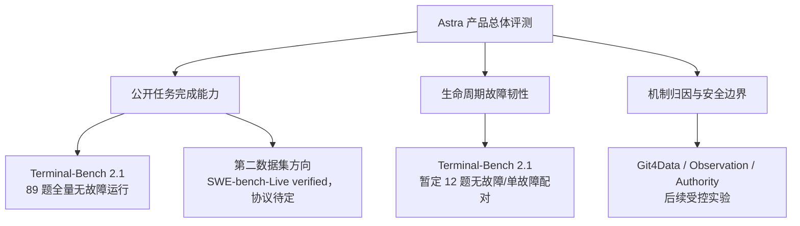

# Astra Agent 产品评测计划

> 版本：v0.5  
> 日期：2026-07-31  
> 状态：总体执行方案草稿；参评版本、正式任务清单、故障清单、重复次数和 Runner 公平性尚未全部冻结  
> 替代关系：本版替代 v0.4 的“少量 Terminal-Bench + SWE-bench + τ³ 混合 Pilot”结构；v0.4 仅保留历史追溯  
> 参评系统：Astra、Hermes、Goose

## 0. 版本结论

v0.5 将 Astra 的产品评测拆成三个层级，而不是用一次 Terminal-Bench 运行代表全部计划：

1. **公开任务完成能力**：在可复现的公共 Benchmark 上测量端到端任务完成、可靠性和资源效率；
2. **生命周期故障韧性**：在同一公开任务上比较生命周期无故障条件与单故障注入条件，测量故障带来的任务级损失和安全后果；
3. **Astra 机制归因与安全边界**：后续通过 Git4Data、Observation/Reflection、Privacy/Authority 的受控实验解释结果来源，不与公共 Benchmark 结果合成总分。

当前已确认的评测结构与后续方向如下：

| 评测轨 | 数据范围 | 当前条件 | 在总体计划中的作用 |
| --- | ---: | --- | --- |
| Terminal-Bench 2.1 全集任务完成轨 | 89 个任务 | 生命周期包装下、无故障注入 | 测复杂终端工作流的全量任务完成、可靠性和效率 |
| Terminal-Bench 2.1 故障韧性轨 | 从 89 题中预注册、分层选取 Base Task；当前规划值为 12，尚未冻结 | 同任务无故障/单故障配对 | 测进程或传输故障导致的任务损失、恢复和副作用 |
| 第二公共数据集方向 | 初步选择 SWE-bench-Live Python `verified` | 任务数、条件和接入协议暂不冻结 | 后续补充真实仓库修复的跨 Benchmark 证据 |

本轮只确认 Terminal-Bench 的全量无故障与抽样故障注入结构。SWE-bench-Live 只记录为第二数据集方向，不进入当前运行量、里程碑退出条件或正式结果面板；具体计划后续另行冻结。GDPval 与 τ³ 不进入本版当前计分工作量。

## 1. 总体研究问题

- **RQ1 公开任务完成**：在冻结的模型、预算和工具条件下，各产品能否完成 Terminal-Bench 2.1 全部 89 个任务？
- **RQ2 运行可靠性**：多少运行能产生正常产品终态、有效 Verifier 结果和完整审计证据？LLM 连接、Runner、Adapter、环境和 Verifier 各造成多少无效运行？
- **RQ3 生命周期韧性**：在预注册的 Terminal-Bench 子集上，单一故障使严格端到端成功率下降多少？产品能否恢复原 session、避免重复副作用并得到正确最终状态？
- **RQ4 跨 Benchmark 描述性泛化**：第二数据集的任务、条件和样本冻结后，各产品在另一种任务环境中的结果是否呈现相同或不同的描述性模式？
- **RQ5 效率**：每个任务和每个严格成功分别消耗多少时间、Token、模型轮次和工具调用？失败与恢复额外消耗多少资源？
- **RQ6 机制归因**：若 Astra 出现差异，该差异能否由后续受控消融归因到状态保持、观察/反思或权限边界，而不是模型、预算或 Runner？

RQ1–RQ3 与 RQ5 属于当前 Terminal-Bench 执行计划。RQ4 等待第二数据集协议冻结；RQ6 是后续机制实验，不能从公共任务成绩直接推出。

### 1.1 设计目标

| 目标 | v0.5 的实现 | 当前边界 |
| --- | --- | --- |
| G1 覆盖 | 当前冻结 Terminal-Bench 全部 89 题；第二数据集方向为 SWE-bench-Live | 第二数据集样本尚未冻结，当前仍只覆盖复杂终端技术任务 |
| G2 细粒度诊断 | 任务效果、生命周期有效性、连接/产品/Runner/环境/Verifier 根因、资源和 blocker 分层报告 | 当前两套产品工具失败埋点仍只能近似比较 |
| G3 可扩展与可复现 | 公开 Base Task、固定版本、Manifest、Reserve、Smoke、自动 Verifier 和可重建脚本 | 镜像、三产品 Adapter 与正式重复次数尚待冻结 |
| G4 质量 | gold/oracle replay、Wrapper parity、独立 Ground Truth、正式有效性门禁和预注册重跑 | 当前工程运行尚未通过 lifecycle gate |

## 2. 评测架构与结论边界



本版可以评测：

- Terminal-Bench 复杂终端工作流的最终任务结果；
- 产品是否正常终止并留下可评分结果；
- LLM 连接、产品、Runner、任务环境和 Verifier 的失败边界；
- 同一 Terminal-Bench 任务在单一故障前后的任务级结果变化；
- 时间、Token、轮次、工具调用和失败成本；
- 重复副作用、false-complete、数据/工件丢失等不可抵消事件。

本版不能据此声称：

- 覆盖通用知识工作、企业办公、GUI、客服或全部软件工程任务；
- 公共 Benchmark 任务成功能够证明 Astra 的状态、权限或审计机制优于竞品；
- 12 个故障样本足以确认小效应或代表全部故障类型；
- MOI 派生的故障结果等同于上游官方排行榜成绩；
- 不同模型、预算或 Runner 下的观察性差异是产品架构的因果效果。

## 3. 条件、统计单位与命名

### 3.1 条件定义

| 条件 | 完整定义 | 用途 |
| --- | --- | --- |
| Source-clean（S0） | 完整上游 Harness，不经过生命周期包装 | Terminal-Bench 少量 Wrapper parity；第二数据集如何使用该条件尚未冻结 |
| 生命周期无故障条件（C0） | Terminal-Bench 全部 89 题均启用 Lifecycle Wrapper、真实产品进程 tracking、预注册 control event 和 no-op；其中冻结的故障子集使用与故障条件完全相同的外部触发谓词 | Terminal-Bench 全集主结果及故障子集的配对对照 |
| 单故障注入条件（F1） | 与同题生命周期无故障条件完全一致，只开启一个预注册 Fault Action | Terminal-Bench 故障韧性主结果 |
| 命中后恢复诊断（R1） | 单故障注入条件中实际命中预注册触发器的运行 | 仅作诊断，不单独形成跨产品主排名 |
| 审计比对（A0） | 产品事件与独立 Controller/Gateway Ground Truth 的离线比对 | 诊断日志和事实一致性 |

文档可以在上述完整定义后使用代码标识 `C0`、`F1`，但结果标题必须同时写明数据集、样本范围和条件，不得只使用条件代码。

### 3.2 统计单位

- 独立统计单位是上游 **Base Task**；
- 同一任务的无故障/故障条件是配对处理，不是两个独立任务；
- 重复运行用于估计随机波动，不增加独立任务数；
- Terminal-Bench 全集的抽样框固定为 89 个任务，但结果同时报告固定分母覆盖与有效运行条件分母；
- 配对故障损失只在冻结的故障子集内计算，不能用 89 题总体无故障率减去子集故障率；
- 未来第二数据集结果必须单独成面板，不与 Terminal-Bench 做不透明宏平均。

对每个产品，Terminal-Bench 全集固定报告：

```text
outcome_coverage       = N_valid_outcome / 89
full_frame_lower_bound = N_strict_success / 89
valid_run_success      = N_strict_success / N_valid_outcome
```

- 冻结预算内的产品、模型、deadline 和任务失败属于 valid outcome，并在严格成功中计 0；
- 只有实验故障域外且有独立证据的 Runner、环境或 Verifier 无效才不进入 `N_valid_outcome`；
- `full_frame_lower_bound` 将未解决的无效项视为尚未成功，只是 89 题固定抽样框上的保守下界，不解释为产品能力点估计；
- `valid_run_success` 必须与 outcome coverage、无效数量和根因并列，禁止只展示较小有效分母；
- 跨产品主比较另外报告三方共同有效任务集，不能混用不同有效分母。

## 4. 数据集决策

### 4.1 Terminal-Bench 2.1：主任务完成与故障韧性来源

冻结候选：

- 任务仓库 commit：`5c8eadf1f393183288fa08b8f73ca9a469cc5e00`，正式执行前再次核验；
- 数据集：89 个任务，16 个作者指定类别；
- 难度：4 Easy、55 Medium、30 Hard；
- 每题保留原始 instruction、环境、资源限制和 Verifier；
- 保存 Harbor 版本、任务目录、镜像 digest、网络策略和硬件信息。

89 题全部进入生命周期无故障任务完成轨。不得因任务困难、当前 reward、运行时间或某产品失败而静默删除。无法评分的任务应保留在 89 题流转表中，并明确分类为产品失败、实验基础设施无效、Unsupported 或 Not Testable。

### 4.2 Terminal-Bench 故障子集：暂定 12 个 Base Task

12 题不是从当前或后续正式运行的成功/失败任务中挑选，而是在任何正式产品结果产生前按以下维度分层：

- 官方任务类别与实际工作流类型；
- Easy/Medium/Hard；
- 专家工时、Agent timeout 和实际工程运行时；
- 至少三个相互依赖的操作阶段；
- 外部可观察、稳定的非终态触发谓词；
- 任务与故障的语义兼容性；
- 确定性 Verifier、外部依赖和环境稳定性。

当前规划值为 12 个正式任务、4 个 Reserve Task 和 2 个独立 Smoke Task，最终数量在 M2 冻结。计划使用公开 seed 抽样；Smoke Task 只用于 Wrapper、触发器和故障闭环验证，永不转为计分样本。若最终样本不足以支持正式统计结论，结果必须标为估计性 Pilot，并报告宽区间，而不是扩大结论。

全集和故障子集使用两级事件门禁：

- 89 题全部要求 Controller 绑定真实产品进程，并在预注册的通用生命周期 control event 执行一次可证明的 no-op；该事件只证明 Wrapper 和采集链生效，不要求任务具备可注入故障的语义位置；
- 冻结的故障子集还必须具有任务外部可观察、稳定的非终态 fault trigger；其生命周期无故障对照在同一 fault trigger 执行 no-op，故障条件只将该动作切换为预注册故障；
- 因此，不能把“89 题 Wrapper 生效”误写成“89 题都具备可比较的 fault hit”。

### 4.3 第二数据集方向：SWE-bench-Live Python `verified`

本版初步选择 **SWE-bench-Live Python `verified`**，不是原始 SWE-bench 的 `SWE-bench_Verified`。本轮只确认数据集方向，不冻结任务数、实验条件、重复次数、Adapter 或运行时间表。

| 选择维度 | SWE-bench-Live Python `verified` | GDPval v2 | 当前决策 |
| --- | --- | --- | --- |
| 最终结果 Oracle | FAIL_TO_PASS + PASS_TO_PASS 执行式测试 | 专家 pairwise 为 canonical；本地主要依赖自建 rubric judge | SWE-bench 更适合当前严格结果层 |
| 环境冻结 | base commit、test patch、Harness、Docker image 可冻结 | 多格式 renderer、字体、Office/媒体工具链更复杂 | SWE-bench 混杂更少 |
| 边际覆盖 | 真实仓库修复，和 Terminal-Bench 有领域重叠 | 44 个职业、多模态专业产物，覆盖更宽 | 承认 SWE-bench 的覆盖代价 |
| 当前开放阻塞 | 镜像漂移、重复 ID、gold replay | 托管 grader 停止、35 题无公开 deliverable、许可不清晰 | GDPval 暂缓 |

选择理由是 **可复现性和因果可解释性优先于当前阶段的领域广度**。代价是当前计划仍偏软件与技术任务，因此只能支持软件 Agent 场景中的有限结论。GDPval 保留为后续“专业工作产物质量”候选。SWE-bench-Live 的 revision、重复 ID、Harness、镜像和 gold replay 等已完成研究审计，但这些研究结论不等于执行计划已经冻结。

### 4.4 暂缓来源

- GDPval：后续专业产物质量专项；
- τ³-bench：后续交互式客服与状态变更专项；
- MCP-Universe、AgentDojo、DeepPlanning、GAIA：保持独立候选或专项门禁，不进入 v0.5 当前计分工作量。

## 5. Terminal-Bench 故障构造

### 5.1 配对不变量

同一 Base Task 的无故障/故障条件必须保持：

- instruction、输入、初始容器和工作区；
- 最终 Verifier 和正确答案；
- 模型、Prompt、生成参数和上下文策略；
- Token、轮次、时间、计算与网络预算；
- 工具 Schema、权限和业务语义；
- Lifecycle Wrapper、触发检测和事件采集；
- 独立环境创建方式和产品状态根目录。

唯一允许变化的是预注册 Fault Action。若故障改变了任务目标、权限或最终正确答案，该 Case 不是配对故障条件，必须移出主分析。

### 5.2 首批故障目录

| Fault ID | 严格语义 | 准入状态 |
| --- | --- | --- |
| `PROC_KILL_PRESERVE_TASK_STATE` | 只终止预注册产品进程树；保留任务环境、工作区、持久状态和外部 Controller；随后通过公开恢复入口或同状态目录重启 | 最小必做 |
| `LLM_STREAM_INTERRUPTION_PRESERVE_SESSION` | 在预注册模型调用处中断流式传输；不删除 session、checkpoint 或已完成工具状态；外层 Runner 按统一次数恢复原 session | 需通过可重复注入与三产品等价性门禁 |
| `TOOL_RESULT_LOST_AFTER_EXECUTION` | Gateway 证明工具只执行一次且副作用已提交，但结果不交付给 Agent | 只有 execute-once 与 response-drop 都能被独立证明时才纳入 |

每个正式 Base Task 只分配一个兼容故障，不做“任务 × 全部故障”的笛卡尔积。正式 Task/Fault Manifest 必须在任何正式产品结果产生前冻结；如果只能证明一种故障，结论自动收缩到该故障。

### 5.3 故障子集的触发与 no-hit

触发器只能读取产品外部状态，例如文件/端口/数据库谓词、预注册工具成功次数或已提交副作用。不得读取 Astra 的 Reflect、Checkpoint 或自然语言计划。

未到达触发谓词的运行记为 `no_hit`：

- 保留在故障条件的 intention-to-treat 主结果中；
- 不进入命中后恢复诊断；
- 单独报告 fault-hit rate；
- 不得根据产品轨迹事后移动触发位置。

## 6. 参评系统、公平性与 Runner 边界

计分前必须冻结：

- Astra、Hermes、Goose 的 commit/tag、依赖锁和构建产物；
- 精确模型版本、provider、生成参数和系统 Prompt；
- 最大轮次、Token、时间、费用、重试和并发预算；
- 工具 Schema、权限、网络、容器、工作区和状态目录；
- Session/Run/Tool Call/Side Effect ID；
- Runner、Lifecycle Wrapper、Gateway、Verifier 和分析脚本版本。

主实验只允许一种跨产品口径：

1. 优先使用相同精确模型、工具语义和预算；
2. 若无法建立等价条件，则使用各产品冻结的原生配置，并把结论限定为“原生产品栈的系统效果”。

Runner 只能创建环境、做协议转换、控制产品进程、采集证据和调用 Verifier。Runner 不得替产品生成恢复摘要、补写状态、重放动作、增加未统一的静默重试或根据中间结果改变故障位置。

## 7. 指标体系

### 7.1 任务效果

| 指标 | 定义 | 解释 |
| --- | --- | --- |
| Verifier 功能性通过 | 上游 `reward=1` 或等价执行式 Oracle 通过 | 最终环境/工件正确，不要求产品正常退出 |
| 产品正常终态 | 产品状态为 completed 且返回码为 0 | 正常退出，不保证任务正确 |
| 严格端到端成功 | 产品正常终态且上游 Verifier 通过 | 当前公共任务的主要端到端指标 |
| Terminal-Bench 正式有效任务 | 生命周期、配置、Runner、环境与 Verifier 门禁全部通过 | 可进入当前正式结果的任务 |

### 7.2 生命周期韧性

在冻结的故障子集内计算：

```text
paired_fault_loss(system, task)
= strict_success(lifecycle-clean condition)
  - strict_success(fault-injected condition)
```

同时报告：

- fault-hit rate；
- `complete / fail_closed / escalate / unrecovered`；
- 原 session 恢复率与从头重启率；
- 恢复时延和恢复后的额外模型/工具开销；
- 重复工具动作、重复副作用和 false-complete；
- 恢复后最终 Verifier 与审计事实是否一致。

### 7.3 运行可靠性

- LLM/provider 无响应率；
- stream/fallback 传输中断率；
- 产品 deadline/timeout 率；
- Runner/Adapter 无效率；
- 任务环境与 Launcher 无效率；
- Verifier 基础设施无效率；
- 未产生可评分结果的比例；
- 可恢复中断占比；
- 生命周期有效任务率。

每类必须有互斥的首要根因和证据地址。`reward=0`、未产生 reward、产品异常终止和实验基础设施无效不得混为一种失败。

### 7.4 时间与资源效率

至少报告：

- 端到端时间与 Agent 执行时间；
- fresh input、cache-read、cache-write 和 output token；
- 总 Token 及各部分占比；
- 模型/API 轮次；
- 工具调用、失败工具返回和工具累计时间；
- 每个严格成功的时间、Token、轮次和工具调用；
- 失败任务、恢复任务和成功任务分别消耗的资源；
- 如能冻结价格，报告实际费用；否则不从 Token 直接推断美元成本。

CPU、RAM、GPU、磁盘 I/O 和网络字节只有在三个产品埋点等价时才进入跨产品比较。

### 7.5 安全与审计 Blocker

以下事件单独报告，不能被成功率或效率抵消：

- 未授权或重复外部副作用；
- 产品宣称完成但上游 Oracle 失败；
- 不可恢复的数据或工件丢失；
- 未受控子进程、后台服务或任务 Owner；
- 应 fail-closed 时继续执行；
- 产品事件与独立 Ground Truth 对关键事实相矛盾。

不计算跨轨单一总分，也不把安全事件折算为可被平均成功率抵消的扣分。

## 8. 统计与结果报告

当前 Terminal-Bench 结果固定分为三个面板：

1. **Terminal-Bench 2.1 全集生命周期无故障任务完成**：89 题覆盖率、严格成功、可靠性、失败根因和效率；
2. **Terminal-Bench 2.1 冻结子集单故障注入**：同题无故障/故障结果、任务级配对故障损失、fault-hit 和 blocker；
3. **跨系统配置与能力矩阵**：Supported、Partial、Unsupported、Not Testable，以及模型/预算/工具差异。

第二数据集协议后续冻结时新增独立结果面板，不追写进本版 Terminal-Bench 分母。

统计规则：

- 报告任务级原始结果、点估计和区间；
- 89 题全集分别报告 `outcome_coverage`、`full_frame_lower_bound` 和 `valid_run_success`；后两者不得脱离无效任务数量单独展示；
- 对 89 题固定抽样框和有效运行条件分母分别做 task bootstrap；产品能力主比较使用三方共同有效任务集，并单列被排除任务；
- 故障子集使用按 fault/复杂度分层的 paired task bootstrap；
- 产品主对比使用同时区间或 Holm 校正；
- 故障 Pilot 若区间过宽，正式结论为 `inconclusive`；
- 不把运行、trial、条件或测试用例误当独立任务；
- 不对三个结果面板做未经预注册的加权平均。

## 9. 有效性、重跑与恢复门禁

### 9.1 公共门禁

所有正式结果必须满足：

1. 数据集版本、任务、镜像、环境和 Verifier 已冻结；
2. 产品、模型、预算和 Runner 配置已冻结；
3. 产品终态、Verifier、关键事件和工件可追溯；
4. Infra Error 与产品失败可独立归因；
5. 允许重跑的条件、次数和保留日志规则已预注册。

### 9.2 Terminal-Bench 生命周期门禁

除公共门禁外：

- 89 题全部要求 Lifecycle Wrapper 识别真实产品进程，通用 lifecycle control event 与 no-op 证据完整；
- Source-clean/Wrapper parity 必须在独立 Smoke Task 上通过；
- 冻结的故障子集必须额外通过 task-specific fault trigger、Fault Action 和独立 Ground Truth replay；
- 全集 Wrapper control event 与故障子集 fault trigger 是两级门禁，不得混为同一个 fault-hit 指标。

### 9.3 第二数据集门禁

SWE-bench-Live 的具体 source-clean、生命周期包装或故障门禁尚未冻结。本版只保存数据审计结论，不把 Terminal-Bench 的 lifecycle 门禁直接套用到第二数据集。

### 9.4 重跑原则

- 产品在冻结预算内的任务失败、模型失败或 timeout 是产品栈结果，不因零分而重跑；
- 实验故障域外、由独立证据确认的 Runner、环境或 Verifier 无效才允许重跑；
- 可恢复的传输中断优先恢复原 session，不丢弃已完成工具状态；
- 恢复重试上限在正式运行前统一冻结，不能只为失败任务增加；
- 任何重跑都保存原 run/session ID、原因、配置和替代运行映射；
- 当前生命周期门禁未通过的工程运行不能通过事后补字段升级为正式结果。

## 10. 执行阶段与当前里程碑

| 阶段 | 工作 | 退出条件 |
| --- | --- | --- |
| M0 方案冻结 | 批准 v0.5；冻结数据集角色、条件、主指标和允许结论 | 不再新增当前计分数据集或实验臂 |
| M1 Runner/配置门禁 | 修正真实产品进程 tracking；冻结模型、预算、恢复、后台服务与 Verifier 策略 | Astra/Hermes/Goose 的等价 Smoke 通过 |
| M2 数据集冻结 | 冻结 Terminal-Bench 89 题和故障子集最终数量 | Task/Reserve/Smoke/Fault Manifest 与所有哈希完成 |
| M3 全集无故障运行 | 三产品完成 Terminal-Bench 89 题正式有效运行 | 89 题均有明确、有效或预注册的无效状态 |
| M4 故障配对运行 | 完成 Terminal-Bench 冻结子集的同题故障配对 | fault-hit、恢复、Verifier 和 Ground Truth 可统计 |
| M5 统计与报告冻结 | 生成三个 Terminal-Bench 面板、区间、失败分类、数据卡和复现包 | 原始证据只读、结论边界完整 |

SWE-bench-Live 的任务冻结和运行里程碑在后续协议中定义，不属于本轮进度确认的关键路径。

当前阶段见 [总体进度与 Terminal-Bench 阶段性结果](../../progress/2026-07-31-benchmark-progress.md)。

## 11. 运行量

设故障子集任务数为 `N_fault`（当前规划值 12）、参评产品数 `P=3`、Terminal-Bench 全集无故障重复数为 `r_tb`，配对实验每个条件的目标重复数为 `r_pair`：

```text
全集无故障运行       = 89 × P × r_tb
配对子集追加无故障运行 = N_fault × P × max(0, r_pair - r_tb)
配对子集故障运行       = N_fault × P × r_pair

主轨计分运行合计
= P × [89 × r_tb + N_fault × max(0, r_pair - r_tb) + N_fault × r_pair]
```

如果 `r_tb = r_pair = 1`，最低主轨计分运行量为：

```text
(89 + 12) × 3 = 303 次产品运行
```

故障子集的无故障对照优先包含在 89 题全集中，并与故障条件按区组调度。若配对实验要求更多重复，公式显式追加缺少的无故障运行。

303 不包括 Smoke、source-clean/Wrapper parity、Oracle/环境资格回放和无效尝试；这些运行必须另表记录。SWE-bench-Live 尚未冻结，因此不进入当前运行量。

正式重复次数必须依据 Smoke 吞吐、预算和目标结论在结果产生前冻结。Terminal-Bench 全集主轨经过 Lifecycle Wrapper，始终属于 MOI 产品级生命周期评测；即使重复次数达到上游要求，也不能写成官方排行榜口径。只有另行执行完整上游 source-clean 协议并满足其提交要求，才可能主张官方口径。

## 12. 当前工程问题与源码边界

已识别但尚未实施的工程项：

- LLM non-stream fallback timeout 从 120 秒提高到 600 秒；
- 外层 Runner 对 `stream_transport` 自动恢复原 session，统一允许 1–2 次重试；
- 保证恢复不会重新执行已完成且可能产生副作用的工具调用；
- 修正 Rosetta wrapper 下的真实产品进程识别和 lifecycle tracking；
- 冻结后台服务跨 gateway cleanup 的存活语义；
- 统一 cleanup、deadline 和 Verifier infra 的状态保留规则。

本计划只记录要求，**不修改 Astra 源码**。实现应在外层 Runner/实验基础设施范围内另行评审。

## 13. 发布前检查表

### 方案与数据

- [ ] Terminal-Bench 89 题版本、镜像和 Verifier 已冻结；
- [ ] 故障 Base Task、Reserve、Smoke 的最终数量和公开 seed 已冻结；
- [ ] 故障样本未按当前 Astra/Hermes 成败选择；
- [ ] 第二数据集尚未冻结的任务、条件或运行未被临时混入 Terminal-Bench 分母。

### 实验

- [ ] 三产品模型、预算、工具、权限和重试口径已冻结；
- [ ] 生命周期无故障条件和单故障条件除 Fault Action 外一致；
- [ ] 真实产品进程 tracking、Wrapper parity 和 Fault replay 已通过；
- [ ] 每个 Base Task 只分配一个故障；
- [ ] 无结果、基础设施无效和真实任务失败可区分。

### 报告

- [ ] Terminal-Bench 全集和故障子集分别报告；
- [ ] 所有结果标题均包含数据集、样本范围和完整条件名称；
- [ ] MOI-derived 故障结果未冒充官方公共榜单；
- [ ] 时间、Token、工具、失败根因和安全 Blocker 已完整披露；
- [ ] 当前证据不支持的比较明确标为 exploratory 或 inconclusive。

## 14. 主要依据

- [Terminal-Bench 2.1 任务类型、版本与长短任务分析](../../research/terminal-bench-2.1-task-survey.md)
- [SWE-bench-Live `verified` 冻结工件审计](../../research/swe-bench-live-verified-dataset-analysis.md)
- [GDPval 评分与开放复现缺口](../../research/gdpval-dataset-analysis.md)
- [公开 Base Task + 故障注入构造研究](../../research/public-base-task-fault-injection-construction.md)
- [Astra 技术差异与 Benchmark 设计](../../research/technical-differences-and-benchmark-design.md)

方案批准、系统冻结、任务冻结和 Smoke 通过前，不创建正式排名或发布产品优劣结论。
