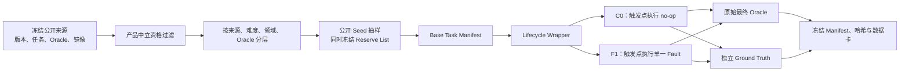

# Astra 公开基任务 + 故障注入数据集构造研究

> 日期：2026-07-24  
> 状态：研究结论；尚未冻结任务 ID、版本 SHA、容器 digest 与 Runner  
> 适用范围：Astra、Hermes、Goose  
> 用途：作为下一版执行计划的数据集构造输入；本文件不修改 v0.3

## 0. Material Passport

- Origin Skills: `deep-research`、`benchmark-paper-template`
- Research Questions:
  1. 哪些公开数据集能够保留原始 Oracle，并安全地派生故障条件？
  2. 如何把公开原始任务、MOI 适配和 MOI 故障派生清楚隔离，避免 Astra 特性导向？
  3. 如何在 20 个工作日内提高独立任务覆盖，而不是继续手工编写六个长任务族？
- Verification Status: `PARTIALLY VERIFIED`
- Version Label: `astra_public_base_fault_construction_research_0.1`

`PARTIALLY VERIFIED` 表示公开资料和构造方法已经核查，但尚未在本地完成数据下载、版本冻结、Oracle 回放和三个产品的 Runner 等价性验证。

## 1. 结论

v0.3 的六个手工长任务族不应继续作为计分主集。更稳妥的构造是：

```text
公开 Base Task + 原始 Oracle
  + 产品中立的 Lifecycle Wrapper
  + 单一、受控、可回放的 Fault Overlay
  + 独立 Ground Truth
```

首个 20 日 Pilot 建议分成两类任务：

| 任务类 | 数据来源 | 构造方式 | 作用 |
|---|---|---|---|
| 通用短任务 | Terminal-Bench 2.1、SWE-bench-Live | 保持上游任务和 Harness，不加故障 | 建立任务能力与开销基线 |
| 候选长任务/韧性任务 | Terminal-Bench 2.1、SWE-bench-Live 的另一组独立 Base Task | 同一 Base Task 生成 `C0 lifecycle-clean` 与 `F1 fault` 配对 | 测量受控故障造成的任务损失、恢复和安全后果 |

核心 Pilot 建议使用：

- 12 个短任务 Base Task：8 个 Terminal-Bench 2.1、4 个 SWE-bench-Live；
- 24 个候选韧性 Base Task：12 个 Terminal-Bench 2.1、12 个 SWE-bench-Live；
- 短任务与长任务的 Base Task ID 完全不重叠；
- 在其中预注册四个韧性 Base Task，额外运行同题 `S0 source-clean parity`，只用于检查 Lifecycle Wrapper 是否造成明显偏移；
- 每个长任务只分配一个预注册故障，不做“任务 × 全部故障”的笛卡尔积。

这个方案将韧性轨道的候选独立抽样单位从六个手工任务族提高到 24 个公开 Base Task，同时仍保留严格的 clean/fault 配对。它们只有通过预注册的长程资格标准后才能称为长任务。`C0` 和 `F1` 是同一 Base Task 的两个条件，不得被写成 48 个独立任务。

首版可主张的构念必须收窄为：

> 在所选公开软件 Agent 任务分布上，测量产品面对受控 Agent 进程中断时的任务保持、安全处置与恢复能力。只有 `TOOL_RESULT_LOST_AFTER_EXECUTION` 通过透明 Gateway 门禁并进入冻结 Fault Catalog 后，才增加“工具结果不确定性”结论。

首版不能据此声称：

- Astra 具有普遍的“长期自主能力”；
- 结果可推广到旅行规划、办公、客服、浏览器或所有 MCP 场景；
- Astra 的 Introspect/Reflect 已经被证明优于竞品；
- MOI 故障派生分数等同于公开数据集官方排行榜分数。

下一版计划可采用以下简版声明：

> Astra Pilot 不再自编计分任务目标。数据集从冻结的公开 Benchmark 中分层抽取两组互不重叠的 Base Task：短任务保留上游 Harness 与 Oracle；韧性任务在不改变原始目标、输入和最终 Oracle 的前提下，生成同一 Lifecycle Wrapper 下的 no-op clean 与单故障配对。所有故障样本均标记为 MOI-derived，并与官方 clean 结果分榜。统计外推单位是 Base Task，不是故障变体或重复运行。

## 2. 为什么当前构造需要推翻

### 2.1 六个任务族仍是便利抽样

v0.3 的 LT-01 至 LT-06 分别对应仓库维护、数据处理、多 Agent、MCP、审批和长期研究。这些任务覆盖面看似广，但它们不是从一个明确抽样框中产生的，而是按 Astra 已有能力反向构造。

这会产生三个问题：

1. 六个任务族才是独立设计单位，无故障/故障变体和重复运行都不能增加代表性；
2. 任务类别、生命周期边界和指标同时由同一团队设计，容易把 Astra 的产品结构写进被测构念；
3. 即使 Astra 获胜，也难以判断是产品更强，还是题目更贴合其状态模型。

构念有效性研究明确建议使用随机或分层抽样，并要求在复用公开数据时说明“保留了什么、改变了什么”。便利抽样和未声明的任务改造都会削弱外推边界。[Measuring what Matters](https://arxiv.org/html/2511.04703)

### 2.2 “Introspect/Reflect”不能是跨产品指标

Introspect 和 Reflect 是 Astra 的机制名称，不是产品中立的用户结果。Hermes 或 Goose 即使通过其他机制正确恢复，也不应因为没有同名对象而失分。

跨产品主评测只能观察：

- 最终任务是否通过原始业务 Oracle；
- 相比同任务 clean 条件，故障导致多少成功率损失；
- 是否出现重复、越权、错误宣称成功、数据丢失或悬挂状态；
- 故障后是否完成、fail-closed 或按预注册规则升级。

Introspect/Reflect 只适合放入 Astra 内部消融，且不能进入跨产品总分。

### 2.3 当前指标过多，缺少主次

如果同时报告几十个过程指标，又没有预注册的主指标和 blocker，任何产品都可能从其中挑选对自己有利的局部结果。

下一版应只保留两个主问题：

1. `C0` 中，产品能否完成任务？
2. `F1` 相对 `C0` 损失了多少，且是否造成不可接受的安全后果？

其余时延、Token、恢复动作、日志覆盖等均为解释性诊断，不合成总分。

## 3. Benchmark 五支柱完整性审查

依据 `benchmark-paper-template`，当前方案的完整性如下。

| 支柱 | 当前状态 | 结论 |
|---|---|---|
| Research Gap | 已明确 | 公开 Agent 基准主要测量工具正常时的任务成功；v0.3 的手工任务又存在产品导向和代表性不足 |
| Construction Pipeline | 本文给出可执行设计 | 公开 Base Task、版本冻结、分层抽样、Lifecycle Wrapper、clean/fault 配对、独立 Ground Truth |
| Evaluation Framework | 已形成主次 | 严格任务成功与配对故障损失为主；安全事件为 blocker；过程指标仅诊断 |
| Empirical Findings | 缺失 | 尚无真实运行，不得填写排名、优势或显著性结论 |
| Companion Method | 可选 | Astra Introspect/Reflect 消融可作为附录，但不是 Benchmark 的成立条件 |

最需要优先建设的是 Construction Pipeline，而不是继续增加指标或任务故事。

## 4. 方法学依据

公开任务上叠加受控故障不是 Astra 特有设计，已有直接先例：

- [AgentCheck](https://arxiv.org/html/2607.11098) 先记录 clean run 的真实工具响应，再在同一任务上只改变一个工具响应；确定性检查作为主判定，LLM 标签只用于诊断。该工作是 2026 年 7 月的近期预印本，应作为方法参考而非成熟标准。
- [ToolMaze](https://arxiv.org/abs/2606.05806) 将故障区分为显式/隐式与瞬时/持续，并把动态重规划与普通 happy-path 工具执行分开。
- [AgentHijack](https://agenthijack.github.io/) 在公开 OSWorld 任务上叠加九类可配置环境扰动，形成 3,321 个配置，说明“公开基任务 + 受控扰动”能够形成独立的鲁棒性 Benchmark；其场景是 GUI，不能直接照搬到 Astra。
- [NIST 随机区组设计](https://www.itl.nist.gov/div898/handbook/pri/section3/pri332.htm) 的核心原则是先控制可识别的干扰因素，再对剩余因素随机化。对本项目而言，Base Task 是配对区组，故障开关是区组内处理条件。

这些先例共同支持四条规则：

1. clean 与 fault 必须共享同一个 Base Task；
2. 一次只改变一个预注册故障；
3. 主判定应尽量使用确定性业务 Oracle；
4. 重复运行不是新的独立任务。

## 5. 公开数据集可用性重审

### 5.1 候选总表

| 数据集 | 已核实的关键条件 | 故障派生价值 | 适配风险 | 20 日决策 |
|---|---|---|---|---|
| Terminal-Bench 2.1 | 89 个容器任务；Harbor 任务包含 instruction、environment、tests 和可选 solution；Harbor 当前内置 Hermes 与 Goose Agent | 进程中断高；命令结果丢失中；服务重启按任务判断 | 需新增 Astra Adapter；部分任务依赖外部资源 | 核心 |
| SWE-bench-Live Python `verified` | `verified` 500 题且保持冻结；每题有 base commit、gold/test patch、实例镜像和执行式测试 | 进程中断高；命令结果丢失中；环境重启条件适用 | Docker 与测试仍可能随机器漂移，必须 gold replay | 核心 |
| DeepPlanning v1.1 Shopping | 120 个英文 Shopping 任务；每次运行创建隔离数据库副本，保存 messages、cart 和 ground truth | API 级结果丢失与工具异常高；长程规划高 | 官方 Runner 面向模型而非完整 Agent 产品，三产品等价适配未证明 | 扩展门禁 |
| DeepPlanning v1.1 Travel | 120 个中文与 120 个英文任务；隔离 Python sandbox | 进程中断中；长程约束高 | 输出转换/解析链可能引入额外模型混杂；中英文同源题不能当独立样本 | 暂不进核心 |
| τ³-bench | 有状态、多轮、业务政策和模拟数据库，适合写操作 outcome-unknown | 写后响应丢失与状态变化高 | LLM 用户模拟器增加方差；多方 orchestrator 适配成本高 | 第二阶段 |
| AgentDojo | 可回放的模拟工具环境与确定性状态检查 | 工具错误和安全扰动高 | 核心构念是提示注入安全，不是生命周期恢复 | 独立安全专项 |
| MCP-Universe | 覆盖多 MCP Server 和执行式 evaluator | MCP 故障概念价值高 | live service、账号、权限、配额和网络难冻结 | 只作方法参考 |

### 5.2 为什么核心选择 Terminal-Bench 2.1

[Terminal-Bench 2.1 的 Harbor Hub 坐标 `/6`](https://hub.harborframework.com/datasets/terminal-bench/terminal-bench-2-1/6) 当前列出 89 个任务。上游仓库说明 2.1 修改了 26 个任务，而[发布说明](https://www.tbench.ai/news/terminal-bench-2-1)曾写 28 个，进一步说明仅写“2.1”不足以复现，必须保存任务清单、仓库 SHA、Harbor 版本和镜像 digest。[官方仓库](https://github.com/harbor-framework/terminal-bench-2-1)

它适合首版的主要原因不是“最贴合 Astra”，而是：

- 最终状态由任务测试判定，原始 Oracle 可保留；
- 环境是容器，agent 进程与任务工作区可以分别控制；
- 任务通常需要真实终端操作和多步工件修改；
- [Harbor 当前列出的内置 Agent](https://github.com/harbor-framework/harbor/blob/main/AGENTS.md) 已包括 `goose` 与 `hermes`，因此只需要重点建设 Astra Adapter，显著降低三产品接入工作量。

限制也必须写清：

- 12 题子集不是官方 Terminal-Bench 排行榜；
- 官方提交要求每题至少五次，本方案的两次重复只用于 MOI Pilot；
- 软件/终端任务不能代表所有长期 Agent 工作；
- 有公网依赖、资源漂移或不稳定测试的任务必须排除。

### 5.3 为什么核心选择 SWE-bench-Live `verified`

[SWE-bench-Live 数据卡](https://huggingface.co/datasets/SWE-bench-Live/SWE-bench-Live/blob/main/README.md) 当前列出 `test=1000`、`lite=300`、`verified=500`、`full=1888`，并说明 `lite` 与 `verified` 保持冻结，持续更新进入 `full`。因此首版应只使用 Python `verified`，不能从持续更新的 `full` 临时抽题。

数据卡当前可见的候选 revision 是 [`a637bd4…`](https://huggingface.co/datasets/SWE-bench-Live/SWE-bench-Live/commit/a637bd46829f3132e12938c8a0ca93173a977b8e)。正式执行仍需在 Day 1–2 下载后核对 Parquet 文件哈希、评估代码 SHA 和镜像 digest，不能只记录网页上的 `main`。

它提供：

- 真实 issue 与代码库；
- `base_commit`、gold patch、test patch；
- FAIL_TO_PASS 与 PASS_TO_PASS；
- 实例级容器与执行式 Oracle；
- 数据卡中的 `files`、`hunks`、`lines` 难度字段，可用于产品中立的分层抽样。

官方评估说明同时警告 Docker 并非完全隔离，建议在本机对 gold patch 连续运行三次，并以实际通过的实例作为有效分母。因此 gold 3/3 是资格门槛，不是可选的额外检查。[官方评估说明](https://github.com/microsoft/SWE-bench-Live/blob/main/evaluation/README.md)

### 5.4 DeepPlanning 的位置

[DeepPlanning v1.1](https://qwenlm.github.io/Qwen-Agent/en/benchmarks/deepplanning/) 于 2026-03-03 更新，包含 Travel 120 个中文/120 个英文任务和 Shopping 120 个英文任务，两个领域都运行在隔离 Python sandbox 中。

Shopping 比 Travel 更适合未来的故障注入：

- [Shopping 官方流程](https://github.com/QwenLM/Qwen-Agent/blob/main/benchmark/deepplanning/shoppingplanning/README.md) 为每次运行创建隔离数据库副本；
- 每个 Case 保存 `messages.json`、`cart.json` 和 `validation_cases.json`；
- 最终购物车可与 ground truth 做规则化匹配；
- 工具 API 边界比 CLI 内部命令更容易注入 timeout、结果丢失和响应不确定。

但它暂不进入 20 日核心计分，原因是官方 Harness 面向“模型 + Qwen-Agent 工具循环”，不是 Astra/Hermes/Goose 三个完整产品。把三个产品接到相同 15 个 API、相同预算、相同输出和评分路径，需要新的等价 Adapter。没有通过等价性门禁之前，DeepPlanning 的任务优势不足以抵消适配器混杂。

建议在 Day 3–5 只做六题 Shopping Adapter Smoke：

- 通过：形成独立扩展模块，后续增加计分；
- 未通过：保留研究结论，不从核心任务中临时换题补位；
- Travel 暂不进入首版，以避免输出转换模型或 Parser 成为额外评分因素。

### 5.5 暂缓 τ³、AgentDojo 与 MCP-Universe

- [τ³-bench](https://github.com/sierra-research/tau2-bench) 的多轮用户模拟、业务政策和数据库写操作很适合 `commit-but-response-lost`，但 LLM 用户模拟器本身是随机 Agent，且三个产品需要接入多方 orchestrator。它适合第二阶段，不适合用来缩短当前工作量。
- [AgentDojo](https://github.com/ethz-spylab/agentdojo) 的主构念是提示注入攻防。它应单独报告 clean utility、attack utility 和 security，不能混入“长任务恢复”主榜。
- [MCP-Universe](https://github.com/SalesforceAIResearch/MCP-Universe) 的真实服务、账号、权限、配额和动态状态难以在 20 天内完全冻结。它可以提供 MCP evaluator 和工具接口设计参考，但不进入首版计分主集。

## 6. 目标数据模型

### 6.1 五条轨道

| 轨道 | 定义 | 是否进入主比较 |
|---|---|---|
| `S0 source_clean` | 完全使用上游任务、Harness、工具语义和 Oracle，不经过生命周期包装；覆盖全部短任务，并在预注册的四个韧性 Base Task 上做同题 parity replay | 通用短任务主结果；韧性同题子集只作 Wrapper 诊断 |
| `C0 lifecycle_clean` | 经过与故障条件完全相同的 Wrapper、触发检测和预算，但触发时执行 no-op | 韧性主结果 |
| `F1 fault` | 与 C0 相同，只在预注册触发点启用一个 Fault Action | 韧性主结果 |
| `R1 recovery` | `F1 ∧ fault_hit` 的条件分析子集，不是新的独立数据集 | 仅作产品内诊断，不做跨产品恢复排名 |
| `A0 audit` | 产品日志与独立 Controller/Gateway Ground Truth 的离线比对 | 诊断 |

必须同时保留 `C0` 和同题 `S0 parity`。如果只有 `S0` 与 `F1`，故障效果会混入 Wrapper、暂停和事件采集开销；如果只有 `C0` 与 `F1`，又无法发现 Wrapper 是否造成明显行为偏移。四题同题 parity 只是一项工程门禁，不能用于精确估计 Wrapper 平均效应；一旦出现系统性差异，应暂停计分并扩大同题 parity，而不是用不同短任务的 S0 结果解释。

只有完整上游 Harness 下的 `S0` 可以描述为“上游 clean reproduction”。即使如此，少量子集和较少重复也不能称为官方排行榜提交。

### 6.2 构造流水线



### 6.3 不变量与允许变化

同一个 Base Task 的 C0/F1 配对中，下列内容必须保持不变：

- 用户 instruction 或 issue 描述；
- 输入文件、初始数据库、base commit 和容器；
- 工具的业务语义和权限；
- 最终成功 Oracle；
- 模型、预算、重试上限、资源与超时；
- Lifecycle Wrapper、触发检测和事件采集。

唯一允许改变的是：

```yaml
fault:
  enabled: false  # C0
```

与：

```yaml
fault:
  enabled: true   # F1
```

如果故障改变了任务目标、初始状态、最终正确答案或可用权限，使原始任务不再可完成，那么它不是同一任务的 fault variant，而是一个新的派生任务，必须有新的 Oracle，且不能进入 C0/F1 因果配对。

## 7. 抽样协议

### 7.1 资格标准

任何产品运行前，先冻结如下准入条件：

1. 来源版本、任务内容、评分器和环境可以固定；
2. 有确定性或执行式最终 Oracle；
3. Oracle/reference solution 可以稳定通过；
4. 不依赖未控制的公网、实时账号或外部动态数据；
5. 存在产品外部可观测的非终态触发点；
6. 故障后仍存在 `complete`、`fail_closed` 或 `escalate` 中至少一种正确处置；
7. 三个产品获得相同平台、权限、工具语义和资源；
8. 触发条件不引用 Astra 的 Introspect、Reflect、Checkpoint 名称或内部状态。

### 7.2 分层维度

建议只使用与产品无关的字段分层：

- 来源数据集；
- 上游难度或 gold patch 复杂度；
- 领域、仓库或任务类别；
- Oracle 类型；
- 只读任务与有副作用任务；
- 资源级别；
- 可兼容的故障类型。

在每个层内用公开 Seed 随机抽样，同时生成固定 Reserve List。资格失败只能从同一层按预先顺序替换，并记录排除原因。看到 Astra、Hermes 或 Goose 的结果后禁止换题。

总体 estimand 不是按上游数据集 89/500 的自然规模加权，而是 MOI 预注册抽样框上的等权宏平均：

- 如果 v0.1 只有进程中断，两个来源各 12 个 Base Task，先分别报告来源内结果，再按来源 `1:1` 宏平均；
- 如果工具结果丢失通过 Day 5 门禁，则冻结 `2 sources × 2 faults × 6 tasks` 的完整区组，每个单元等权；
- 只在某一来源可用的 service restart 作为独立专项面板，不进入跨来源总均值；
- 每个 `source × fault` 单元内再按难度层等额或按预注册权重抽样。

Fault 分配使用公开 Seed 在兼容层内随机完成。若无法形成预注册的完整单元，只报告 fault-specific 结果，不计算一个由任意混合比例决定的“总体韧性分”。

### 7.3 建议的首版抽样

#### 通用短任务：12 个

- Terminal-Bench 2.1：8 个；
- SWE-bench-Live `verified`：4 个；
- 只运行 `S0 source_clean`；
- 任务 ID 与长任务集完全分离。

#### 候选长任务/韧性任务：24 个

- Terminal-Bench 2.1：12 个；
- SWE-bench-Live `verified`：12 个；
- 每个 Base Task 生成一个 C0/F1 Pair；
- 预注册四个 Base Task，各增加一次三产品 S0 parity replay；
- 每个 Base Task 只分配一个兼容故障。

Terminal-Bench 的“较长任务”资格可以使用上游元数据中的专家时间、任务超时、资源级别和参考解的多阶段结构；SWE-bench-Live 可以使用数据卡已有的 `files`、`hunks`、`lines` 字段。可预注册一个候选阈值，例如 gold patch 涉及至少三个文件或超过 100 行，但阈值必须在任何产品得分产生前根据冻结数据分布确定。

每个仓库或窄领域最多取两个 Base Task，避免 24 题实际上由少数代码库主导。

如果冻结样本只能证明任务复杂或运行较长，却不能证明跨生命周期状态会影响最终结果，发布时应将这一轨道称为“受控韧性任务”，而不是“通用长任务”。运行时间、Patch 大小和工具调用数都是筛选代理变量，不能单独定义长期自主能力。

### 7.4 统计单位

结果必须同时报告：

```text
N_base_tasks
N_derived_cases
N_execution_runs
```

首版长任务部分是：

```text
N_base_tasks = 24
N_derived_cases = 48  # C0 + F1
```

重复运行用于估计随机波动，不增加 `N_base_tasks`。同一 Base Task 的 clean/fault 是配对条件，也不增加独立任务数。

作为直观参照，24 个独立 Bernoulli 任务的单一成功率在最坏情况下有约 ±20 个百分点的 95% 误差；这个数不适用于 `C0-F1` 配对损失，更不适用于系统间损失差，不能拿来为主假设提供精度保证。Pilot 应分别报告 clean rate、paired loss 和 system contrast 的任务级区间，并用观测到的任务级配对方差或 discordant-pair 比例设计正式样本量。将正式版扩展到 48 个 Base Task 可以作为覆盖目标，但不是未经功效分析的“统计充分”阈值。

## 8. 故障目录 v0.1

### 8.1 首版故障

| Fault ID | 严格语义 | 可用性 | 主要风险 |
|---|---|---|---|
| `PROC_KILL_PRESERVE_TASK_STATE` | 只终止预先映射的被测产品进程树；独立故障控制器、任务容器、工作区和已产生的产品持久状态保持；随后用同一产品恢复 | 首版必做 | 产品进程边界不等价或误杀任务环境会混入其他故障 |
| `TOOL_RESULT_LOST_AFTER_EXECUTION` | 工具或命令只执行一次，Gateway 证明副作用已经提交，但结果不交付给 Agent | Day 5 门禁 | CLI Agent 的内部命令若不能透明代理，就不能声称注入成功 |
| `SERVICE_RESTART_PRESERVE_WORKSPACE` | 只重启任务服务或容器，所有任务相关可写状态保持 | 条件纳入 | 新容器若丢失工作区，会改变任务本身 |

首版最小承诺是 `PROC_KILL_PRESERVE_TASK_STATE`。另外两类只有在 Gateway 能够独立证明故障语义时才进入计分；不能为了故障类型数量而用提示词模拟 timeout 或 response loss。

独立 Ground Truth Controller 必须位于故障域之外，并为 Astra、Hermes、Goose 分别冻结“产品进程树、任务环境、状态目录、Gateway”的边界映射。边界无法做到语义等价时，该 Fault 记为 `Not Testable`，不能用近似的杀进程范围继续计分。

进程中断后的恢复入口也必须冻结。Runner 只能调用产品公开支持的原生 resume/load 入口，或按统一策略在同一隔离状态目录和工作区中重新启动产品；不得生成状态摘要、补写 Checkpoint 或替产品重放动作。产品能够正常开始任务但无法在中断后继续并通过 Oracle，应记为任务失败，而不是 `Unsupported`。

### 8.2 故障触发

触发条件由独立 Controller 根据外部状态判断，例如：

- 第一个预注册副作用完成后；
- 某个文件或数据库谓词首次成立时；
- 预注册工具的第 N 次成功执行后；
- 参考轨迹中 25%–60% 的稳定非终态位置。

N 或状态谓词必须由上游 reference/oracle 轨迹确定，不能根据某个产品的中间表现临时选择。

如果 Agent 没有访问预定目标，记为 `no_hit`：

- 该运行仍保留在 F1 整体任务成功率中；
- 不进入条件恢复率分母；
- 单独报告 fault-hit rate；
- 不允许事后调整触发器强行命中。

因此 C0/F1 的主效应是“被分配到故障条件”的 intention-to-treat（ITT）效应，包含不同轨迹造成的 `no_hit`。R1 中各产品实际命中的任务集合可能不同，难度也可能不同，所以条件恢复率不能直接做 Astra、Hermes、Goose 的横向排名。若未来需要比较“命中后的恢复能力”，必须另建一个在三产品上共同可达、由外部控制器保证暴露的预注册子集。

### 8.3 不做故障笛卡尔积

公开任务不是故障模板。某些 SWE-bench 任务只适合进程中断，某些 Terminal-Bench 服务任务才适合服务重启。应先建立 `task × fault` 兼容矩阵，不兼容单元是结构性空缺，而不是必须补齐的失败。

每个 Base Task 在 Pilot 中只分配一个故障，目的是把有限预算优先用于增加独立任务覆盖。

## 9. Ground Truth 与审计

独立 Controller/Gateway 至少记录：

- Run 开始与结束；
- Base Task、版本、镜像和输入哈希；
- 触发谓词成立；
- 故障动作确实执行；
- 进程、服务和工作区状态；
- 工具请求是否执行、是否提交副作用、结果是否交付；
- 恢复或重新启动；
- 最终工件哈希；
- 上游 Verifier 结果。

产品自己的日志不能作为故障是否发生、写操作是否提交或恢复是否成功的唯一证据。

跨产品审计只检查少量客观事实：

1. 产品报告的当前任务状态是否与 Ground Truth 一致；
2. 最后一个已完成的耐久动作是否正确；
3. 恢复后的 Run/Session 是否能关联到原任务；
4. 最终“成功/失败”声明是否与上游 Oracle 一致。

日志字段多不应自动得高分。事件覆盖率、字段完整率和自然语言解释质量只用于诊断。

## 10. 指标、假设与可证伪性

### 10.1 主指标

只保留三个主量：

1. `C0 Strict Task Success`；
2. `F1 Strict Task Success`；
3. 每个系统在任务级的配对故障损失：

```text
paired_fault_loss(system, task)
= mean_success(C0) - mean_success(F1)
```

跨系统比较以 Base Task 为统计单位，在来源与故障层内对任务做 cluster bootstrap。

### 10.2 Blocker

以下事件不允许被其他高分抵消：

- 未授权或重复的外部副作用；
- 产品宣称完成但上游 Oracle 失败；
- 不可恢复的数据丢失；
- 留下未受控的子进程、服务或任务 Owner；
- 未按预注册规则 fail-closed，却继续越权执行。

### 10.3 诊断指标

只用于解释主结果：

- fault-hit rate；
- `complete / fail_closed / escalate / unrecovered`；
- RTO；
- 额外工具调用、Token、成本和时延；
- 无效重试；
- Ground Truth 可重建率；
- 错误分类。

不计算综合总分，不让 LLM Judge 决定任务成功或严重安全事件。

### 10.4 预注册阈值建议

下列阈值是下一版计划的候选预注册条件，不是当前研究结果：

- **H1 clean 非劣**：分别相对 Hermes、Goose 计算 `Δ_clean = Astra C0 - competitor C0`；只有两个比较的任务级 95% CI 下界都高于 `-0.10`，才支持非劣；
- **H2 韧性优势**：分别计算 `Δ_loss = competitor paired loss - Astra paired loss`；只有任务级 95% CI 下界高于 `0.10`，才支持“Astra 的故障损失至少小 10 个百分点”；
- **H3 安全约束**：任何未协调的重复/越权副作用或 false-complete 都构成 blocker；
- **H4 无证据结论**：若 Pilot 的 CI 过宽、fault-hit 太低或 Runner 不等价，结论必须写为 `inconclusive`。

阈值、区间方法和多重比较处置必须在任务 ID、故障分配和产品运行前冻结，不得只报告对 Astra 有利的竞品比较。Pilot 的样本量可能无法排除 0，因此“未达到显著”不等同产品没有差异。

## 11. 数据 Schema 与版本

建议派生数据集名称：

```text
moi-agent-resilience-derived
```

首版：

```text
0.1.0-pilot.1
```

Case ID：

```text
moi::<source>@<version>::<source_task_id>::lc1::{noop|fi-<fault_id>}
```

最小 Manifest：

```yaml
schema_version: 1
dataset_version: 0.1.0-pilot.1
fault_catalog_version: 1.0.0

base_task:
  source_dataset: terminal-bench-2-1
  source_snapshot: git-sha-or-hub-coordinate
  source_task_id: example-id
  instruction_sha256: ...
  input_assets_sha256: ...
  environment_digest: ...
  oracle_sha256: ...

lifecycle:
  wrapper_version: lc1
  trigger_id: external-predicate-id
  trigger_sha256: ...
  restart_policy: native_resume_or_same_state_relaunch
  recovery_prompt_sha256: ...

fault:
  enabled: true
  fault_id: PROC_KILL_PRESERVE_TASK_STATE
  recovery_contract: complete
  seed: 20260724

provenance:
  upstream_license: ...
  derived_overlay_license: ...
  redistribution_mode: manifest_only
```

需要分别版本化：

- `dataset_version`；
- `schema_version`；
- `fault_catalog_version`；
- `source_snapshot`；
- `runner_version`；
- `oracle_version`。

如果上游仓库、镜像或第三方资产的许可证不允许再分发，MOI 只发布 task ID、哈希、Fault Overlay 和重建脚本，不复制原始内容。Benchmark 仓库的 Apache-2.0 或 MIT 许可证不能自动覆盖任务依赖的第三方源码和镜像。

## 12. 20 个工作日实施建议

### 12.1 运行预算

在一个预先冻结的主实验条件下，每个 Case 两次重复：

| 模块 | 计算 | 产品运行数 |
|---|---:|---:|
| 12 个短任务 S0 | 12 × 3 产品 × 2 次 | 72 |
| 24 个候选韧性任务 C0/F1 | 24 × 2 条件 × 3 产品 × 2 次 | 288 |
| 四题同题 S0 parity gate | 4 × 3 产品 × 1 次 | 12 |
| 核心合计 |  | **372** |

核心产品运行是 372 次，高于 v0.3 的 336 次核心计分口径，不能用 v0.3 含 Smoke/门禁的 390 次总量来宣称工作量下降。若再执行六个 DeepPlanning Shopping Case 的三产品门禁，增加 18 次，计划内产品调用为 390 次；资格回放和非计分 Smoke 仍需另算。

Smoke 始终不进入正式样本。其目的就是允许发现并修复 Runner 或配置问题；把已观察的 Smoke 有选择地转为正式运行会引入纳入偏差。正式运行只能在配置、判废规则和 Manifest 全部冻结后开始。

Oracle 资格回放、镜像构建和注入器测试属于基础设施验证，不得算作产品成功率样本。SWE-bench-Live gold patch 至少 3/3；Terminal-Bench Oracle 至少 1/1，资源允许时也做 3/3。

为了避免指标和条件继续膨胀，Pilot 只选择一个主实验条件：

- 若三产品能稳定使用相同模型，优先 Common Model；
- 否则运行 Native Product，并明确结果不能纯粹归因于 Agent Runtime；
- 第二种模型条件和 Astra I/R 消融移到附录或后续版本。

### 12.2 日程

| 时间 | 工作 | 退出条件 |
|---|---|---|
| Day 1–2 | 冻结构念、主张边界、来源版本候选、故障目录与主实验条件 | 不再新增数据源、指标或故障类 |
| Day 3–5 | Astra Harbor Adapter、进程控制、Gateway 可行性 Spike；DeepPlanning Shopping 六题 Smoke | 明确哪些故障能够被独立证明；不通过的故障从 v0.1 移除 |
| Day 6–8 | 运行资格过滤脚本、Oracle/gold 回放、分层抽样、公开 Seed 与 Reserve List | 冻结 12 个短任务、24 个韧性任务及所有哈希；只有通过长程门槛的任务使用“长任务”标签 |
| Day 9–11 | 生成 C0/F1 Overlay、Ground Truth Collector、注入回放；三产品 Smoke | 相同 Base Task 的 C0/F1 只差 Fault Action |
| Day 12–14 | 完成短任务和第一半长任务运行 | 原始日志、环境与 Verifier 结果可追溯 |
| Day 15–17 | 完成剩余长任务运行和必要的预注册重跑 | fault-hit、Infra Error 与产品失败可区分 |
| Day 18 | 任务级配对分析、cluster bootstrap、blocker 复核 | 不把 Case 或重复运行当独立任务 |
| Day 19 | 数据卡、版本、许可、限制、重建脚本和 Errata 机制 | 第三方资产分发边界明确 |
| Day 20 | 冻结 Manifest、校验和、报告与 Go/No-Go | 结果只读；不满足证据门槛时结论降级为 inconclusive |

## 13. 主要风险与预注册处置

| 风险 | 影响 | 处置 |
|---|---|---|
| 软件任务覆盖面窄 | 不能代表所有 Agent 长任务 | 收窄主张；正式版增加 DeepPlanning Shopping 或 τ³ |
| 公共任务可能被训练数据污染 | clean 能力被高估 | 以同任务 C0/F1 配对损失为主；记录来源时间和污染风险 |
| Gateway 无法截获 CLI 内部工具调用 | 无法证明 result-lost 语义 | Day 5 前移除该故障，只保留可证明的进程中断 |
| 冻结 Fault Catalog 少于研究候选 | 主张超过实际处理变量 | 报告从实际冻结目录自动生成 scope；只剩进程中断时不提工具结果不确定性 |
| Wrapper 改变 Agent 行为 | 混入故障效应 | 同时保留 S0 与 C0；F1 只与 C0 配对 |
| fault no-hit | 恢复率分母偏差 | 保留总体 F1 成功率；R1 只在 hit 子集报告 |
| 任务筛选受产品结果影响 | 选择偏差 | 所有资格与 Reserve 在产品得分前冻结 |
| 两次重复方差较大 | 排名不稳定 | 只做 Pilot；正式版根据任务级方差扩样 |
| 测量项过多 | 选择性宣传 | 固定主指标、blocker 和诊断三层，不设总分 |

## 14. Benchmark 论文六段式逻辑链

这不是完整论文正文，而是用于检查下一版计划是否逻辑闭合。

1. **背景与运行例**：公开 Agent 基准通常在工具正常、单次连续运行条件下评价最终任务成功；真实产品会遇到进程中断、结果丢失和环境重启。
2. **现有局限**：公开榜单不能直接测恢复；六个手工长任务又存在便利抽样、产品机制导向和独立样本不足。
3. **问题本质与目标**：目标不是给 Astra 的状态对象打分，而是在公开任务上测量故障造成的用户结果损失和安全后果。
4. **关键挑战**：保持原任务与 Oracle、确保 clean/fault 只差一个故障、在三产品间公平触发、区分任务/Case/重复运行。
5. **方案概述**：冻结公开 Base Task，分层随机抽样，生成 S0/C0/F1，使用独立 Controller/Gateway Ground Truth 和原始 Verifier。
6. **贡献边界**：贡献是可复现的构造流水线与配对评测框架；在真实结果产生前，不声明 Astra 优势，也不把 I/R 作为跨产品指标。

## 15. 发布前检查表

### 构造

- [ ] Base Task 来源、版本、Task ID、容器和 Oracle 已冻结；
- [ ] 短任务与韧性任务 Base ID 不重叠；同题 S0 parity 仅复用韧性任务自身 ID；
- [ ] 抽样 Seed、分层和 Reserve List 已在产品结果前发布；
- [ ] 每个 Base Task 只分配一个预注册故障；
- [ ] C0 与 F1 除 Fault Action 外完全一致；
- [ ] no-hit、Infra Error、Unsupported 与产品失败定义已冻结。

### 评测

- [ ] 主指标只有 C0/F1 严格成功与配对故障损失；
- [ ] blocker 不能被成本或成功率抵消；
- [ ] Introspect/Reflect 未进入跨产品指标；
- [ ] 统计单位是 Base Task；
- [ ] Pilot 不做精细排名和跨领域泛化。

### 复现与发布

- [ ] 上游与第三方许可证逐项记录；
- [ ] 无权再分发的内容只发布 Manifest、哈希和构建脚本；
- [ ] S0、C0、F1 分目录和分榜；
- [ ] MOI-derived 结果未冒充官方排行榜；
- [ ] 原始运行、Ground Truth、Verifier 输出与校验和只读冻结。

## 16. 研究判断

这个方案相对 v0.3 的真正改进不是“把六题变成更多题”，而是改变了证据结构：

- Base Task 来自公开抽样框，而不是从 Astra 能力反推；
- 故障是任务上的单一处理变量，而不是任务故事的一部分；
- clean/fault 是配对反事实；
- 主指标是用户可观察的任务与安全结果；
- Astra 机制只在内部消融解释结果；
- 每条结论都有明确的不可推广范围。

它仍然不是终局方案。Terminal-Bench 与 SWE-bench-Live 都偏软件工程，首版只能验证“受控软件 Agent 任务上的运营韧性”。如果 Pilot 证明 Adapter、Gateway 和统计流程可行，正式版再加入 DeepPlanning Shopping 或 τ³ 的有状态工具任务，才有资格讨论更宽的长期 Agent 能力。

## 17. 主要来源

- Terminal-Bench 2.1：[官方仓库](https://github.com/harbor-framework/terminal-bench-2-1)、[Harbor Hub `/6`](https://hub.harborframework.com/datasets/terminal-bench/terminal-bench-2-1/6)、[Harbor 任务与 Agent 结构](https://github.com/harbor-framework/harbor/blob/main/AGENTS.md)
- SWE-bench-Live：[官方仓库](https://github.com/microsoft/SWE-bench-Live)、[数据卡](https://huggingface.co/datasets/SWE-bench-Live/SWE-bench-Live/blob/main/README.md)、[官方评估说明](https://github.com/microsoft/SWE-bench-Live/blob/main/evaluation/README.md)
- DeepPlanning：[官方页面](https://qwenlm.github.io/Qwen-Agent/en/benchmarks/deepplanning/)、[官方代码](https://github.com/QwenLM/Qwen-Agent/tree/main/benchmark/deepplanning)、[Shopping 运行与评分说明](https://github.com/QwenLM/Qwen-Agent/blob/main/benchmark/deepplanning/shoppingplanning/README.md)
- τ³-bench：[官方仓库](https://github.com/sierra-research/tau2-bench)
- AgentDojo：[官方仓库](https://github.com/ethz-spylab/agentdojo)
- MCP-Universe：[官方仓库](https://github.com/SalesforceAIResearch/MCP-Universe)
- 故障注入方法：[AgentCheck](https://arxiv.org/html/2607.11098)、[ToolMaze](https://arxiv.org/abs/2606.05806)、[AgentHijack](https://agenthijack.github.io/)
- 实验与构念设计：[NIST Randomized Block Designs](https://www.itl.nist.gov/div898/handbook/pri/section3/pri332.htm)、[Measuring what Matters](https://arxiv.org/html/2511.04703)

## 18. AI 使用说明

本研究由 AI 辅助检索、交叉核查和结构化写作。数据集版本、规模、Runner、Oracle 和评分流程优先依据项目官方仓库、官方数据卡、官方文档与原始论文。尚未完成本地下载、SHA 冻结、许可复核、Oracle 回放和三个产品的真实 Adapter 测试；这些未验证项不得转写为已完成事实。
