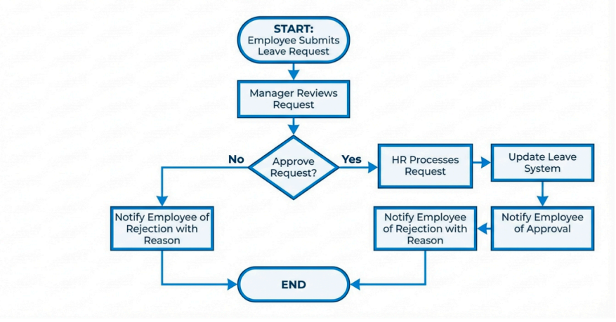
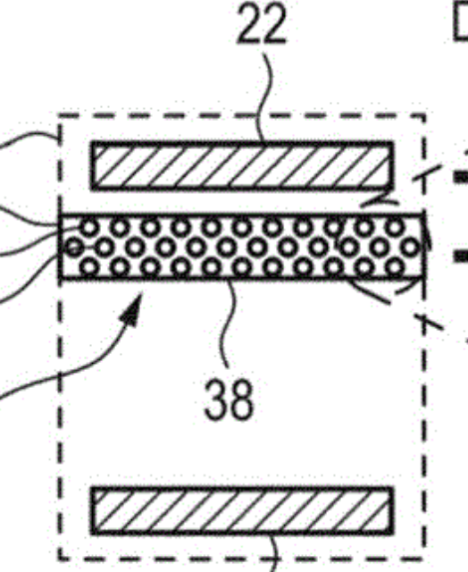
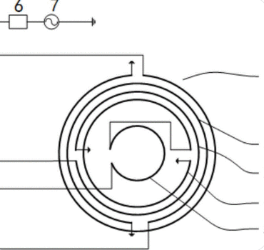
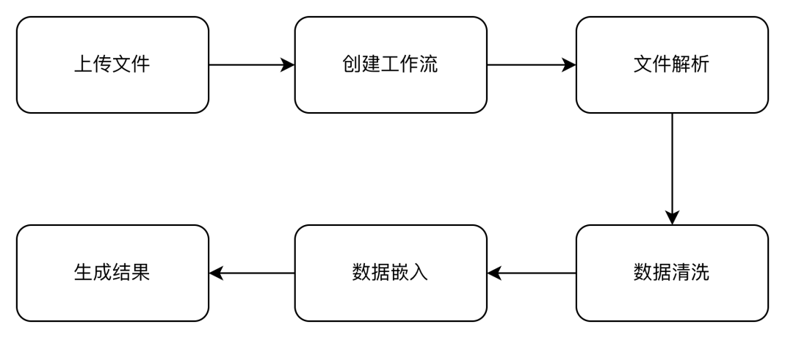

1. 绪论
2. 运算放大器
3. 二极管及其基本电路
4. 场效应三极管及其放大电路
5. 双极结型三极管及其放大电路
6. 频率响应
7. 模拟集成电路
    1. 模拟集成电路中的直流偏置技术
        1. FET电流源电路
        2. BJT电流源电路
8. 差分式放大电路
9. 差分式放大电路的传输特性
10. 反馈放大电路

测试表格

<table><tr><td>
流程图
</td><td>
文本1
</td><td>
文本2
</td></tr><tr><td rowspan="10">

</td><td rowspan="10">
test1

test2、差分式放大电路

FET差分式放大电路
</td><td>
文本21
</td></tr><tr><td>
文本22
</td></tr><tr><td>
文本23
</td></tr><tr><td>
文本24
</td></tr><tr><td>
文本25
</td></tr><tr><td>
文本26
</td></tr><tr><td>
文本27
</td></tr><tr><td>
文本28
</td></tr><tr><td>
文本29
</td></tr><tr><td>
文本20
</td></tr></table>

## 1.1 **解析效果**

部位38是缓冲带

最底部右侧

中间部分

图形区

最下方

  
图一.光照正面外观-

1.1.1 广超反面外观

最下方

### 1.1.1 **文本类型**

#### 1.1.1.1 **准确性**

- 案例1：

[https://github.com/matrixorigin/MO-Cloud/issues/7018](https://github.com/matrixorigin/MO-Cloud/issues/7018)

闵可夫斯基

闵可夫·J·斯基

- 测试记录：

1. 2026-01-07 30B模型QA环境验证未复现

### 1.1.2 **图片类型**

#### 1.1.2.1 **散点图**

[https://github.com/matrixorigin/MO-Cloud/issues/6999](https://github.com/matrixorigin/MO-Cloud/issues/6999)

- 预期结果：

必须作为整体进行Caption和OCR解析，不能被拆分

- 测试记录：

2. 2026-01-07 30B模型QA环境验证未复现

### 1.1.3 **表格类型**

#### 1.1.3.1 **三线表**

The rapid advancement of semiconductor technology has fundamentally transformed the landscape of modern embedded systems. In today's industrial environment, the integration of high-performance microcontrollers, such as the STM32 series or ARM-based processors, is no longer just about raw clock speed. Instead, the focus has shifted toward power efficiency, hardware-level security, and seamless peripheral integration.

Systems must now handle complex tasks ranging from real-time sensor fusion to high-speed data transmission via encrypted network protocols.

<table><tr><td>
Name
</td><td>
Purpose
</td></tr><tr><td>
APF Help
</td><td>
Accessible from the APF Help Shortcut in the windows start menu

Initial Setup: Verify system environment variables.
<ul><li>Activity Manager Help</li><li>Diagnostic Tool Help</li></ul></td></tr><tr><td>
APF1
</td><td>
Standard interface for application framework and logic.

Process management and background task scheduling.
</td></tr><tr><td>
Storage
</td><td>
High-speed data caching and persistent storage.	

Redundant array of independent disks configuration.
</td></tr><tr><td>
APF Help
</td><td>
Accessible from the APF Help Shortcut in the windows start menu

Initial Setup: Verify system environment variables.
<ul><li>Activity Manager Help</li><li>Diagnostic Tool Help</li></ul></td></tr><tr><td>
APF2
</td><td>
Standard interface for application framework and logic.

Process management and background task scheduling.
</td></tr><tr><td>
Storage
</td><td>
High-speed data caching and persistent storage.	

Redundant array of independent disks configuration.
</td></tr><tr><td>
APF Help
</td><td>
Accessible from the APF Help Shortcut in the windows start menu

Initial Setup: Verify system environment variables.
<ul><li>Activity Manager Help</li><li>Diagnostic Tool Help</li></ul></td></tr><tr><td>
APF3
</td><td>
Standard interface for application framework and logic.

Process management and background task scheduling.
</td></tr><tr><td>
Storage
</td><td>
High-speed data caching and persistent storage.	

Redundant array of independent disks configuration.
</td></tr><tr><td>
APF Help
</td><td>
Accessible from the APF Help Shortcut in the windows start menu

Initial Setup: Verify system environment variables.
<ul><li>Activity Manager Help</li><li>Diagnostic Tool Help</li></ul></td></tr><tr><td>
APF4
</td><td>
Standard interface for application framework and logic.

Process management and background task scheduling.
</td></tr><tr><td>
Storage
</td><td>
High-speed data caching and persistent storage.	

Redundant array of independent disks configuration.
</td></tr><tr><td>
APF Help
</td><td>
Accessible from the APF Help Shortcut in the windows start menu

Initial Setup: Verify system environment variables.
<ul><li>Activity Manager Help</li><li>Diagnostic Tool Help</li></ul></td></tr><tr><td>
APF5
</td><td>
Standard interface for application framework and logic.

Process management and background task scheduling.
</td></tr><tr><td>
Storage
</td><td>
High-speed data caching and persistent storage.	

Redundant array of independent disks configuration.
</td></tr><tr><td>
APF Help
</td><td>
Accessible from the APF Help Shortcut in the windows start menu

Initial Setup: Verify system environment variables.
<ul><li>Activity Manager Help</li><li>Diagnostic Tool Help</li></ul></td></tr><tr><td>
APF6
</td><td>
Standard interface for application framework and logic.

Process management and background task scheduling.
</td></tr><tr><td>
Storage
</td><td>
High-speed data caching and persistent storage.	

Redundant array of independent disks configuration.
</td></tr><tr><td>
Storage
</td><td>
High-speed data caching and persistent storage.	

Redundant array of independent disks configuration.
</td></tr></table>