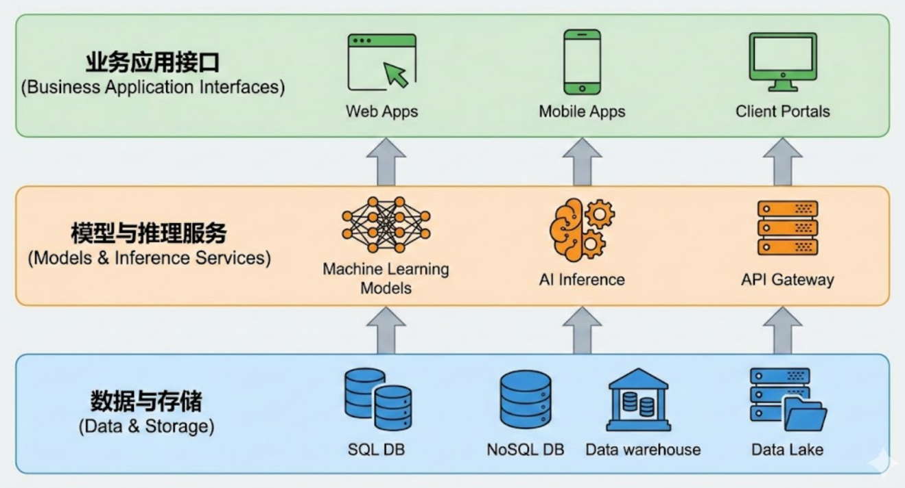

AI 应用落地方案说明书

1. Project background and objectives	3

1.1. DCC：Document Control Center	3

1.2. DCN：Document Change Notice(for Company Rules and Regulations)	3

1.3. DMS：Document Management System	3

1.4. Background description	3

1.4.1. Industry prospects1	3

1.4.2. Industry prospects2	3

1.4.3. Industry prospects3	3

1.4.4. Industry prospects4	3

1.4.5. Industry prospects	3

1.4.6. Main pain points	3

1.5. Construction objectives	3

2. Overall scheme design	4

2.1. Overview of system architecture	4

2.2. 技术选型说明	4

2.2.1. 后端与基础设施	4

2.2.2. 模型相关	4

2.2.3. 其他模型相关	4

2.3. Technical selection description	4

2.3.1. Backend and Infrastructure	4

2.3.2. Model-related	5

2.3.3. Other model-related	5

2.3.4. Backend and Infrastructure	5

2.3.5. Model-related	5

2.3.6. Other model-related	5

2.3.7. RAG: Retrieval Augmented GenerationOther model-related	5

2.3.8. Other model-related	5

3. Core functional modules	5

3.1. All documents generated by function departments should be named according to the below-mentioned categories of documents.	5

3.1.1. Data Source	5

3.1.2. All documents generated by function de	6

3.1.3. 数据处理模块包括以下流程	6

3.2. 模型服务模块	6

3.2.1. 推理服务	6

3.2.2. 模型更新策略	6

3.3. 应用层模块	6

3.3.1. 典型应用场景	6

3.3.2. 权限与安全	6

4. 4. Implementation plan and milestones	6

4.1. Categories and hierarchy of documents	6

4.2. 实施阶段划分	7

4.3. 风险与应对	7

4.3.1. 技术风险	7

4.3.2. 业务风险	7

5. Attachment	8

5.1. Atachment1：Formate for xxxxx1	8

5.2. Atachment1：Formate for xxxxx2	8

5.3. Atachment1：Formate for xxxxx3	8

5.4. Atachment1：Formate for xxxxx4	8

5.5. Atachment1：Formate for xxxxx5	8

5.6. Atachment1：Formate for xxxxx6	8

5.7. Atachment1：Formate for xxxxx7	8

5.8. Atachment1：Formate for xxxxx8	8

5.9. Atachment1：Formate for xxxxx9	8

5.10. Atachment1：Formate for xxxxx10	8

6. 总结与展望	8

# 1 Project background and objectives

## 1.1 DCC：Document Control Center

## 1.2 DCN：Document Change Notice(for Company Rules and Regulations)

## 1.3 DMS：Document Management System

## 1.4 Background description

With the continuous evolution of artificial intelligence technology, large language models (LLM) and multimodal models have demonstrated remarkable capabilities in comprehension, generation, and reasoning. An increasing number of enterprises are beginning to experiment with integrating AI technology into their actual business processes, aiming to enhance information processing efficiency, optimize decision-making quality, and reduce reliance on human experience. Against this backdrop, the focus of AI application has gradually shifted from "model effect demonstration" to "systematic implementation capability". How to embed model capabilities into existing business systems in a stable and controllable manner has become a common concern for both technical and business teams.

### 1.4.1 Industry prospects1

### 1.4.2 Industry prospects2

### 1.4.3 Industry prospects3

### 1.4.4 Industry prospects4

### 1.4.5 Industry prospects

The current industry as a whole exhibits the following characteristics：

- The capabilities of pre-trained models have rapidly improved, but there are still differences in scenario generalization
- The scale of internal data within the enterprise continues to grow, leading to a strong demand for intelligent retrieval and analysis
- AI systems are gradually evolving from single-point applications towards platformization and servitization

### 1.4.6 Main pain points

In the actual implementation process, common issues include but are not limited to：

- The data sources are complex, with a coexistence of structured, semi-structured, and unstructured data
- The coupling between model services and business logic is too high, resulting in poor system maintainability
- Without a unified evaluation and monitoring mechanism, it is difficult to continuously ensure the effectiveness of the model

## 1.5 Construction objectives

1. The goal of this project is to build an AI application system that is scalable, maintainable, and implementable，
2. Capable of supporting multiple business scenarios within the enterprise，
3. Provide a technical foundation for subsequent iterations。

# 2 Overall scheme design

## 2.1 Overview of system architecture

The system is designed with a layered architecture, encompassing a data layer, a model layer, and an application layer. This design ensures the independence between modules and facilitates the addition of new functional modules in the future.

## 2.2 技术选型说明

### 2.2.1 后端与基础设施

- 编程语言：Python
- 服务框架：FastAPI
- 模型部署：vLLM / Triton
- 容器与编排：Docker + Kubernetes
- 大语言模型（LLM）
- 向量模型（Embedding）
- RAG 检索增强生成
- 视觉大模型（VLM）
- 向量模型（Embedding）
- RAG 检索增强生成
- Programming language: Python
- Service framework: FastAPI
- Model deployment: vLLM / Triton
- Containers and orchestration: Docker + Kubernetes
- Large Language Model (LLM)
- Vector model (Embedding)
- RAG: Retrieval Augmented Generation
- Visual Large Model (VLM)
- Vector model (Embedding)
- RAG: Retrieval Augmented Generation
- Programming language: Python
- Service framework: FastAPI
- Model deployment: vLLM / Triton
- Containers and orchestration: Docker + Kubernetes
- Large Language Model (LLM)
- Vector model (Embedding)
- RAG: Retrieval Augmented Generation
- Visual Large Model (VLM)
- Vector model (Embedding)
- Visual Large Model (VLM)
- Vector model (Embedding)
- RAG: Retrieval Augmented Generation
- Visual Large Model (VLM)
- Vector model (Embedding)
- RAG: Retrieval Augmented Generation
- Service framework: FastAPI

### 2.2.2 模型相关

### 2.2.3 其他模型相关

## 2.3 Technical selection description

### 2.3.1 Backend and Infrastructure

### 2.3.2 Model-related

### 2.3.3 Other model-related

### 2.3.4 Backend and Infrastructure

### 2.3.5 Model-related

### 2.3.6 Other model-related

### 2.3.7 **RAG: Retrieval Augmented Generation**Other model-related

### 2.3.8 Other model-related

# 3 Core functional modules

## 3.1 All documents generated by function departments should be named according to the below-mentioned categories of documents.

### 3.1.1 Data Source

1. Equipment pperation instruction

<table><tr><td>
Data Type 
</td><td>
Data Type 
</td><td>
Data Type 
</td><td>
Data Type 
</td></tr><tr><td>
Document Data 
</td><td>
Document Management System
</td><td>
PDF / DOCX
</td><td>
Daily
</td></tr><tr><td>
Tabular Data 
</td><td>
Business Databases
</td><td>
CSV / XLSX
</td><td>
Real-time
</td></tr><tr><td>
Log Data 
</td><td>
Application Systems 
</td><td>
JSON
</td><td>
Real-time
</td></tr></table>

2. Other documents

<table><tr><td>
Data Type 
</td><td>
Data Type 
</td><td>
Data Type 
</td><td>
Data Type 
</td></tr><tr><td>
PDF Data 
</td><td>
PDF Document Data System
</td><td>
PDF
</td><td>
Monthly
</td></tr><tr><td>
TXT Data 
</td><td>
TXT Information Data
</td><td>
TXT
</td><td>
Daily
</td></tr><tr><td>
LogInfo Data 
</td><td>
LogInfo Application Systems 
</td><td>
Log
</td><td>
Weekly
</td></tr></table>

### 3.1.2 All documents generated by function de

### 3.1.3 数据处理模块包括以下流程 

\- 清洗无效数据，去除空值与重复数据
	- 结构化与切分（Chunking）
	- 向量化与索引构建，用于快速检索和匹配

## 3.2 模型服务模块

### 3.2.1 推理服务

模型通过统一的 API 服务对外提供能力，支持高并发和流式输出，以满足业务实时性要求。

### 3.2.2 模型更新策略

- 支持模型热更新，避免服务中断
- 支持多版本并行部署，便于 A/B 测试和回滚
- 智能问答助手
- 文档检索与总结
- 业务辅助决策
- 用户身份鉴权
- 请求审计与日志记录
- 数据访问控制

## 3.3 应用层模块

### 3.3.1 典型应用场景

### 3.3.2 权限与安全

# 4 4. Implementation plan and milestones

## 4.1 Categories and hierarchy of documents

<table><tr><td>
Task ID
</td><td>
Task Des
</td><td>
Priority
</td><td>
Assigned Department
</td><td>
Estimated Hours
</td><td>
Status
</td></tr><tr><td>
T-001
</td><td>
Initial Client Consultation
</td><td>
High
</td><td>
Sales
</td><td>
4
</td><td>
Completed
</td></tr><tr><td>
T-002
</td><td>
Requirement Analysis
</td><td>
Critical
</td><td>
Engineering
</td><td>
12
</td><td>
In Progress
</td></tr><tr><td>
T-003
</td><td>
Market Competitor Audit
</td><td>
Medium
</td><td>
Marketing
</td><td>
8
</td><td>
Pending
</td></tr></table>

## 4.2 实施阶段划分

<table><tr><td>
Task ID
</td><td>
Task Des
</td><td>
Priority
</td><td>
Assigned Department
</td><td>
Estimated Hours
</td><td>
Status
</td></tr><tr><td>
T-003
</td><td>
Initial Client Information 
</td><td>
Critical
</td><td>
Sales
</td><td>
12
</td><td>
Completed
</td></tr><tr><td>
T-004
</td><td>
Requirement Information 
</td><td>
High
</td><td>
Engineering
</td><td>
99
</td><td>
Completed
</td></tr><tr><td>
T-005
</td><td>
Market Competitor Infor
</td><td>
Medium
</td><td>
Marketing
</td><td>
88
</td><td>
Completed
</td></tr></table>

## 4.3 风险与应对

### 4.3.1 技术风险

- 模型效果不稳定 → 引入评估与回滚机制
- 系统性能瓶颈 → 采用分布式部署与负载均衡
- 需求变更频繁 → 采用模块化设计与灵活迭代
- 数据安全问题 → 强化访问控制和日志审计

### 4.3.2 业务风险

# 5 Attachment

## 5.1 Atachment1：Formate for xxxxx1

## 5.2 Atachment1：Formate for xxxxx2

## 5.3 Atachment1：Formate for xxxxx3

## 5.4 Atachment1：Formate for xxxxx4

## 5.5 Atachment1：Formate for xxxxx5

## 5.6 Atachment1：Formate for xxxxx6

## 5.7 Atachment1：Formate for xxxxx7

## 5.8 Atachment1：Formate for xxxxx8

## 5.9 Atachment1：Formate for xxxxx9

## 5.10 Atachment1：Formate for xxxxx10

# 6 总结与展望

本文档围绕 AI 应用落地这一核心目标，从项目背景、总体方案、核心功能模块以及实施计划等多个角度，对系统建设思路进行了系统性说明。

通过分层架构设计与模块化拆分，可以在保证系统稳定性的同时，提升整体的可扩展性与可维护性，使 AI 能力能够随着业务需求的变化持续演进。

- 在未来的优化方向上，可以重点考虑以下几个方面： - 引入多模态模型能力，支持图	像、表格与文本的联合理解
- 构建面向复杂任务的智能体（Agent）系统，实现任务自动拆解与执行
- 加强模型效果评估与监控体系，形成数据驱动的持续优化闭环

综上所述，该方案不仅适用于当前阶段的 AI 应用建设，也为后续能力扩展和规模化部署预留了充足空间。
Atatachement

# 7 SMIC document security levels are categorized accounting to the security control level’s defined in “CR-GWNL-01-1001 SMIC Classified Information Protection Policy (CIPP)”as follows

Security A-SMIC Top Secret

Security B-SMIC Confidential

Security C-SMIC Restricted

Security D-SMIC Internal

# 8 TECN: Temporary engineering changes can be requested as necessary

## 8.1 Effective period of TECN

### 8.1.1 The maximum effective period of a TECN is 14 working days. If in special siituation, e.g. raw material or part specification evaluation, the maxium effective period is 6 months.

### 8.1.2 TECN renewal:TECN which are preferable,suitable,and necessary for advancing into permanent engineering changes can be renewed for three time at most.