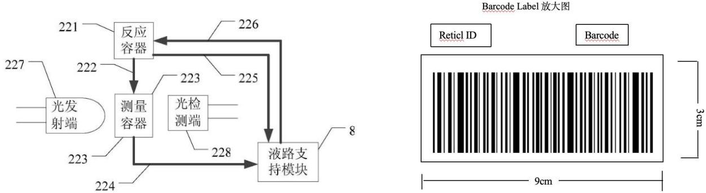

<table><tr><td>DoclNo.:xx-xxxx-xx-xxxx</td><td>Doc.Title:SMIC200mmxxxxx xxxx xxxx xxxxxxxx xxxx xxxx xxxx xxxx xxxx xxxx</td><td>Rec.:1</td><td>Page No.:1/3</td></tr></table>

1. Project background and objectives

1.1. DCC：Document Control Center

1.2. DCN：Document Change Notice(for Company Rules and Regulations)

1.3. DMS：Document Management System

## 1.4. Background description

With the continuous evolution of artificial intelligence technology, large language models (LLM) and multimodal models have demonstrated remarkable capabilities in comprehension, generation, and reasoning. An increasing number of enterprises are beginning to experiment with integrating AI technology into their actual business processes, aiming to enhance information processing efficiency, optimize decision-making quality, and reduce reliance on human experience. Against this backdrop。

1.4.1. Industry prospects

A. The current industry as a whole exhibits the following characteristics：

B. The capabilities of pre-trained models have rapidly improved, but there are still differences in scenario generalization

C. The scale of internal data within the enterprise continues to grow, leading to a strong demand for intelligent retrieval and analysis

D. AI systems are gradually evolving from single-point applications towards platformization and servitization

E. Main pain points

F. In the actual implementation process, common issues include but are not limited to：

G. The data sources are complex, with a coexistence of structured, semi-structured, and unstructured data

H. The coupling between model services and business logic is too high, resulting in poor system maintainability

I. Without a unified evaluation and monitoring mechanism, it is difficult to continuously ensure the effectiveness of the model

a. 为了能使 Reticle Stocker 讷讷够正确快速的读取光照条码，光照 MA 必须使用BarcodeReader扫描自光照厂所送出的Barcode（以有效防止人为之输入错误），之后再利用光照室旁的 Barcode Printer 打印 Reticle ID，并贴雨 Reticle POD 之上。

b. Barcode使用9cmX3cm标签打印，它的形式如下（图四）：

  
0 0 1 8 0 0 l 1 1 A A . I D A  
图四 Barcode 打印实例

The information contained herein is exclusive property of SIMC, and shall not be ditributed, reprodujced, or disclosed in whole or in part whithout priornwrittrn permission of SMIC

<table><tr><td>DoclNo.:xx-xxxx-xx-xxxx</td><td>Doc.Title:SMIC200mmxxxxx xxxx xxxx xxxxxxxx xxxx xxx xxxx xxxx xxxx</td><td>Rec.:1</td><td>Page No.:2/3</td></tr></table>

c. Recicle POD Size： $2 2 7 . 3 3 \mathrm { W } \times 2 3 0 \mathrm { L } \times 9 2 . 2 \mathrm { H } ( \mathrm { m m } )$ 。Barcode打印完毕后，要贴在Reticle POD 的适当位置上，才能被 Reticle Stock 顺利地读出。Barcode 贴在 POD上的位置如下（图五）所示：

  
图五 Barcode 位置及贴法

## 1.5. 技术选型说明

1.5.1. 后端与基础设施

 编程语言：Python

 服务框架：FastAPI

 模型部署：vLLM / Triton

 容器与编排：Docker + Kubernetes

## 1.5.2. 模型相关

 大语言模型（LLM）

 向量模型（Embedding）

 RAG 检索增强生成

## 1.5.3. 其他模型相关

 视觉大模型（VLM）

 向量模型（Embedding）

 RAG 检索增强生成

1.6. Technical selection description

1.6.1. Backend and Infrastructure

 Programming language: Python

 Service framework: FastAPI

The information contained herein is exclusive property of SIMC, and shall not be ditributed, reprodujced, or disclosed in whole or in part whithout priornwrittrn permission of SMIC

<table><tr><td>DoclNo.:xx-xxxx-xx-xxxx</td><td>Doc. Title:SMIC200mmxxxxx xxxx xxxx xxxx xxxx xxxx xxxx xxxx xxxx xxxx xxxx</td><td>Rec.:1</td><td>Page No.:3/3</td></tr></table>

 Model deployment: vLLM / Triton

 Containers and orchestration: Docker + Kubernetes

## 1.6.2. Model-related

 Large Language Model (LLM)

 Vector model (Embedding)

 RAG: Retrieval Augmented Generation

## 1.6.3. Other model-related

 Visual Large Model (VLM)

 Vector model (Embedding)