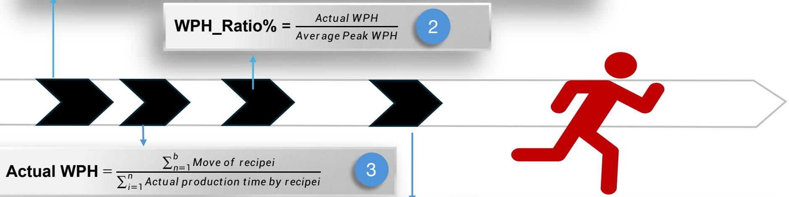

1 WPH(Water Per Hour): Theoretical unit throughput by recipe Peak WPH: The throughput under continuous run status

2

Average Peak WPH

$$
4 = \frac {\sum_ {i = 1} ^ {n} \text {Move of recipei}}{\text {Theoretical production time by recipei}} = \frac {\sum_ {i = 1} ^ {n} \text {Move of recipei}}{\sum_ {i = 1} ^ {n} \frac {\text {Move of recipei}}{\text {Peak WPH by recipei}}}
$$

30m@6m/s

30m@6m/s

The average speed? $(6+3)/2=4.5\text{m/s}$ ? ✗ $(30+60)/(20/6+60/3)=3.6\text{m/s}$ ? √

Recipe 1: PWPH 1=20, move 1=1000

Recipe 2: PWPH 2=25, move 2=1500

Average PWPH: 1000+1500)/(1000/20+1500/25)=22.7