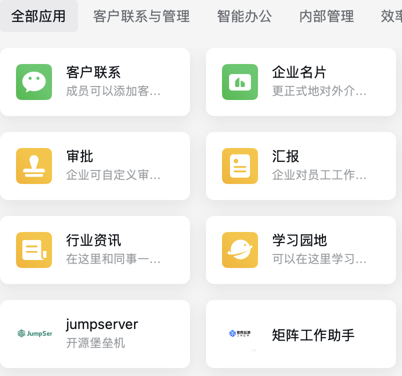
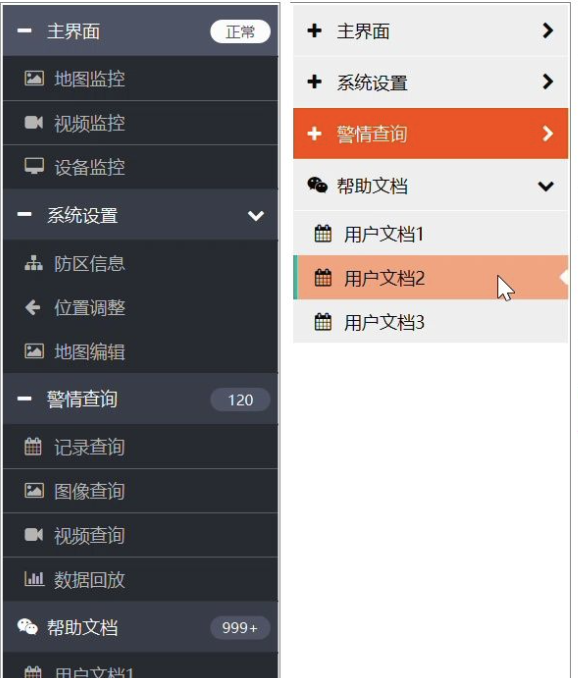
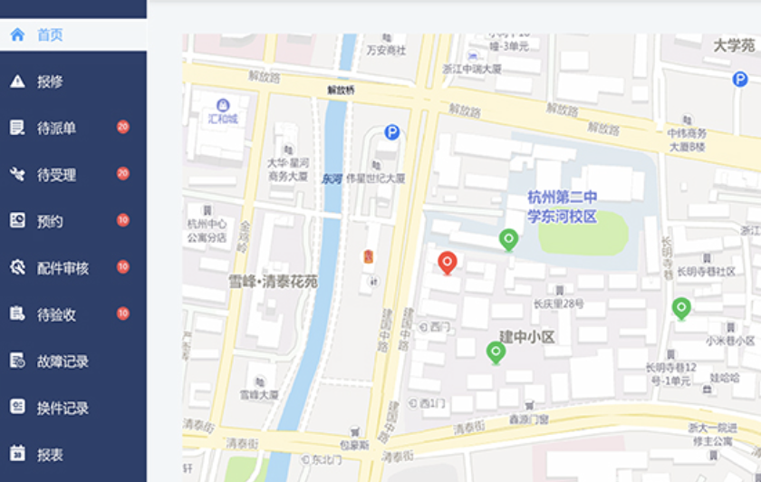

## **进入路径**

路径：常用应用系统（更多）→Finance-Accounting→财务在线系统

中芯国际集成电路制造有限公司

smiconductor manafactrring international corporation

中芯国际集成电路制造有限公司

smiconductor manafactrring international corporation

SMIC confidential

All copyright and IP belong to SMIC For reference only and may not be copied or distributed without writen permission from SMIC. SMIC shall not be responseible for any party’s reliance on these materials.

## **系统界面**

路径：常用应用系统（更多）→Finance-Accounting→财务在线系统

SMIC confidential

All copyright and IP belong to SMIC For reference only and may not be copied or distributed without writen permission from SMIC. SMIC shall not be responseible for any party’s reliance on these materials.