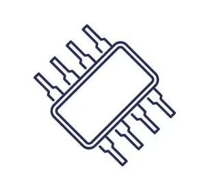
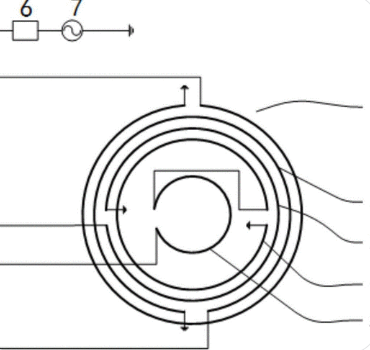
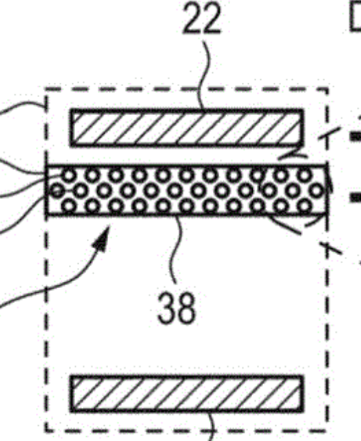
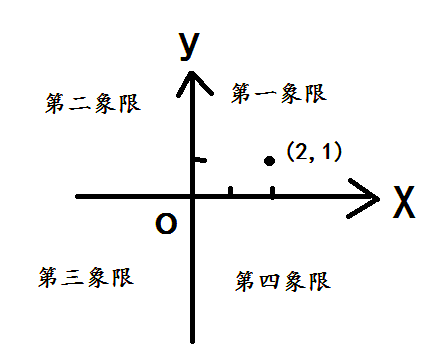
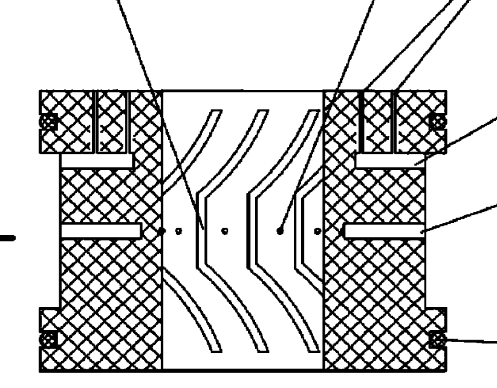

注意：xxxxxxxxxxxxxxxx

# 1 **测试方案**

## 1.1 **前置条件**

### 1.1.1 **输入前置条件**

**描述文字，参考附件xxxxxx**

1. **编号缩进项目1**

**编号缩进项目1行文**

### 1.1.2 **系统状态描述**

**三级章节文字内容2**

## 1.2 **测试过程描述**

### 1.2.1 **接口调用规范描述**

1. **调用参数1**

**参数1类型，参数1范围，参数1含义**

2. **调用参数2**

**参数2类型，参数2范围，参数2含义**

3. **调用参数3**

**参数3类型，参数3范围，参数3含义**

Table2:

<table><tr><td>
参数名称
</td><td>
参数类型
</td><td>
参数范围
</td><td>
我的描述
</td><td>
参数示意图
</td></tr><tr><td>
集成电路引脚
</td><td>
物理结构参数
</td><td>
引脚数量、间距、长度等（如 SOP-8、QFN-24 等封装规格）
</td><td>
表示芯片类元器件的引脚布局，用于电气连接与封装识别
</td><td>

</td></tr><tr><td>
旋转阀（或旋转执行机构）
</td><td>
运动结构参数
</td><td>
旋转角度（0°~360°）、扭矩、转速等
</td><td>
表示可旋转的阀类或执行机构，用于流体控制或机械传动
</td><td>

</td></tr><tr><td>
层状流道（或多孔介质流道）
</td><td>
流体力学参数
</td><td>
流道宽度（如 38）、层数、孔隙率、流速范围等
</td><td>
表示多层结构的流体通道，常用于换热、过滤或流体分配场景
</td><td>

</td></tr><tr><td>
层状流道（或多孔介质流道）
</td><td>
几何坐标参数
</td><td>
坐标点 (x,y)，x∈(-∞,+∞)，y∈(-∞,+∞)
</td><td>
用于定位平面内点的位置，区分四个象限，图中示例点为 (2,1)
</td><td>

</td></tr><tr><td>
密封流道（或迷宫密封结构）
</td><td>
密封与流体参数
</td><td>
流道间隙、密封级数、介质压力、温度等
</td><td>
表示带有密封结构的流体通道，通过迷宫结构减少泄漏
</td><td>

</td></tr></table>

## 1.3 **测试过程描述**

### 1.3.1 **接口调用规范描述**

4. **调用参数1**

**参数1类型，参数1范围，参数1含义**

5. **调用参数2**

**参数2类型，参数2范围，参数2含义**

6. **调用参数3**

**参数3类型，参数3范围，参数3含义**

7. **调用参数4**

**参数4类型，参数4范围，参数4含义**