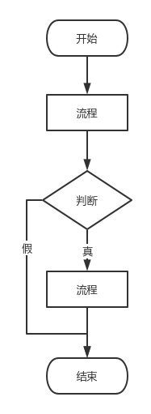

阿斯蒂芬阿萨德

阿第三方阿萨德

奥德赛发斯蒂芬阿斯蒂芬阿斯顿发sd

表格一：

<table><tr><td>
核心流程展示
</td><td>
阶段概括
</td><td>
详细执行要点（扩充）
</td></tr><tr><td>

</td><td>
CE         

 

CE

 

MFG

 

MFG

 

MFG

 
</td><td>
STEP1 CE START

STE2 CE EXEC 开始执行数据处理步骤

STEP3 CE 判断执行结果是否成功，再决定如何处理

STEP4如果执行成功，发起执行后的后续数据持久化处理

STEP5如果执行失败，结束退出
</td></tr></table>

阿第三方阿斯蒂芬阿斯蒂芬

阿第三方asdf

多发点发生的 阿斯顿发生的发阿斯蒂芬阿斯蒂芬水电费阿第三方阿是放大

表格3

ECN

Create

Abolish

Revise

Signoff

DCC

/

Initial

Process

Parallel

Sign-off

Release

Recall

N