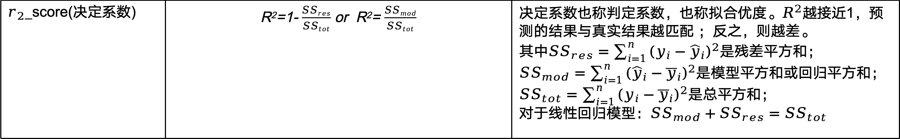

## YMS\_mock

MatrixOne Intelligence

Copyright © 2026 矩阵起源（深圳）信息科技有限公司粤公安网备 44030402004672号 | 粤ICP备2021044820号

线性回归

- 《春》是现代散文家朱自清创作的散文，最初发表于1933年7月，此后长期被中国中学语文教材选用。 《春》的篇幅很短，全文    只有七百多字，共分十个自然段，可分成三部分。
    - 《第一部分，即第一个自然段，写盼春的心切和迎	春的喜悦；
    - 第二部分，即第二至第七个自然段，对春天的景物进行了形象地描绘，第三部分，即第八至第十自然段，是对春天的颂扬。
- 在该篇“贮满诗意”的“春的赞歌”中，事实上饱含了作家特定时期的思想情绪、对人生及至人格的追求，
    - 表现了作家骨子里的传统文化积淀和他对自由境界的向往。
    - 1927年之后的朱自清，始终在寻觅着、营造着一个灵魂深处的理想世界——梦的世界，用以安放他“颇不宁静”的拳拳之心，抵御外面世界的纷扰，使他在幽闭的书斋中“独善其身”并成就他的治
    - 在该篇“贮满诗意”的“春的赞歌”中，事实上饱含了作家特定时期的思想情绪、对人生及至人格的追求，表现了作家骨子里
- 1R平方(R-sqared) Cor平方[0, 1].

MatrixOne Intelligence

Copyright © 2026 矩阵起源（深圳）信息科技有限公司粤公安网备 44030402004672号 | 粤ICP备2021044820号