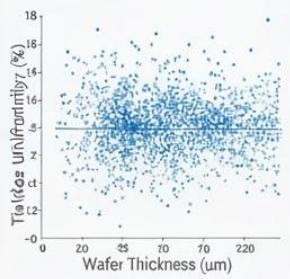
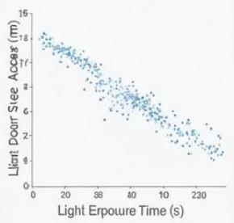
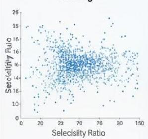
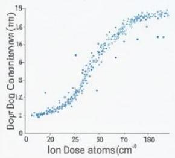
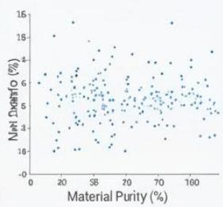
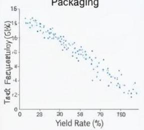

## SEMCUREEDTOR MANUFACTURING PROCESS FLOWCHART

Wafer Manufacturing

  
Sillion ingots are sfced inio thin wafers. Scatter plot shaiont the between wafer thickness and uniformity.

Photolithography  
  
Pattems are tranafered onto the
the wate linecater ahowe the
exposure time vs feckre stre accuracy.

Etching  
  
Unvanted material is removed Scatter plot shoia ahows etch depth agtinst aelescicity ratio.

Ion Implantation  
  
Introducing impurities to change to change elecical prorre alleisn scatter iocn pckes lincettath puthers, elenstase to fulb.

Thin Film Deposition  
  
Adding layers of conductive
conducive or insulating material.
Scatter ploowe vs
ion dose agonia us, mesulation

Electrical Testing & Packaging  
  
Pess heiorm id equi 9 a land mjatine
prackaging fahge sicstter tinn
scatter ion to toris imente cecrl
tum artestreny ati cult praitty.