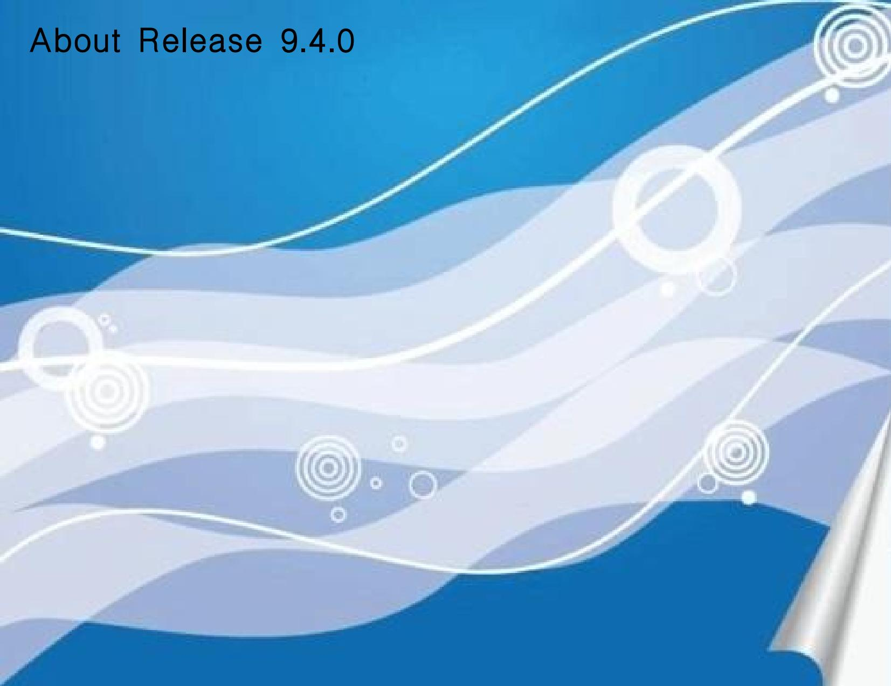

## Applied APF Release Notes

About Release 9.4.0

Applied APF Release Notes ---- 1
APF Installation Description ---- 3
APF grid for APF integration components ---- 4
APF Server and APF Client compatibility ---- 5

## APF Installtion Description

“Installing APF Components” chapter for the appropriate operating system in the Appied APF Installation Guide for your platform.

When converting an 8.x repository, you can determine whether the instant values stored in the source repository are converted to UTC format during the conversion, or whether they are retained in indeterminate, non-UTC format in the destination repository.

■ Note As a best practice, Applied Materials recommends using UTC instant values, which re

! Important By default, 9.4 or higher version repositories (including Activity

Manager job repositories) are not backward compatible with pre-9.4 Repository Servers or writing clients without setting the <rs\_reuse\_client\_memory> option in the Repository Server’s <options> section of the apf.xml file to false prior to upgrading. For more information, see 448885 later in these release notes.

## ▲ To convert an existing pre-9.0 source repository for use with this release

1. If you want to convert non-UTC instant values in the source repository to UTC instant values, edit the apf.xml configuration of your existing (pre-9.0) source repository, and define the <time\_zone> parameter in the repository’s configuration; set this parameter to the time zone in which instants are expressed in the repository. (For information about the <time\_zone> parameter and its supported values, see the “apf.xml File Reference” appendix of the Applied APF System Administration Guide included with the current release.) If you do not define the <time\_zone> parameter in the repository’s configuration, then instant values are retained in non-UTC format during the conversion.

■ Note The <time\_zone> parameter is ignored by the existing repository; it is

read by the Converter to determine how to handle instant values in the repository. If defined, then during the repository conversion, instant values (which where previously expressed in local server time ) are converted to UTC instants in the updated repository.

## 2. Configure are new destination repository for the current release.

A subset of instants stored in the APF repository (that is, instants that indicate repository object existence and indexed instants) can be stored in a different format than other instants in the repository (either local or UTC, but not a mixture of both). The decision about which format to use for these instants depends on which version of APF repository data, and whether the integrated external systems in your environment support using UTC inst T ts, define the rnal systems in your environment support using define the <object\_existence\_time> element in the <format> section of the destination repository’s apf.xml configuration, and set the element to one of the following supported values;

## APF grid for APF integration components

The following table shows the compatibility grid for APF integration components:

<table><tr><td>operating system</td><td>Database</td><td>Oracle Dynamic Adapter</td><td>Oracle Dynamic Extractor</td><td>MSSQL Server Adapter</td><td>MSSQL Server Extractor</td><td>MySQL Adapter</td><td>MySQL Extractor</td><td>DB2 Trigger Adapter</td><td>DB2 Extractor</td><td>APF IGT</td><td>Transform Editor</td><td>Server IDK</td><td>Dispatch API (C#)</td><td>Dispatch API (C++)</td><td>Status Tool API</td></tr><tr><td colspan="2">Windows2012/2016-Standard(64bit)</td><td>√</td><td>√</td><td>√</td><td>√</td><td>√</td><td>√</td><td></td><td></td><td>√</td><td>√</td><td>√</td><td>√</td><td>√</td><td>√</td></tr><tr><td></td><td>Oracle 11g R2</td><td>√</td><td>√</td><td></td><td></td><td></td><td></td><td></td><td></td><td>√</td><td></td><td></td><td></td><td></td><td></td></tr><tr><td></td><td>Oracle 12c R2</td><td>√</td><td>√</td><td></td><td></td><td></td><td></td><td></td><td></td><td>√</td><td></td><td></td><td></td><td></td><td></td></tr><tr><td></td><td>MSSQL Server 2012</td><td></td><td></td><td>√</td><td>√</td><td></td><td></td><td></td><td></td><td>√</td><td></td><td></td><td></td><td></td><td></td></tr><tr><td></td><td>MSSQL Server 2016</td><td></td><td></td><td>√</td><td>√</td><td></td><td></td><td></td><td></td><td>√</td><td></td><td></td><td></td><td></td><td></td></tr><tr><td></td><td>MySQL 5.6</td><td></td><td></td><td></td><td></td><td>√</td><td>√</td><td></td><td></td><td>√</td><td></td><td></td><td></td><td></td><td></td></tr><tr><td colspan="2">Linux RHEL 6.2 or 7.2 (64 bit)</td><td>√</td><td>√</td><td>√</td><td>√</td><td></td><td></td><td></td><td></td><td></td><td></td><td>√</td><td></td><td>√</td><td></td></tr><tr><td></td><td>Oracle 11g R2</td><td>√</td><td>√</td><td></td><td></td><td></td><td></td><td></td><td></td><td>*</td><td></td><td></td><td></td><td></td><td></td></tr><tr><td></td><td>Oracle 12c R2</td><td>√</td><td>√</td><td></td><td></td><td></td><td></td><td></td><td></td><td>*</td><td></td><td></td><td></td><td></td><td></td></tr><tr><td></td><td>MSSQL Server 2012</td><td></td><td></td><td>√</td><td>√</td><td></td><td></td><td></td><td></td><td>*</td><td></td><td></td><td></td><td></td><td></td></tr><tr><td></td><td>MSSQL Server 2016</td><td></td><td></td><td>√</td><td>√</td><td></td><td></td><td></td><td></td><td>*</td><td></td><td></td><td></td><td></td><td></td></tr><tr><td colspan="2">HP-UX 11.31 (64-bit titanium)</td><td>√</td><td>√</td><td></td><td></td><td></td><td></td><td></td><td></td><td></td><td></td><td>√</td><td></td><td>√</td><td></td></tr><tr><td></td><td>Oracle 11g R2</td><td>√</td><td>√</td><td></td><td></td><td></td><td></td><td></td><td></td><td>*</td><td></td><td></td><td></td><td></td><td></td></tr><tr><td></td><td>Oracle 12c R2</td><td>√</td><td>√</td><td></td><td></td><td></td><td></td><td></td><td></td><td>*</td><td></td><td></td><td></td><td></td><td></td></tr><tr><td colspan="2">Solaris 2.10 (64-bit SPABC)</td><td>√</td><td>√</td><td></td><td></td><td></td><td></td><td></td><td></td><td></td><td></td><td>√</td><td></td><td>√</td><td></td></tr><tr><td></td><td>Oracle 11g R2</td><td>√</td><td>√</td><td></td><td></td><td></td><td></td><td></td><td></td><td>*</td><td></td><td></td><td></td><td></td><td></td></tr><tr><td></td><td>Oracle 12c R2</td><td>√</td><td>√</td><td></td><td></td><td></td><td></td><td></td><td></td><td>*</td><td></td><td></td><td></td><td></td><td></td></tr><tr><td colspan="2">AIX 7.1</td><td></td><td></td><td></td><td></td><td></td><td></td><td>√</td><td>√</td><td></td><td></td><td>√</td><td></td><td>√</td><td></td></tr><tr><td></td><td>DB2 (10.1,10.5)</td><td></td><td></td><td></td><td></td><td></td><td></td><td>√</td><td>√</td><td>*</td><td></td><td></td><td></td><td></td><td></td></tr><tr><td colspan="2">AIX 7.2</td><td></td><td></td><td></td><td></td><td></td><td></td><td>√</td><td>√</td><td></td><td></td><td>√</td><td></td><td>√</td><td></td></tr><tr><td></td><td>DB2 (11.1)</td><td></td><td></td><td></td><td></td><td></td><td></td><td>√</td><td>√</td><td>*</td><td></td><td></td><td></td><td></td><td></td></tr></table>

APF support will also work with customers in resolving issues with both APF integration and server components on RHEL 6.x versions later than 6.2 and RHEL 7.x versions later than 7.2.

## APF Server and APF Client compatibility

The following table shows the compatibility grid for APF version 9.1.1 server and client software.

<table><tr><td></td><td>HP</td><td>Solaris</td><td>RHEL</td><td>AIX</td><td>Microsoft Windows</td></tr><tr><td colspan="6">Server software</td></tr><tr><td>Operating System Version(s)</td><td>HP-UX11.31(Itanium 64-bit only)</td><td>Solaris2.10(64-bit)(SPARC environments only)</td><td>RHEL6.264 bitRHEL7.264-bit</td><td>AIX6.164-bitAIX7.164-bit</td><td>Windows Server 2008 R2 SP1 *Windows Server 2012 R2 Standard</td></tr><tr><td colspan="6">Related software</td></tr><tr><td>CoinMP solver**</td><td>N/A</td><td>N/A</td><td>N/A</td><td>N/A</td><td>1.7.6</td></tr><tr><td>CPLEX Optimizer solver**</td><td>N/A</td><td>N/A</td><td>N/A</td><td>N/A</td><td>12.6.1</td></tr><tr><td>Gurobi Optimizer solver**</td><td>N/A</td><td>N/A</td><td>N/A</td><td>N/A</td><td>7.0.2</td></tr><tr><td>Java (64-bit)</td><td>8.0.08(HP)</td><td>6u45(Oracle)7u2(Oracle)8u102(Oracle)</td><td>6u45(Oracle)7u2(Oracle)8u102(Oracle)</td><td>N/A</td><td>6u45 (Oracle)7u9 (Oracle)8u102 (Oracle)</td></tr><tr><td>IBM XL C/C++ Runtime</td><td>N/A</td><td>N/A</td><td>N/A</td><td>13.1.2</td><td>N/A</td></tr><tr><td>Microsoft Message Queueing (MSMQ)</td><td>N/A</td><td>N/A</td><td>N/A</td><td>N/A</td><td>5.0 or later</td></tr><tr><td>Microsoft .NET Framework</td><td>N/A</td><td>N/A</td><td>N/A</td><td>N/A</td><td>4.5</td></tr></table>

## APFP Dispatch API Guide

Applied APF RTD 9.4.0

APFP Dispatch API Guide ---- 1
Dispatch list format ---- 3
Tag descriptions ---- 3
Parding the dispatch list ---- 3
Items implement or fixed ---- 4
Support coverage ---- 5
Version obsolescence ---- 5
Accessing the distribution site ---- 6
About This Document ---- 6

## Dispatch list format

Although the Dispatch API provides functions for parsing and accessing the dispatch result, you may want to handle the response yourself. In that case, this description of the returned dispatch list may be helpful. Pre-defined headers for the dispatch list

Designed for ZLink IoT Cloud (version 3.2+), enables gateways and edge devices to exchange batch control or data acquisition tasks using a compact and extensible TLV (Type–Length–Value) binary encoding. This approach ensures compatibility across vendors #rows, supports dynamic task type extensions, and performs reliably even under constrained network conditions. The following sections outline the technical specification and usage guidelines for this fictional API.Also, note that there is one key, #ISS\_SLIS\_DIAGS, which does not confirmed.

## Tag descriptions

The following table provides description for the tages used in a dispatch query result:

Tag Description

#headers Pre-defined headers for the dispatch list.

#columns The column heading names for the list.

#widths The widths for each column, used in formating the data.

#types The data types for each column. Normally used to decide how to justify a column by default.

#lotcol Which column contains the lot names.

#rows The query data table in row-major form.

#blocked A flag for each lot that indicates if it is blocked. The WorkStram dispatcher interface uses this flag to determine whether that lot is selectable by the operator.

#ISS-DDIS- This is diagnostic information from the dispatcher, relating DIAGS to the execution time of the rule. Note that it does not follow the same “#tag value” formats as the otheer tags.

## Parding the dispatch list

The following functions are available for parding and processing the dispatcher result:

[C++]

#include “writerlibx/iss\_schedmsg.h”

#include “writerlibx/iss\_schedmsg\_print.h”

/\* Parsing of raw dispatch results \*/

schedmsg \* iss\_parseSchedMsg(const char \*rawText, u\_int text Size);

## Items implement or fixed

This study presents a power-function-based peak separation framework for gamma-ray spectroscopy. By introducing a tunable exponent parameter into the peak model, the method enhances discrimination in overlapped spectral regions while maintaining numerical stability.

<table><tr><td>ID</td><td>Progress</td><td>Priority</td><td>Short Description</td></tr><tr><td>PROJ-001</td><td>Not Started</td><td>Urgent</td><td>Essential Project Test</td></tr><tr><td>PROJ-002</td><td>Rejected</td><td>Deferred</td><td>Critical System Review</td></tr><tr><td>BUG-003</td><td>Approved</td><td>Critical</td><td>Backup All Task Items</td></tr><tr><td>BUG-004</td><td>Testing</td><td>Urgent</td><td>Complete Critical Process Migrate</td></tr><tr><td></td><td>Pending</td><td></td><td></td></tr><tr><td>FEAT-005</td><td>Review</td><td>Low</td><td>Implement All Feature Items</td></tr><tr><td>PROJ-006</td><td>Cancelled</td><td>Normal</td><td>Final Report Review Check</td></tr><tr><td>PROJ-007</td><td>Delayed</td><td>High</td><td>Complete Final Analysis Schedule</td></tr><tr><td>BUG-008</td><td>In Progress</td><td>Critical</td><td>Essential Analysis Review</td></tr><tr><td>PROJ-009</td><td>Delayed</td><td>Urgent</td><td>Complete Secondary Update Deploy</td></tr><tr><td>ISSUE-010</td><td>Completed</td><td>Urgent</td><td>Urgent Documentation Fix Required</td></tr><tr><td></td><td>Pending</td><td></td><td></td></tr><tr><td>BUG-011</td><td>Review</td><td>Optional</td><td>Primary Report Review</td></tr><tr><td>ISSUE-012</td><td>Not Started</td><td>Low</td><td>Prepare Review for Upgrade</td></tr><tr><td>PROJ-013</td><td>Completed</td><td>Normal</td><td>Final Optimization Upgrade Check</td></tr><tr><td>REQ-014</td><td>On Hold</td><td>Medium</td><td>Prepare Support for Backup</td></tr><tr><td>ITEM-015</td><td>Rejected</td><td>Deferred</td><td>Urgent Project Fix Required</td></tr><tr><td>WORK-016</td><td>In Progress</td><td>Critical</td><td>Deploy All Function Items</td></tr><tr><td>PROJ-017</td><td>Delayed</td><td>Deferred</td><td>Prepare Configuration for Monitor</td></tr><tr><td>TASK-018</td><td>In Progress</td><td>Urgent</td><td>Fix All Feature Items</td></tr><tr><td>REQ-019</td><td>Testing</td><td>Critical</td><td>Urgent Maintenance Fix Required</td></tr><tr><td>PROJ-020</td><td>On Hold</td><td>Low</td><td>Urgent Update Fix Required</td></tr><tr><td></td><td></td><td></td><td>Complete Secondary System</td></tr><tr><td>TASK-021</td><td>Rejected</td><td>Normal</td><td>Develop</td></tr><tr><td>FEAT-022</td><td>Completed</td><td>Critical</td><td>Essential Training Implement</td></tr><tr><td>WORK-023</td><td>In Progress</td><td>Medium</td><td>Backup and Validate Optimization</td></tr><tr><td>FEAT-024</td><td>Approved</td><td>Deferred</td><td>Prepare Support for Configure</td></tr><tr><td>ITEM-025</td><td>Cancelled</td><td>Optional</td><td>Final Configuration Review</td></tr><tr><td>BUG-026</td><td>In Progress</td><td>Normal</td><td>Critical Training Review</td></tr><tr><td>BUG-027</td><td>Not Started</td><td>High</td><td>Implement the Critical Project</td></tr><tr><td>ISSUE-028</td><td>In Progress</td><td>Low</td><td>Urgent Optimization Fix Required</td></tr><tr><td>REQ-029</td><td>Rejected</td><td>Optional</td><td>Essential Optimization Review</td></tr><tr><td>PROJ-030</td><td>In Progress</td><td>Deferred</td><td>Final Deployment Migrate Check</td></tr><tr><td>TASK-031</td><td>In Progress</td><td>Critical</td><td>Primary Review Review</td></tr><tr><td>BUG-032</td><td>Completed</td><td>Optional</td><td>Prepare Deployment for Deploy</td></tr><tr><td>WORK-033</td><td>Completed</td><td>High</td><td>Develop the Secondary Support</td></tr><tr><td>TASK-034</td><td>In Progress</td><td>Low</td><td>Final Deployment Validate Check</td></tr><tr><td>BUG-035</td><td>Delayed</td><td>Critical</td><td>Update All Integration Items</td></tr><tr><td>FEAT-036</td><td>Testing</td><td>Urgent</td><td>Validate and Validate Support</td></tr><tr><td>BUG-037</td><td>On Hold</td><td>Low</td><td>Backup the Critical Training</td></tr><tr><td>ISSUE-038</td><td>Not Started</td><td>Critical</td><td>Urgent Optimization Fix Required</td></tr><tr><td>REQ-039</td><td>Not Started</td><td>High</td><td>Urgent Component Schedule</td></tr><tr><td>BUG-040</td><td>Delayed</td><td>High</td><td>Schedule Initial Project Meeting</td></tr><tr><td>TASK-041</td><td>Rejected</td><td>High</td><td>Urgent Training Fix Required</td></tr><tr><td>ISSUE-042</td><td>On Hold</td><td>Low</td><td>Analyze All Project Items</td></tr><tr><td>REQ-043</td><td>On Hold</td><td>Optional</td><td>Final Component Update Check</td></tr><tr><td>PROJ-044</td><td>In Progress</td><td>Low</td><td>Complete Final Report Test</td></tr><tr><td>PROJ-045</td><td>Completed</td><td>Normal</td><td>Urgent Process Fix Required</td></tr><tr><td>FEAT-046</td><td>Rejected</td><td>Critical</td><td>Develop and Validate Analysis</td></tr><tr><td>FEAT-047</td><td>In Progress</td><td>High</td><td>Prepare Function for Analyze</td></tr><tr><td>BUG-048</td><td>Cancelled</td><td>Low</td><td>Prepare Maintenance for Validate</td></tr><tr><td>TASK-049</td><td>In Progress</td><td>Deferred</td><td>Complete Major Module Update</td></tr><tr><td>REQ-050</td><td>On Hold</td><td>Medium</td><td>Urgent Support Fix Required</td></tr><tr><td>TASK-051</td><td>In Progress</td><td>High</td><td>Complete Urgent Support Review</td></tr></table>

## Support coverage

This section description the support converage provide with the release,including version obsolescence, how to access the distribution site, and how to contact software support.

## Version obsolescence

ISS-DDIS-DIAGS is not a generic industry standard term; it is an internal system/module identifier, commonly seen in semiconductor equipment software environments (e.g., Applied Materials systems).

Defines the schema of the result set. Each entry describes a column, including column name, data type, unit (if applicable), and optional attributes such as precision or nullability.

Contains the actual data records returned by the dispatch query. Each row corresponds to one result entry and follows the order defined in #columns

<table><tr><td>Version</td><td>Released</td><td>Superseded</td><td>Standaed Support Ends</td><td>Extended Support Ends</td></tr><tr><td>Date</td><td>Plan(%)</td><td>Actual(%)</td><td>任务总数</td><td>已完成任务数</td></tr><tr><td>25-05-09</td><td>6.2</td><td>6.2</td><td>15</td><td>15</td></tr><tr><td>25-05-16</td><td>8.3</td><td>8.3</td><td>20</td><td>20</td></tr><tr><td>25-05-23</td><td>10.7</td><td>10.7</td><td>26</td><td>26</td></tr><tr><td>25-05-30</td><td>14.0</td><td>12.8</td><td>34</td><td>31</td></tr><tr><td>25-06-13</td><td>19.0</td><td></td><td></td><td></td></tr></table>

## Accessing the distribution site

Term Breakdown (typical engineering interpretation)

1.ISS

2.Integrated / Intelligent System Services

Refers to the system-level service layer of the equipment software.

Device Data / Diagnostic Data Information System

Indicates a subsystem responsible for collecting, managing, or distributing device diagnostic data.

## About This Document

Term Breakdown (typical engineering interpretation)

ISS,Integrated / Intelligent System Services

Refers to the system-level service layer of the equipment software.

DDIS,Device Data / Diagnostic Data Information System

Indicates a subsystem responsible for collecting, managing, or distributing device diagnostic data.

DIAGS,Diagnostics,Explicitly denotes diagnostic, health, or troubleshooting-related data and functions.

Combined Meaning,ISS-DDIS-DIAGS

A system-level diagnostic data module or namespace used for equipment health monitoring, fault diagnosis, and maintenance analysis, rather than for process or recipe control.

Typical Usage Contexts,Dispatch or query result namespaces

Equipment diagnostic or service queries

System logs and traces

Maintenance / engineering mode data access

Key Distinction

Process data → used for wafer processing and recipe control

ISS-DDIS-DIAGS → used for equipment diagnostics, debugging, and health monitoring,One-sentence summary

ISS-DDIS-DIAGS refers to a system-level diagnostics module that provides

If you can share the exact query output or field names where this appears, the meaning can be narrowed further (e.g., real-time diagnostics vs. historical logs).

<table><tr><td colspan="2">Tracing Number enhancements</td></tr><tr><td>Tracking numbers</td><td>Description</td></tr><tr><td>(451763)</td><td>Writing a formal paper on the semiconductor industry (chip industry)requires a balance of technical insight, economic analysis, and geopolitical context.[IMAGE]Below is a structured academic essay</td></tr><tr><td>SR00320423(450597,45490)</td><td>The semiconductor industry serves as the nervous system of the modern global economy. From the simplest household appliances to the most sophisticated Artificial Intelligence (AI) clusters, &quot;chips&quot; are the fundamental building (blocks of digital) transformation.• As we move further into the decade, the industry is transitioning from a period of globalization:• The industry is not a monolith but a highly fragmented and specialized ecosystem. It is generally divided into three primary business models:Semiconductors have become a tool of foreign policy. Export controls and domestic subsidy programs (like the U.S. CHIPS Act and .</td></tr><tr><td>(502677)</td><td>Moore&#x27;s Law&quot;—the observation that the number of transistors on a chip doubles approximately every two years—is slowing down. To maintain performance gains, the industry is turning to Advanced Packaging (3D stacking) and architectures.Semiconductors have become a tool of foreign policy.■ The future of the chip industry will likely be defined by the &quot;AI-First&quot; hardware paradigm. As AI models grow in complexity, the bottleneck is shifting from raw processing</td></tr><tr><td colspan="2">Activiy Manager Client enhancements</td></tr><tr><td>Tracking numbers</td><td>This section lists enhancements to the Admin Client.Description</td></tr></table>

(450022) The semiconductor industry remains the most critical sector for 21st-century sovereignty. While the challenges of escalating costs and geopolitical tensions are significant, the relentless pace of innovation ensures that semiconductors will continue to dictate the speed of human progress.If this is for a university course, ensure you cite sources like

<table><tr><td>Tracking</td><td>Description numbers</td></tr><tr><td>(452847)</td><td>You can now right-click a Run Report block in the work area, and then click Edit Report on the shortcut menu to automatically launch the Formatter and edit the block&#x27;s associated report.</td></tr></table>

## Admin Client enhancements

<table><tr><td>Tracking numbers</td><td>This section lists enhancements to the Admin Client.Description</td></tr><tr><td>(453263)</td><td>The settings on the Advanced Settings tab of the Adapter configuration have been reorganized, by removing the Oracle and DB2 groupings. The settings common to all Adapters appear first, and the database type-specific settings appear later on the tab. Also see 451650 for Adapter-side changes.The settings related to the T Log Adapter have been removed because they are no longer supported.</td></tr></table>