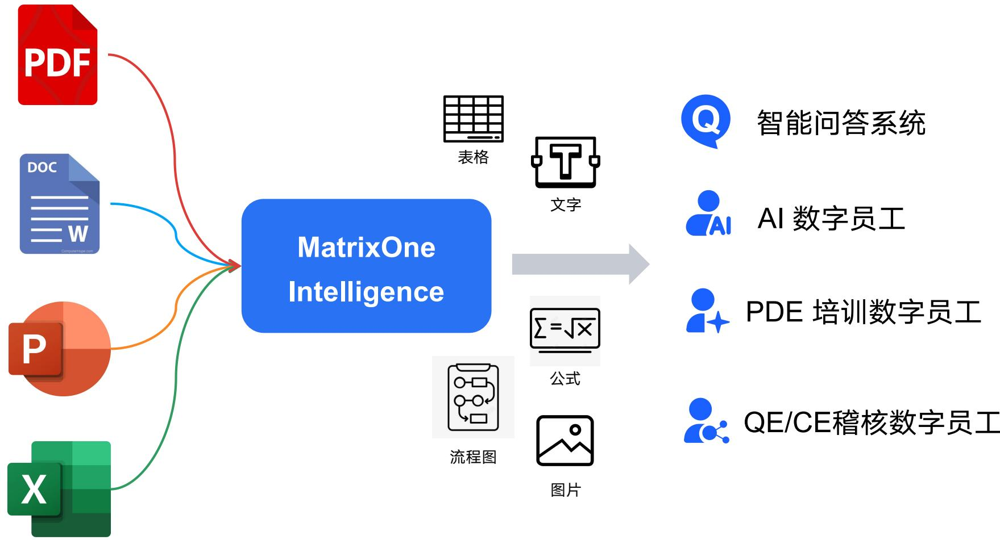
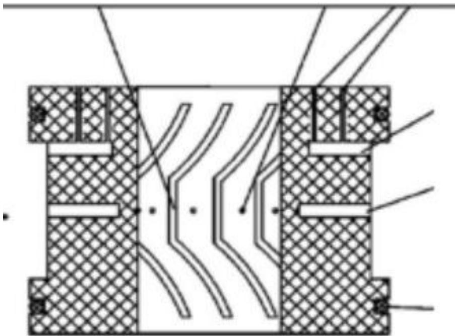

## 中芯国际文档解析项目开工会

2025 年 12 月 26 日

## 会议议程

01 项目背景
02 需求分析
03 项目计划
04 项目协作
05 风险应对

图片

## 项目背景介绍

## 中芯国际 SMIC 文档解析开发项目

主要是为了对PDF、PPT、Word、Exce等多种格式文件以及图片、表格、流程图等内容进行解析，将非结构化数据转化为结构化数据并利用。

基于大模型算法构建文档要素抽取引擎，实现对PDF、PPT、Word、Excel等文档以及文档内图片、表格、流程图等复杂数据的解析分析，最终形成可支持智能问答系统、AI数字员工、光刻机异常分析助手、PDE培训数字员工、QE/CE稽核数字员工等应用的功能模块。

智能问答系统

AI 数字员工

PDE 培训数字员工

QE/CE稽核数字员工

底部贴边文本样例，button text sample，button text sample，button text sample

需求示例1如下图  

需求示例1如下图  

文字公式解析

高可用

接口对接

标题层级关系

宕机自动回复

多种文件统一接口

块级和行级公式

多节点部署

API可调试

中英文混合

文档优先解析策略

API可配置

多场景流程图识别解析跨页表和多线表解析表格和图片混合解析

资源可监控 计算资源扩展 500高并发访问

图片理解表格解析

可扩展 / 高并发

最终交付目标为 100%，时间 2025/1/19

<table><tr><td>需求类别</td><td>子类别</td><td>需求概要</td><td>MOI 满足情况</td><td>MOI 满足度</td></tr><tr><td rowspan="4">解析</td><td>文字解析</td><td>能够正确识别全字符集,对文档中的标题、正文及其层级内容可以正确区别,识别中日英等混合语言的文档。</td><td>不支持页眉页脚解析</td><td>95%</td></tr><tr><td>图片理解</td><td>对流程图、图表、图文混合图像等图片类型进行正确的文字提取和语义理解,提供必要的跨页合并和结构化数据输出,支持多中图片文件类型的解析。</td><td>Caption 理解效果需要提升不支持图表解析为结构化数据</td><td>70%</td></tr><tr><td>表格解析</td><td>能够正确按照表格拓普输出结构化数据,对表格中的嵌入图片正确理解,支持跨页表格以及excel 中的离散表格识别提取</td><td>不支持跨页表格拼接不支持是否合并单元格输出控制</td><td>80%</td></tr><tr><td>公式解析</td><td>正确识别 Office 文档中各个位置的公式,并输出为 markdown 公式语法</td><td>行级、表格内公式无法识别</td><td>70%</td></tr><tr><td rowspan="2">性能</td><td>可扩展/高并发</td><td>支持计算资源的横向扩展,支持 500 人高并发访问</td><td>支持计算资源扩展,支持任务并发配置及文件内图片解析并发</td><td>100%</td></tr><tr><td>高可用</td><td>支持系统宕机自动恢复,高负载持续运行,并在多节点部署,支持文档优先解析策略。</td><td>计算节点为无状态服务节点</td><td>100%</td></tr><tr><td>可视化</td><td>可观测</td><td>对系统的监控状态检测,提供任务监控及审计日志,具有自动清理数据的能力。</td><td>基础的信息都有记录,待信息整合不支持 API 调用后自动清理数据</td><td>70%</td></tr><tr><td>API</td><td>接口对接</td><td>支持单一 API 对各种类型文档解析,API 可配置是否返回原始文件、数据清除、批量解析、状态推送等</td><td>已支持基础的 API 接口,待支持若干可配置功能</td><td>80%</td></tr></table>