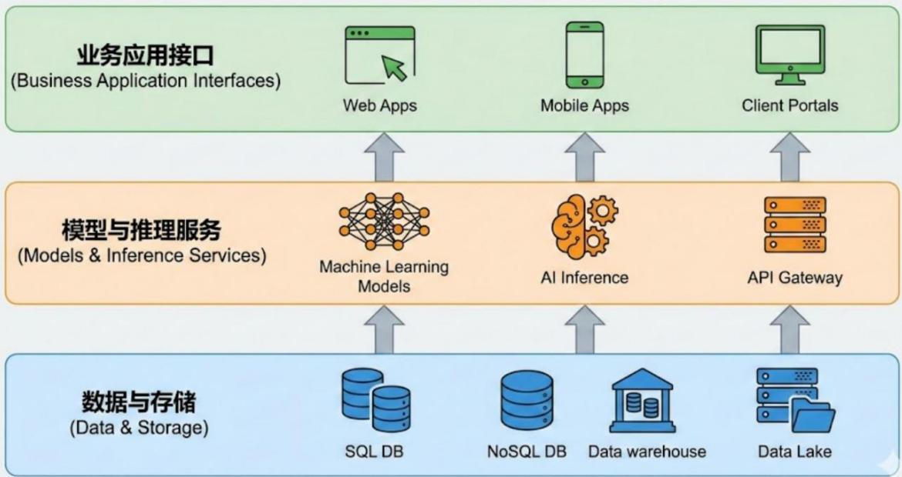

DoclNo.:QR-QUSM-02-2001 Doc. Title:SMIC Document Control Procedure Rec.:1 Page No.:1/9

## Semiconfuctor Manufacturing International Corporation

## AI 应用落地方案说明书

1. Project background and objectives .... 3
1.1. DCC: Document Control Center.... 3
1.2. DCN: Document Change Notice(for Company Rules and Regulations).... 3
1.3. DMS: Document Management System.... 3
1.4. Background description.... 3
1.4.1. Industry prospects1.... 3
1.4.2. Industry prospects2.... 3
1.4.3. Industry prospects3.... 3
1.4.4. Industry prospects4.... 3
1.4.5. Industry prospects.... 3
1.4.6. Main pain points.... 3
1.5. Construction objectives.... 3
2. Overall scheme design.... 4
2.1. Overview of system architecture.... 4
2.2. 技术选型说明.... 4
2.2.1. 后端与基础设施.... 4
2.2.2. 模型相关.... 4
2.2.3. 其他模型相关.... 5
2.3. Technical selection description.... 5
2.3.1. Backend and Infrastructure.... 5
2.3.2. Model-related.... 5
2.3.3. Other model-related.... 5
2.3.4. Backend and Infrastructure.... 5
2.3.5. Model-related.... 5
2.3.6. Other model-related.... 5
2.3.7. RAG: Retrieval Augmented GenerationOther model-related.... 5
2.3.8. Other model-related.... 5
3. Core functional modules.... 6
3.1. All documents generated by function departments should be named according to the below-mentioned categories of documents.... 6
3.1.1. Data Source.... 6
3.1.2. All documents generated by function de.... 6
3.1.3. 数据处理模块包括以下流程.... 6
3.2. 模型服务模块.... 6
3.2.1. 推理服务.... 6

The information contained herein is exclusive property of SIMC, and shall not be distributed, reproduced, or disclosed in whole or in part without priornwrittn permission of SMIC

DoclNo.:QR-QUSM-02-2001 Doc. Title:SMIC Document Control Procedure Rec.:1 Page No.:2/9
3.2.2. 模型更新策略....6
3.3. 应用层模块....6
3.3.1. 典型应用场景....6
3.3.2. 权限与安全....7
4. 4. Implementation plan and milestones....7
4.1. Categories and hierarchy of documents....7
4.2. 实施阶段划分....7
4.3. 风险与应对....7
4.3.1. 技术风险....7
4.3.2. 业务风险....8
5. Attachment....8
5.1. Attachment1: Formate for xxxx1....8
5.2. Attachment1: Formate for xxxx2....8
5.3. Attachment1: Formate for xxxx3....8
5.4. Attachment1: Formate for xxxx4....8
5.5. Attachment1: Formate for xxxx5....8
5.6. Attachment1: Formate for xxxx6....错误! 未定义书签。
5.7. Attachment1: Formate for xxxx7....错误! 未定义书签。
5.8. Attachment1: Formate for xxxx8....错误! 未定义书签。
5.9. Attachment1: Formate for xxxx9....错误! 未定义书签。
5.10. Attachment1: Formate for xxxx10....错误! 未定义书签。
6. 总结与展望....8

## Semiconfuctor Manufacturing International Corporation

<table><tr><td>DoclNo.:QR-QUSM-02-2001</td><td>Doc. Title:SMIC Document Control Procedure</td><td>Rec.:1</td><td>Page No.:3/9</td></tr></table>

1. Project background and objectives

1.1. DCC: Document Control Center

1.2. DCN: Document Change Notice(for Company Rules and Regulations)

1.3. DMS: Document Management System

## 1.4. Background description

With the continuous evolution of artificial intelligence technology, large language models (LLM) and multimodal models have demonstrated remarkable capabilities in comprehension, generation, and reasoning. An increasing number of enterprises are beginning to experiment with integrating AI technology into their actual business processes, aiming to enhance information processing efficiency, optimize decision-making quality, and reduce reliance on human experience. Against this backdrop, the focus of AI application has gradually shifted from "model effect demonstration" to "systematic implementation capability". How to embed model capabilities into existing business systems in a stable and controllable manner has become a common concern for both technical and business teams.

1.4.1. Industry prospects1

1.4.2. Industry prospects2

1.4.3. Industry prospects3

1.4.4. Industry prospects4

1.4.5. Industry prospects

The current industry as a whole exhibits the following characteristics:

\- The capabilities of pre-trained models have rapidly improved, but there are still differences in scenario generalization

\- The scale of internal data within the enterprise continues to grow, leading to a strong demand for intelligent retrieval and analysis

\- AI systems are gradually evolving from single-point applications towards platformization and servitization

## 1.4.6. Main pain points

In the actual implementation process, common issues include but are not limited to:

\- The data sources are complex, with a coexistence of structured, semi-structured, and unstructured data

\- The coupling between model services and business logic is too high, resulting in poor system maintainability

\- Without a unified evaluation and monitoring mechanism, it is difficult to continuously ensure the effectiveness of the model

## 1.5. Construction objectives

A. The goal of this project is to build an AI application system that is scalable, maintainable, and implementable,

B. Capable of supporting multiple business scenarios within the enterprise,

C. Provide a technical foundation for subsequent iterations.

## Semiconfuctor Manufacturing International Corporation

<table><tr><td>DoclNo.:QR-QUSM-02-2001</td><td>Doc. Title:SMIC Document Control Procedure</td><td>Rec.:1</td><td>Page No.:4/9</td></tr></table>

## 2. Overall scheme design

## 2.1. Overview of system architecture

The system is designed with a layered architecture, encompassing a data layer, a model layer, and an application layer. This design ensures the independence between modules and facilitates the addition of new functional modules in the future.

## 2.2. 技术选型说明

## 2.2.1. 后端与基础设施

\- 编程语言：Python

\- 服务框架：FastAPI

\- 模型部署：vLLM / Triton

\- 容器与编排: Docker + Kubernetes

## 2.2.2. 模型相关

\- 大语言模型 (LLM)

\- 向量模型 (Embedding)

\- RAG 检索增强生成

## Semiconfuctor Manufacturing International Corporation

<table><tr><td>DoclNo.:QR-QUSM-02-2001</td><td>Doc. Title:SMIC Document Control Procedure</td><td>Rec.:1</td><td>Page No.:5/9</td></tr></table>

## 2.2.3. 其他模型相关

\- 视觉大模型 (VLM)

\- 向量模型 (Embedding)

\- RAG 检索增强生成

## 2.3. Technical selection description

2.3.1. Backend and Infrastructure

\- Programming language: Python

• Service framework: FastAPI

• Model deployment: vLLM / Triton

\- Containers and orchestration: Docker + Kubernetes

## 2.3.2. Model-related

• Large Language Model (LLM)

• Vector model (Embedding)

• RAG: Retrieval Augmented Generation

## 2.3.3. Other model-related

• Visual Large Model (VLM)

• Vector model (Embedding)

• RAG: Retrieval Augmented Generation

2.3.4. Backend and Infrastructure

• Programming language: Python

• Service framework: FastAPI

• Model deployment: vLLM / Triton

\- Containers and orchestration: Docker + Kubernetes

## 2.3.5. Model-related

• Large Language Model (LLM)

• Vector model (Embedding)

• RAG: Retrieval Augmented Generation

## 2.3.6. Other model-related

• Visual Large Model (VLM)

• Vector model (Embedding)

## 2.3.7. RAG: Retrieval Augmented Generation Other model-related

• Visual Large Model (VLM)

• Vector model (Embedding)

• RAG: Retrieval Augmented Generation

2.3.8. Other model-related

• Visual Large Model (VLM)

• Vector model (Embedding)

The information contained herein is exclusive property of SIMC, and shall not be distributed, reproduced, or disclosed in whole or in part without priornwrittn permission of SMIC

## Semiconfuctor Manufacturing International Corporation

<table><tr><td>DoclNo.:QR-QUSM-02-2001</td><td>Doc. Title:SMIC Document Control Procedure</td><td>Rec.:1</td><td>Page No.:6/9</td></tr></table>

• RAG: Retrieval Augmented Generation

• Service framework: FastAPI

## 3. Core functional modules

3.1. All documents generated by function departments should be named according to the below-mentioned categories of documents.

## 3.1.1. Data Source

A. Equipment pperation instruction

<table><tr><td>Data Type</td><td>Data Type</td><td>Data Type</td><td>Data Type</td></tr><tr><td>Document Data</td><td>Document Management System</td><td>PDF / DOCX</td><td>Daily</td></tr><tr><td>Tabular Data</td><td>Business Databases</td><td>CSV / XLSX</td><td>Real-time</td></tr><tr><td>Log Data</td><td>Application Systems</td><td>JSON</td><td>Real-time</td></tr></table>

B. Other documents

<table><tr><td>Data Type</td><td>Data Type</td><td>Data Type</td><td>Data Type</td></tr><tr><td>Document Data</td><td>Document Management System</td><td>PDF / DOCX</td><td>Daily</td></tr><tr><td>Tabular Data</td><td>Business Databases</td><td>CSV / XLSX</td><td>Real-time</td></tr><tr><td>Log Data</td><td>Application Systems</td><td>JSON</td><td>Real-time</td></tr></table>

## 3.1.2. All documents generated by function de

3.1.3. 数据处理模块包括以下流程

\- 清洗无效数据，去除空值与重复数据

\- 结构化与切分 (Chunking)

\- 向量化与索引构建，用于快速检索和匹配

## 3.2. 模型服务模块

## 3.2.1. 推理服务

模型通过统一的 API 服务对外提供能力，支持高并发和流式输出，以满足业务实时性要求。

## 3.2.2. 模型更新策略

\- 支持模型热更新，避免服务中断

\- 支持多版本并行部署，便于 A/B 测试和回滚

## 3.3. 应用层模块

3.3.1. 典型应用场景

\- 智能问答助手

## Semiconfuctor Manufacturing International Corporation

<table><tr><td>DoclNo.:QR-QUSM-02-2001</td><td>Doc. Title:SMIC Document Control Procedure</td><td>Rec.:1</td><td>Page No.:7/9</td></tr></table>

\- 文档检索与总结

\- 业务辅助决策

## 3.3.2. 权限与安全

\- 用户身份鉴权

\- 请求审计与日志记录

\- 数据访问控制

## 4. 4. Implementation plan and milestones

4.1. Categories and hierarchy of documents

<table><tr><td>Task ID</td><td>Task Des</td><td>Priority</td><td>Assigned Department</td><td>Estimated Hours</td><td>Status</td></tr><tr><td>T-001</td><td>Initial Client Consultation</td><td>High</td><td>Sales</td><td>4</td><td>Completed</td></tr><tr><td>T-002</td><td>Requirement Analysis</td><td>Critical</td><td>Engineering</td><td>12</td><td>In Progress</td></tr><tr><td>T-003</td><td>Market Competitor Audit</td><td>Medium</td><td>Marketing</td><td>8</td><td>Pending</td></tr></table>

4.2. 实施阶段划分

<table><tr><td>Task ID</td><td>Task Des</td><td>Priority</td><td>Assigned Department</td><td>Estimated Hours</td><td>Status</td></tr><tr><td>T-001</td><td>Initial Client Consultation</td><td>High</td><td>Sales</td><td>4</td><td>Completed</td></tr><tr><td>T-002</td><td>Requirement Analysis</td><td>Critical</td><td>Engineering</td><td>12</td><td>In Progress</td></tr><tr><td>T-003</td><td>Market Competitor Audit</td><td>Medium</td><td>Marketing</td><td>8</td><td>Pending</td></tr></table>

## 4.3. 风险与应对

## 4.3.1. 技术风险

## Semiconfuctor Manufacturing International Corporation

<table><tr><td>DoclNo.:QR-QUSM-02-2001</td><td>Doc. Title:SMIC Document Control Procedure</td><td>Rec.:1</td><td>Page No.:8/9</td></tr></table>

\- 系统性能瓶颈 $\rightarrow$ 采用分布式部署与负载均衡

## 4.3.2. 业务风险

\- 需求变更频繁 $\rightarrow$ 采用模块化设计与灵活迭代

\- 数据安全问题 $\rightarrow$ 强化访问控制和日志审计

## 5. Attachment

5.1. Attachment1: Formate for xxxxx1

5.2. Attachment1: Formate for xxxx2

5.3. Attachment1: Formate for xxxxx3

5.4. Attachment1: Formate for xxxxx4

5.5. Attachment1: Formate for xxxxx5

## 6. 总结与展望

## 6.1. Effective period of TECN

SMIC document security levels are categorized accounting to the security control level's defined in “CR-GWNL-01-1001 SMIC Classified Information Protection Policy (CIPP)” as follows

Security B-SMIC Confidential

Security C-SMIC Restricted

## 6.2. Effective period of TECN

A. Document format should follow the requirements sign-off

B. Document sign-off should follow the requirements in item 20

C. Document access authority should follow the requirements in item 18.2

D. Document effectiveness cycle time should be within 14 working days

6.3. All documents generated by function departments should be named according to the below-mentioned categories of documents for example,"SMIC Document Control Procedure" Document title naming rules are follows:

## 6.3.1. FAB documents

A. Equipment operation instruction

<table><tr><td>Document Scope</td><td>Naming Rule Format</td></tr><tr><td>200mm Fab</td><td>SMIC 200mm XXX(Module)XXX(Equipment/System Name)O.I.E.gSMIC 200mm ETCH LAM TCP 9400 DFMP.M. O.I.</td></tr><tr><td>300mm Fab</td><td>SMIC 300mm XXX(Module)XXX(Equipment/System Name)O.I.E.gSMIC 300mm Etch AMAT eMAX O.I.</td></tr></table>

The information contained herein is exclusive property of SIMC, and shall not be distributed, reproduced, or disclosed in whole or in part without priornwrittn permission of SMIC

## Semiconfuctor Manufacturing International Corporation

<table><tr><td>DoclNo.:QR-QUSM-02-2001</td><td>Doc. Title:SMIC Document Control Procedure</td><td>Rec.:1</td><td>Page No.:9/9</td></tr></table>

<table><tr><td>ALL Fab :Moduleis operational</td><td>SMIC XXX(Module)XXX(Equipment/System Name)O.I.E.g SMIC LITHO Entegris XCDA PM O.I.</td></tr></table>

## B. Other documents

<table><tr><td>Document Scope</td><td>Naming Rule Format</td></tr><tr><td>200mm Fab</td><td>SMIC 200mm XXX(Module)XXX(Function/System Name)Rule/ProcedureE.g. SMIC 200mm MFG Production Plan Review Procedure</td></tr><tr><td>300mm Fab</td><td>SMIC 300mm XXX(Module)XXX(Function/System Name)Rule/ProcedureE.g. SMIC 300mm YE Recipe Request Procedure</td></tr><tr><td>ALL Fab :Moduleis operational</td><td>SMIC XXX(Module)XXX(Function/System Name)Rule/Procedure E.g. SMIC PIE PCM(Process Control Monitor) Specification Control Procedure</td></tr></table>

## 6.3.2. Non-FAB documents/DCN

(E.g. Mask Operation, RE lab, Facility, etc)

<table><tr><td>Document Scope</td><td>Naming Rule Format</td></tr><tr><td>SMIC(SH,BJ,TJ,SZ)</td><td>SMIC (XX)(Site) XXX(Function area)XXX(Equipment/System name)O.I./Rule/Procedure/Guideline/PolicyE.g. SMIC (SH/BJ) Information Equipment Management Protection Procedure</td></tr><tr><td>SMIC and SMIC managed facilities</td><td>SMIC XXX(Function Area)XXX(Function/Equipment/System Name)O.I./Rule/ProcedureE.g. SMIC Facility UPS O.I.</td></tr></table>

## 6.3.3. Technology development related documents naming rule is defined in

“TD-GENL-01-2047 SMIC Design Rules Template” and “TD-GENL-01-2064 SMIC PDK Document Title and Attached File Naming Rule”