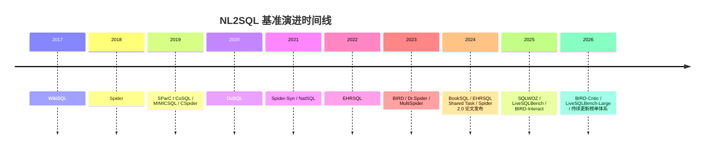

#  NL2SQL 基准全景研究报告

## 执行摘要

截至 **2026-07-22**，NL2SQL 基准已经从早期的**单表、单轮、短 SQL**（如 WikiSQL）演进到 **跨域多表组合推理**（Spider）、**多轮/对话式状态追踪**（SParC、CoSQL、SQLWOZ）、**鲁棒性评测**（Spider-Syn、Dr.Spider）、**大规模真实业务库与外部知识**（BIRD、LiveSQLBench）、以及**企业级长上下文与多方言工作流**（Spider 2.0）等多条线并行发展的局面。若把“研究价值”与“工程贴近度”合在一起看，当前最有代表性的主干序列大致是：**WikiSQL → Spider → BIRD / EHRSQL → Spider 2.0 / LiveSQLBench**。citeturn14search3turn23search8turn28view2turn33view0turn40view0turn17search13

从“最全面”这个目标看，**Spider 家族**仍是论文对比的共同语境，但它已不足以代表现实部署难度：Spider 1.0 官方页在 2024 年已停止接收提交；相比之下，Spider 2.0 把任务扩展到真实企业数据环境、长上下文、多 SQL 方言与代理式工作流，LiveSQLBench 则进一步强调**持续更新、污染控制、真实 CRUD/BI 场景**。BIRD 则位于两者之间：它仍是“单问单答”范式，但把数据库规模、脏值、外部知识和 SQL 效率显式纳入评测。citeturn10search1turn40view1turn17search13turn28view2turn28view3

若以**最权威成绩**为准，Spider/SParC/CoSQL 仍以官方 challenge 页为主；BIRD、Spider 2.0、LiveSQLBench、EHRSQL 则分别有更活跃的官方榜单或 shared task。需要特别说明两点：其一，**NatSQL 严格说不是独立 benchmark，而是面向 Spider 系列的中间表示与标注层**；其二，按“SEQUELIZE”这一精确名称检索，截至 2026-07 未发现被 ACL/EMNLP/NeurIPS/ICLR/NAACL/AAAI 社区广泛承认的同名 canonical NL2SQL 基准，主流检索结果几乎都指向同名 Node.js ORM“Sequelize”，因此本文将其标记为**待核实名称**而非可确认 benchmark。citeturn20view1turn18search0turn18search2turn19search21

## 覆盖范围与时间线

本文覆盖的核心基准包括：**WikiSQL、Spider、Spider-Syn、SParC、CoSQL、NatSQL、MIMICSQL、EHRSQL、MultiWOZ-SQL（按正式发布名记为 SQLWOZ）、BIRD、Dr.Spider、BookSQL、Spider 2.0、LiveSQLBench**；并补充中文/多语方向的重要资源 **CSpider、DuSQL、MultiSpider**。其中，**NatSQL** 主要用于降低 SQL 表达难度、服务 Spider/SParC/CoSQL；**SQLWOZ** 是 2025 年正式发布、以 MultiWOZ ontology 为基础构建的 SQL 化 TOD 基准，可视作用户所说“MultiWOZ-SQL”的正式对应物。citeturn20view1turn33view0turn38view1turn28view2turn38view2turn38view0turn40view0turn17search13turn30search15turn30search1turn30search11

下面这张时间线更适合放在汇报或综述幻灯片里；若做正式图表，建议把**任务范式**（静态/交互）、**领域**（通用/医疗/财务）、**评测指标**（EM/EX/TS/Success Rate/RS）用颜色区分。时间线中的时间点来自各数据集论文或官方主页。citeturn14search3turn23search8turn10search14turn10search6turn37view3turn21view0turn20view1turn31view1turn30search11turn28view2turn38view0turn40view0turn17search13turn38view1

## 基准逐项评析

**WikiSQL**（Salesforce, 2017）是最早的大规模表格问答到 SQL 数据集之一，包含 **80,654** 对问句-SQL，分布在 **24,241** 张 Wikipedia 表上，核心任务是**单轮、单表、静态、英文** SQL 生成；标注采用众包与模板化流程，典型指标是**逻辑形式准确率与执行准确率**。它的价值在于数据规模和训练便利，但 SQL 只覆盖简单 `SELECT / WHERE / AGG`，**不含 JOIN**，今天更适合作为预训练/热身集而不是“综合能力”评测集。典型早期基线是 **Seq2SQL**；到 2020 年代中期，该集整体已接近饱和，因此 2025 年甚至出现了对其进行再清洗和升级的 **LLMSQL** 工作。citeturn14search0turn14search3turn15search19turn17search11

**Spider**（Yale, 2018）仍是学术界最核心的**跨域、多表、复杂 SQL** 静态 benchmark：**10,181** 个问题、**5,693** 个唯一 SQL、**200** 个数据库、**138** 个领域，训练/测试数据库不重叠。官方自 2020 年起把 **Test Suite Accuracy** 作为正式指标；截至官方榜单冻结前，测试集 **MiniSeek** 达到 **91.2 TSA / 81.5 EM**，而 2023 年的 **DAIL-SQL + GPT-4 + Self-Consistency** 也达到 **86.6 TSA**。它覆盖 JOIN、嵌套、聚合、集合运算等，是“模型 SQL 结构推理”最标准的参照；但也存在**测试污染、模板记忆、annotation noise、对现实长上下文不足**等问题。citeturn23search8turn12view0turn12view1turn12view3turn10search1

**SParC** 与 **CoSQL**（Yale + Salesforce, 2019）把 Spider 扩展到**多轮上下文**。SParC 包含 **4,298** 个问题序列、**12k+** 单问句、**200** 个复杂数据库、**138** 个领域，主打**上下文条件 SQL 生成**；CoSQL 则是 **3k 对话、30k+ turns、10k+ SQL** 的 Wizard-of-Oz 对话数据，同时包含 SQL-grounded DST 和 response generation。官方榜单上，SParC 的最好公开成绩仍集中在 2022 年：**RASAT+PICARD** 达到 **74.0 执行问级 / 52.6 交互级**，而 **STAR** 在 Exact Set Match 上有 **67.4 问级 / 46.6 交互级**；CoSQL 上 **STAR** 的 Exact Set Match 为 **57.8 / 28.2**，**RASAT+PICARD** 的 execution with values 为 **66.3 / 37.4**。这两套数据最适合研究**指代、省略、语义修正、上下文 SQL 演化**；局限是榜单更新趋缓、与现实 agent 工具调用还有距离。citeturn10search0turn10search6turn11view0turn13view1turn13view4

**Spider-Syn**（ACL 2021）是基于 Spider 的**人工同义改写鲁棒性集**：官方论文将其定义为把 Spider 中与 schema 相关的词替换为人工挑选同义词的测试集；后续文献和数据卡普遍采用 **1,034 dev / 7,000 train** 的规模描述。它几乎不增加 SQL 结构难度，但显著削弱“词面 schema linking”；早期论文观察到最稳健模型也会出现大幅下降。到 2025 年，OmniSQL 在该集上报告 **TS 72.1**（32B, major voting），较强基线如 Qwen2.5-Coder-32B-Instruct 为 **70.5**。它适合检验**词汇鲁棒性**，不适合评估真实业务语义漂移的全部面向；若要更系统的鲁棒性诊断，应配合 **Dr.Spider** 使用。citeturn21view0turn23search10turn25view0turn27view0turn38view2

**NatSQL**（EMNLP Findings 2021）严格说不是新 benchmark，而是把 SQL 改写成更“接近自然语言”的中间表示，官方代码直接建立在 Spider 数据之上，并支持把 **NatSQL / NatSQL_G** 转回 SQL 做评测。它的研究意义在于：把难点从“直接生成复杂 SQL”部分转移为“先生成更自然的 IR，再还原 SQL”，因此常见于 Spider 系列方法中，用于提升 EM/EX；但若把它与 Spider 并列成独立 benchmark，会混淆“数据集”和“表示层”的边界。工程上，NatSQL 更像**建模技巧**而不是最终验收数据集。citeturn20view1

**MIMICSQL**（2019）是早期医疗 NL2SQL 代表，面向电子病历问题生成 SQL，论文提出 **TREQS**（Translate-Edit）。EHRSQL 论文对比表给出的规模是 **10K 样本、1 个数据库、5 张表、约 7K 行/表**；它的长处是**真实医疗缩写、拼写噪声、领域术语**，但数据库规模和任务范式仍较受限。2022 年之后，医疗方向的主战场实际已转向 **EHRSQL / EHRSQL-2024**。citeturn37view3turn33view0

**EHRSQL**（NeurIPS Datasets & Benchmarks 2022）把医疗 NL2SQL 提升到“**可信语义解析**”层面：问题来自 **222 位医院工作人员** 的真实需求，链接到 **MIMIC-III 与 eICU** 两个 EHR 数据库；全量约 **24,411** 问对，官方发布的 train+valid 约 **21K**。它不仅强调多表、多层嵌套与极强的**时间表达**（表中报告 **93.2%** 查询涉及时间列），还把**不可回答问题**纳入验证/测试，并用 **F1ans、Pexe、Rexe、F1exe** 等指标联合评估。2024 shared task 则迁移到 **MIMIC-IV Demo，17 表、5124/1163/1167 train/dev/test**，以 **Reliability Score RS(10)** 为主指标；LG AI Research & KAIST 的 **PLUQ** 在官方 test 榜单达到 **RS(10)=81.32**，拿到第一。这个基准对医疗问答与高风险场景非常重要，但门槛高、数据访问和合规要求也更严格。citeturn31view1turn31view2turn31view3turn33view0turn34view1turn36view0turn36view1

**BIRD**（NeurIPS 2024）是 2023–2026 期间最关键的新主数据集之一：官方主页给出 **12,751+** 唯一问句-SQL、**95** 个“大型数据库”、总大小 **33.4GB**、覆盖 **37+** 专业领域，并显式强调**脏值、外部知识、生成高效 SQL**。官方单模型榜单截至 2026-07 的最佳测试成绩为 **AskData + GPT-4o：81.95 EX**；紧随其后还有 Agentar-Scale-SQL、Sber Text2SQL、Xiaomi Text2SQL 等。BIRD 的价值在于把“看 schema 生成 SQL”推进到“**理解大量 DB content 与业务知识**”；局限是 hidden test 与 Oracle Knowledge 设定会让复现实验更复杂。其后续扩展 **BIRD-Interact** 又把评测拓展到 conversational / agentic 交互，官方新闻中最好成绩约为 **24.4% c-Interact Success Rate** 与 **17.78% a-Interact Success Rate**。citeturn28view2turn28view3turn9view2turn8view3

**Dr.Spider**（ICLR 2023）是目前最系统的**诊断式鲁棒性 benchmark** 之一，基于 Spider 设计了 **17 类扰动**，覆盖数据库、自然语言问题与 SQL 三个层面。论文指出，即便最稳健模型，整体性能也会下降 **14.0%**，在最难扰动上下降 **50.7%**。它不追求真实业务规模，而是追求“**找出模型究竟怕什么**”；因此非常适合作为论文中的 robustness appendix，但不应替代主 benchmark。citeturn38view2

**BookSQL**（NAACL 2024）代表**财务/会计行业专域**：数据集包含 **100k** 自然语言查询-SQL 对，以及 **100 万条记录** 的会计数据库。论文直接指出，即便是包括 GPT-4 在内的现有强模型，在该域仍有明显性能差距。它适合评估**垂直专业术语、财务报表逻辑、领域 schema 稳定但语义要求高**的场景；局限是领域窄、跨域泛化参考性弱。citeturn38view0

用户所说的 **MultiWOZ-SQL**，截至 2026-07 在主流论文里更标准的名称是 **SQLWOZ**（EMNLP 2025）：它基于 MultiWOZ ontology 构建 **SQL-based dialogue state representation**，覆盖 **5 域、18,365 对话、235,354 turns**，并把 SQL API 调用纳入 TOD 评测。它不是传统“给定 schema 直接写完整 SQL”的静态 benchmark，而是**多轮、对话、可多次 API 调用**的 SQL 状态追踪与响应生成任务。论文中 SQL-based DST 的一组代表性结果里，**Qwen 3 (8B)** 的 All-API / SQL / Others 综合分数优于更小模型，表明该集难点更多来自**复杂用户约束与交互式规划**，而不只是 SQL 语法本身。citeturn17search0turn38view1turn39view0turn39view4turn39view5

**Spider 2.0** 与 **LiveSQLBench** 是当前最贴近生产环境的两条线。Spider 2.0 官方站给出三个设置：**Spider 2.0-Snow 547 例、Spider 2.0-Lite 547 例、Spider 2.0-DBT 68 例**；论文页强调复杂 enterprise workflow、>3000 列、长上下文、多方言与 transformation/analytics。原论文初始对比中，**o1-preview 仅 17.1% success、GPT-4o 仅 10.1%**；但到 2026-07，官方 Snow 榜单头部代理系统已超过 **96%**。LiveSQLBench 则是持续演进、去污染、真实任务导向的新榜单体系；截至 **2026-03-02** 的 Base-Full v1 榜单中，最佳 agent 为 **DIA 48.00% Success Rate**。这两者共同说明：**学术 benchmark 已从“正确 SQL”转向“完成真实数据工作流”**。citeturn40view0turn40view1turn40view2turn9view1turn17search13

## 关键属性汇总表

| 基准名 | 年份 | 任务类型 | 样本数 | 数据库数 | 语言 | 主要 SQL / 能力特性 | SOTA 或代表最佳 | 链接 |
|---|---:|---|---:|---:|---|---|---|---|
| WikiSQL | 2017 | 单轮、单表、静态 | 80,654 | 24,241 表 | 英文 | `SELECT/WHERE/AGG`，无 JOIN | 经典基线 Seq2SQL；现已近饱和，更多作预训练/热身 | 官方数据集 citeturn14search0turn14search3 |
| Spider | 2018 | 单轮、跨域、静态 | 10,181 | 200 | 英文 | JOIN、嵌套、聚合、集合运算 | 官方榜单归档：MiniSeek **91.2 TSA / 81.5 EM**；DAIL-SQL+GPT-4 **86.6 TSA** citeturn12view1turn12view3 | 主页/榜单 citeturn10search1 |
| SParC | 2019 | 多轮、跨域、上下文式 | 4,298 序列 / 12k+ 问句 | 200 | 英文 | 上下文依赖、查询修正、交互级评测 | RASAT+PICARD **74.0 / 52.6**（执行问级/交互级）；STAR **67.4 / 46.6**（EM） citeturn11view0 | 主页/榜单 citeturn10search0 |
| CoSQL | 2019 | 多轮、跨域、对话式 | 3k 对话 / 30k+ turns / 10k+ SQL | 200 | 英文 | DST、澄清、response generation | STAR **57.8 / 28.2**（EM）；RASAT+PICARD **66.3 / 37.4**（execution） citeturn13view1turn13view4 | 主页/榜单 citeturn10search6 |
| MIMICSQL | 2019 | 单轮、单域、医疗 | 10K | 1 | 英文 | 医疗缩写、拼写噪声、条件值拷贝 | 代表基线 TREQS；现多被 EHRSQL 取代 | 原论文 / 规模对照 citeturn37view3turn33view0 |
| Spider-Syn | 2021 | 单轮、跨域、鲁棒性 | 7,000 train / 1,034 dev | 继承 Spider | 英文 | 同义替换鲁棒性、schema linking 弱化 | OmniSQL-32B **72.1 TS**（major）；Qwen2.5-Coder-32B **70.5 TS** citeturn23search10turn27view0 | 论文/代码 citeturn21view0turn20view2 |
| NatSQL | 2021 | IR/标注层，不是独立测试集 | 基于 Spider 等 | 继承原集 | 英文 | 简化 SQL 表达、IR→SQL 转换 | 更常作为建模技巧使用，而非独立榜单 | 论文/代码 citeturn20view0turn20view1 |
| EHRSQL | 2022 | 单轮、单域、医疗可信解析 | 24,411；公开约 21K train+valid | 2 | 英文 | 时间表达、嵌套、不可回答问题 | Shared Task 2024：PLUQ **RS(10)=81.32**（test） citeturn33view0turn36view0 | 论文/任务页 citeturn34view1turn35search4 |
| Dr.Spider | 2023 | 诊断式鲁棒性 | 基于 Spider 扩展 | 继承 Spider | 英文 | 17 类扰动，数据库/NL/SQL 多层诊断 | 论文报告最稳健模型总体仍降 **14.0%** | 论文citeturn38view2 |
| BIRD | 2023 | 单轮、跨域、真实大库 | 12,751+ | 95 | 英文 | 大库内容、脏值、外部知识、效率 | 官方 test 榜首 AskData+GPT-4o **81.95 EX** citeturn28view2turn9view2 | 主页/榜单 citeturn28view2 |
| BookSQL | 2024 | 单轮、单域、财务 | 100k | 领域库 | 英文 | 财务/会计领域 SQL、专业语义 | 论文强调包括 GPT-4 在内仍有明显差距 | 论文/代码 citeturn38view0turn30search4 |
| Spider 2.0 | 2024 | 单轮+代理、企业级 | Snow 547 / Lite 547 / DBT 68 | 多方言企业库 | 英文 | 长上下文、多方言、工作流、Success Rate | Snow 榜单头部 **96.70**；论文初始基线 o1-preview **17.1**、GPT-4o **10.1** citeturn40view0turn40view1 | 官方主页/榜单 citeturn40view0 |
| SQLWOZ | 2025 | 多轮、对话、交互式 API | 18,365 对话 / 235,354 turns | 5 域 | 英文 | SQL-based DST、多 API 调用、复杂用户约束 | 基线中 Qwen 3 8B 在 SQL-based DST 上领先小模型 citeturn39view4turn39view5 | 论文 citeturn38view1 |
| LiveSQLBench | 2025 | 持续更新、真实工作流 | Base-Full v1 600 样本 | 持续扩展 | 英文 | 污染控制、BI/CRUD、Success Rate | DIA **48.00% Success Rate**（Base，2026-03-02） citeturn9view1 | 官方榜单 citeturn17search13 |
| SEQUELIZE | 待核实 | 未确认 canonical benchmark | — | — | — | 检索结果主要指向 Sequelize ORM，而非数据集 | 建议核对名称或论文链接 | 检索证据 citeturn18search0turn18search2turn19search21 |

## 横向比较

如果把这些基准放在同一坐标系里比较，**覆盖领域**上，WikiSQL/Spider/SParC/CoSQL 代表通用研究集，MIMICSQL/EHRSQL 是医疗垂域，BookSQL 是财务垂域，SQLWOZ 是对话系统，BIRD/Spider 2.0/LiveSQLBench 则更贴近企业数据应用；**复杂 SQL 特性**上，WikiSQL 明显最弱，Spider 家族强于传统单表集，BIRD 增加了大库内容与效率约束，Spider 2.0/LiveSQLBench 则把难点推进到**多方言、长 schema、文档读取、代理执行**。citeturn14search3turn23search8turn28view2turn33view0turn38view0turn38view1turn40view1turn17search13

在**自然语言多样性与上下文依赖**上，Spider 本质仍偏“单问句到 SQL”；SParC/CoSQL/SQLWOZ 更适合考察对话历史、省略、澄清和状态更新。Spider-Syn 与 Dr.Spider 不主要提升 SQL 难度，而是提高**评测分辨率**：一个测同义替换，一个测多类型扰动。实践中，如果你的模型在 Spider 高分、但在 Spider-Syn/Dr.Spider 退化明显，通常说明它依然在依赖脆弱的表面 schema linking。citeturn11view0turn13view1turn39view4turn21view0turn38view2

在**评估可靠性**上，EM 往往会低估“语义等价但写法不同”的 SQL，而单数据库 execution accuracy 又可能高估正确性，因此 Spider 官方改用 **Test Suite Accuracy**，CoSQL/SParC 也强调 set-match / test suite；BIRD 使用 EX，但还在榜单上标明是否使用 **Oracle Knowledge**；EHRSQL 更进一步，把“答不该答的问题”纳入主指标 **RS**；Spider 2.0 和 LiveSQLBench 则改用更贴近工程结果的 **Success Rate**。这意味着：**研究论文若只报 Spider EM，已不足以说明部署质量**。citeturn12view0turn13view2turn28view3turn36view1turn40view1turn9view1

在**可复现性与数据质量**上，旧 benchmark 的问题主要是 annotation mismatch、schema noise 与榜单停更；新 benchmark 的问题则转向**评测成本更高、闭源模型参与更多、真实业务规则变化更快**。BIRD 官方在 2025 年就发布了更干净的开发集，Spider 2.0 说明榜单分数会随 evaluator 校验微调，LiveSQLBench 强调持续演进与污染控制，而 2026 年已有专门工作系统讨论 text-to-SQL benchmark 的 annotation errors。换句话说，越“现实”的 benchmark，越难做到“永恒稳定”。citeturn10search1turn28view3turn40view0turn17search13turn24search8

若要做一张“覆盖特性条形图”，我建议用五个维度：**SQL 复杂度、上下文依赖、现实数据库规模、评测可靠性、工程贴近度**。按这五维的定性排序，大致可写成：**Spider 2.0 ≈ LiveSQLBench > BIRD > EHRSQL > Spider > SParC / CoSQL > WikiSQL**；而**鲁棒性维度**则应单列，**Dr.Spider 与 Spider-Syn**会排在最前。这个图比雷达图更易读，也更适合综述中快速说明“为什么 Spider 高分不等于生产可用”。citeturn40view1turn17search13turn28view2turn33view0turn23search8turn11view0turn13view1turn38view2turn21view0

## 选型建议与研究空白

如果你的目标是**学术可比性**，首选仍然是 **Spider + BIRD**：前者保证与历史工作对齐，后者补足大库内容与真实业务语义；如果还关心对话，加入 **SParC/CoSQL**，若关心鲁棒性，再补 **Spider-Syn/Dr.Spider**。如果你的目标是**工程部署前验收**，则应优先用 **Spider 2.0、LiveSQLBench、EHRSQL/BookSQL** 这类更接近生产的集，并至少同时报告 **结构正确性、执行正确性、拒答/回退能力、成本/时延**。citeturn23search8turn28view2turn40view1turn17search13turn33view0turn38view0

对未来 benchmark 设计，我认为有三条最关键。第一，继续从“静态单次生成”转向“**带工具、带文档、带用户澄清**”的代理式评测；第二，把 **评测可靠性** 放到与准确率同等级的位置，避免 EX/EM 单指标误导；第三，把**多语言与多方言**真正做实。2023 年的 MultiSpider、2025 年的 MultiSpider 2.0、2025 年的 SQLWOZ 都说明这一方向已经启动，但统一榜单和高质量公开评测还远未成熟。citeturn30search11turn30search16turn38view1turn40view1turn17search13

当前最大的研究空白主要有四个：**长上下文企业知识接地**、**交互式修正与安全拒答**、**多语/多方言统一评测**、以及**benchmark 污染与标注误差校正**。这也是为什么 2025–2026 年的前沿工作越来越从“继续刷 Spider”转向 **BIRD-Interact、Spider 2.0、LiveSQLBench、BIRD-Critic** 等新任务形态。若只用旧式 benchmark，很容易高估系统在真实数据库产品中的可用性。citeturn8view3turn40view0turn17search13turn28view3turn24search8