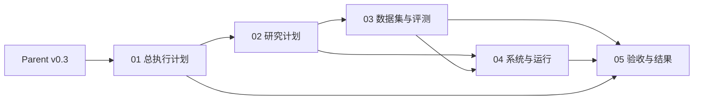

# v0.3 执行 TODO 导航

> 日期：2026-07-29 ｜ 状态：Draft TODO ｜ Parent plan：[v0.3](../v0.3.md)

本目录把 [MOI RAG 产品级 Benchmark 计划 v0.3](../v0.3.md) 分解为可排期、可验收、可追溯的执行项，不另立指标、阈值、数据合同或运行规则。若本目录任何文字与 v0.3 冲突，以 v0.3 为唯一权威；应先修订并批准母计划，再同步这些执行文档。

## 1. 五份文档

| 顺序 | 文档 | 用途 | 主要使用者 |
|---:|---|---|---|
| 1 | [总执行计划](01-master-execution-plan.md) | 统一范围、角色、依赖、阶段门禁、关键路径、总估时和周节奏 | RAG Owner、全体执行者 |
| 2 | [研究计划](02-research-plan.md) | 为身份、Native 路径、可观察性、运行时默认值、运维、安全、商业条件和 Judge 实现收集决策证据 | RAG Owner、研究负责人、Reviewer |
| 3 | [数据集与评测计划](03-dataset-and-evaluation-plan.md) | 落实 corpus、fresh-control、题目、Gold、Judge、人工审计与统计 | Data & Eval Engineer、Reviewer |
| 4 | [系统与运行计划](04-system-and-run-plan.md) | 落实 contracts、adapters、harness、系统配置、Smoke、Formal run 与运行留痕 | Benchmark Engineer、System Operator |
| 5 | [验收与结果模板](05-acceptance-and-result-template.md) | 汇总 Gate 证据、验收决定、结果分层、限制、审批和发布检查 | Reviewer、Approver、RAG Owner |

## 2. 使用顺序

1. 先阅读母计划，再由 [01](01-master-execution-plan.md) 建立执行基线、负责人、依赖和当前 Gate。
2. 按 [02](02-research-plan.md) 关闭 P0 决策问题；未关闭的阻塞项不得用推断补齐。
3. 研究结论稳定后，[03](03-dataset-and-evaluation-plan.md) 与 [04](04-system-and-run-plan.md) 并行推进，并在 schema、artifact contract、Smoke 和 freeze 点会合。
4. 每个 Gate 用 [05](05-acceptance-and-result-template.md) 记录证据、偏差和签字；不以“任务已做”替代 DoD。
5. Formal run 后继续使用 [05](05-acceptance-and-result-template.md) 完成人工审计、统计、限制披露和发布验收。

Pilot 与 Formal 是两种不同承诺：Pilot 预计 **20–28 人日、3–4 周**，只产生可行性结论，不能通过正式验收，也不能替代 v0.3 要求的 hidden formal set、三次 scored initial attempt、盲审和统计。

## 3. 状态符号

| 符号 | 含义 | 使用规则 |
|---|---|---|
| `- [ ]` | 未开始 | 依赖未满足或尚未领取 |
| `- [~]` | 进行中 | 必须同时记录负责人、开始日期和预计完成日 |
| `- [x]` | 已完成 | DoD 全部满足，且产物、hash/run_id 或审批证据可访问 |
| `BLOCKED` | 阻塞 | 记录阻塞依赖、影响 Gate、决策人和下一检查时间 |
| `N/A` | 不适用或确认不可用 | 仅在 v0.3 允许时使用；须有能力证据、影响披露和 Reviewer 复核 |

不得因产物“基本完成”提前勾选；Gate 失败、无效运行和被替换运行均保留原记录。

## 4. 统一角色

| 角色 | 统一职责 |
|---|---|
| **RAG Owner** | 对范围、优先级、依赖、资源、Gate 材料完整性和跨文档一致性负责 |
| **Benchmark Engineer** | 负责 contracts、adapters、harness、artifact/observability、自动化与工程测试 |
| **Data & Eval Engineer** | 负责 corpus、fresh-control、题目/Gold、Judge 集成、抽样、统计与数据 lineage |
| **System Operator** | 按冻结 runbook 配置、建库、运行、观察、重试诊断、reset/rebuild，并记录人工动作 |
| **Reviewer** | 盲化复核 Gold、Judge 标签、运行证据、偏差与报告，不替代执行者自验 |
| **Approver** | 对身份/安全、freeze、invalid/replacement、Gate 与发布作最终签字；不得以口头同意代替记录 |

表中“角色”默认指主责角色；协作或复核角色会在具体任务中并列。Reviewer 与 Approver 在 v0.3 要求盲化或独立判断的环节不得由该项直接执行者代行。

## 5. 统一估时口径

- `1 人日 = 8 小时`有效工作；产品作业运行、排队和外部审批等待不计入人日，但计入日历和阻塞记录。
- 完整 v0.3 核心执行基线为 **65–85 人日**。建议 **3–4 FTE 并行 8–10 周**；单 FTE 顺序执行约 **13–17 周**。
- 基线之外另留 **20%–30% 风险容量（约 13–26 人日）**，并在日历上保留一次 **re-freeze/re-run 周**。若启用该周，其实际人力从风险容量记账，不回写成“原计划内完成”。
- 外部审批、供应商回复、账户开通和产品排队等待不计人日；它们仍可推迟 Gate 和发布日期。
- 可选 Controlled Generation、延后 Track 和 v0.3 外扩展不含在 65–85 人日内；启用前须另行定范围和预算。

## 6. 依赖图

主依赖是 `身份/研究证据 → corpus 与 contracts → Smoke → 数据/Judge 与配置 freeze → Formal runs → 盲审/统计 → 发布`。03 与 04 可并行，但不能绕过共同 schema、artifact contract、Smoke 和 freeze Gate。

## 7. 更新规则

1. 保持任务 ID 稳定；拆分任务时保留父 ID，新增后缀并更新所有依赖。
2. 状态变化必须在同次更新中附产物链接、版本/hash、run_id 或审批记录；不得只改 checkbox。
3. 新指标、阈值、无效运行规则、范围或 Gate 先改母计划；TODO 文档只同步已生效决定。
4. 数据、配置、Judge 或代码 freeze 后发生变化，记录 change reason、影响范围和新签名；需要时触发 re-freeze/re-run，不覆盖旧记录。
5. `rag/runs/` 中的运行记录不可变；私有/大型 raw、log、trace 放受控外部存储，Git 仅保存索引、hash、访问级别和保留期。
6. 每周由 RAG Owner 对齐 01–05 的状态、估时、风险和 Gate；Reviewer 核对已完成项的证据，Approver 只在材料完整后签字。
7. 如果产品能力只能确认“不可观察”或“不可用”，按 v0.3 报告 observability gap/capability limitation，不从答案行为反推，也不把 N/A 解释为优势。

## 8. 子计划与总人日 Crosswalk

**只有 [01 总执行计划](01-master-execution-plan.md) 的 M01–M33 是 65–85 人日总账。** R/DE/SR/A 是同一工作的专业视图；实际工时必须记到下表对应的 M ID 一次，不能把子计划小计再次相加。

| 子计划 ID | 对应 Master ID | 记账规则 |
|---|---|---|
| R01 | M02 | 全额包含 |
| R02–R03 | M04 | 全额包含 |
| R04–R07、R09 | M05 | 全额包含；与 system manifest 工作共享时按实际主责拆分，不重复 |
| R08 | M03、M05 | 安全审批记 M03，产品证据记 M05 |
| R10–R11 | M06 | 全额包含 |
| R12 | M06、M16、M19 | 研究证据记 M06，实现/校准分别记 M16/M19 |
| DE-01 | M09 | 全额包含 |
| DE-02–DE-04 | M07 | 全额包含 |
| DE-05 | M08 | 全额包含 |
| DE-06–DE-09 | M10 | 全额包含 |
| DE-10 | M09、M10 | schema validator 记 M09，数据实例验证记 M10 |
| DE-11 | M17–M18 | Smoke 分析/修复按实际阶段记账 |
| DE-12、DE-14 | M19 | 全额包含 |
| DE-13 | M16 | 全额包含 |
| DE-15 | M29 | 全额包含 |
| DE-16 | M30 | 全额包含 |
| DE-17 | M31–M32 | 对账记 M31，发布输入记 M32 |
| SR-01 | M02、M04 | 身份字段记 M02，Native/API 证据记 M04 |
| SR-02 | M11 | 全额包含 |
| SR-03 | M20 | 全额包含 |
| SR-04 | M21 | 全额包含 |
| SR-05 | M11、M15 | contract 记 M11，采集实现记 M15 |
| SR-06 | M15、M23 | probe 实现记 M15，正式 readiness 记 M23 |
| SR-07 | M20–M22 | Quick rehearsal 记 M20；Optimized 协议/试验记 M21–M22 |
| SR-08–SR-09 | M28 | 全额包含 |
| SR-10 | M17 | 全额包含 |
| SR-11 | M18–M19 | 工程修复记 M18，dataset/Judge freeze 记 M19 |
| SR-12 | M24 | 全额包含 |
| SR-13 | M25 | 全额包含 |
| SR-14 | M26 | 全额包含 |
| SR-15 | M29、M31 | 回答审计记 M29，invalid 对账记 M31 |
| SR-16 | M27 | 全额包含 |
| SR-17 | M31–M32 | 对账/诊断记 M31，报告输入记 M32 |
| SR-18 | M30–M33 | 统计、报告、审批按 M30–M33 的产物分别记账 |
| A-01 | M31 | 全额包含 |
| A-02 | M26、M31 | batch ledger 记 M26，最终覆盖对账记 M31 |
| A-03–A-04 | M30–M32 | 指标/CI 记 M30，reconciliation 记 M31，表格产物记 M32 |
| A-05 | M29 | 全额包含 |
| A-06 | M27、M31–M32 | capability、failure reconciliation、报告分别记账 |
| A-07 | M32 | 全额包含 |
| A-08 | M33 | 全额包含 |

周报只汇总 M ID 的实际人日。子计划可以记录本地耗时，但必须引用同一个 timesheet entry，不能形成第二套累计值。
