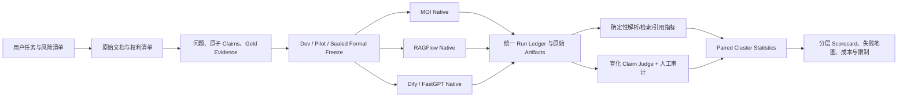

# MatrixOne Intelligence（MOI）RAG Benchmark：定位、必要性与可执行评测方案

> 日期：2026-08-04  
> 状态：研究结论与推荐方案；正式运行前仍需由 Benchmark Owner 冻结为实验协议  
> 资料范围：已审读 `plans/` 下全部现有文件，并核对 MatrixOrigin 官方资料、RAG 评测论文/代码和竞品官方文档  
> **身份不变量：本文及本项目以后所有 “MOI” 均且仅指 MatrixOrigin 的 MatrixOne Intelligence（数据与 AI/RAG 平台），绝不指 `moi-ai.com` 的 MoiAI。**
> 证据口径：带链接的产品能力表示“官方资料已有描述或接口证据”，不自动表示目标租户可用、质量达标或优于竞品；文中的样本量、阈值、优先级和竞品组合均是本项目建议，需经 Gate、pilot 与负责人签字后才成为正式实验合同。

本文使用四类证据标签：`[官方资料事实]` 表示官方文档/代码确实作出该描述或提供该接口，不代表效果已验证；`[厂商主张]` 表示产品定位或效果表述；`[本报告建议]` 表示评测设计判断；`[待实测]` 表示必须在目标版本、租户或镜像上关闭的不确定项。没有标签的规范性“应/必须”均属于本报告方法建议，而非行业统一标准。

## 执行摘要

先给出最重要的结论：

1. **MOI RAG Benchmark 不是一个模型榜，也不是单一数据集。**它是一套对 MatrixOne Intelligence 原生 `原始数据 → 接入 → 解析/切分 → 向量化/索引 → 检索 → Explore 回答/引用` 全链路进行可复现、可审计评测的系统。它应同时包含数据、Gold、系统适配器、运行账本、判分器、统计方法和分层报告。
2. **它直接服务于 MatrixOrigin 的产品、研发、测试、解决方案、售前和管理决策，间接服务于使用企业知识的业务人员与客户。**研发需要知道失败发生在哪一层；发布负责人需要回归门禁；售前和客户需要知道产品是否适合自己的文档、风险与成本，而不是只看一个无上下文的“准确率”。
3. **做它的根本原因是 MOI 的价值主要在“数据到可信答案”的组合产品链路，而普通 RAG 评测往往从已经切好的文本或给定 context 开始。**后者测不到 MOI 最重要、也最容易失败的接入、复杂文档解析、证据保存、范围隔离、作业可观察性和引用溯源。
4. **主结果应是严格的端到端可信任务成功率，本文沿用并保留现有计划中的 TDAS，但必须说明它是内部定义，不是行业标准。**TDAS 之外必须分别报告 readiness、解析、检索、回答、引用、可靠性、时延、成本和可运维性；不能把这些维度揉成一个“综合冠军分”。
5. **正式数据不能只靠公开 benchmark。**公开集适合组件基线和 evaluator 校验；真正决定产品的主轨必须使用公司自有、明确授权或完全合成的 fresh/hidden 企业文档，并由人工冻结原子 claims 和页/段/bbox 证据。
6. **现有 6 PDF / 20 题 / 2 repeat 的 v0.4 只能验证可行性，不能比较产品，也不能证明生产就绪。**正式 v1 可把 `200 文档 / 1,000 问题` 作为初始设计，其中 dev 200、paired pilot/calibration 200、sealed formal 600；最终 formal 数量仍应由独立 pilot 数据做 cluster-aware power simulation 后确认。
7. **竞品选择需要修正。**RAGFlow 不应只是可选项：它的原始文档接入、深度文档理解、可干预解析和引用能力与 MOI 的共同评测边界更接近。Dify 和 FastGPT 仍有价值，但分别更像通用应用构建/中文企业知识库基线。资源只够三个系统时，建议 `MOI + RAGFlow +（Dify 或 FastGPT）`，第三者由真实客户/销售竞争证据决定；有预算再同时加入二者。
8. **AWS Bedrock Knowledge Bases、Azure AI Search、Google Agent Search（原 Vertex AI Search）应是独立的“云托管工程参照组”。**它们的模型、解析、区域、价格和隐藏默认值与自部署产品不同，不能混成一个总榜；Vertex AI RAG Engine 是另一种组件服务，不能与 Agent Search 合并成一个 Google 条目。
9. **`plans/moi-product-positioning-and-local-test.md` 与 `plans/moi-rag-competitor-landscape.md` 误把 MOI 当成 MoiAI。**其中围绕 NotebookLM、ChatDOC、AnythingLLM、桌面办公 Agent 的定位和竞品结论不适用于本项目，应隔离、加误识别警告或归档，不能继续作为 MOI benchmark 的依据。
10. **当前最先要解决的不是再下载数据，而是 P0 contract：**确认目标 MOI 部署、版本、租户、权限、Native Explore/API 路径，以及是否可稳定导出回答、引用、检索 trace、作业状态和解析产物。这个 Gate 不通过，正式 benchmark 不应启动。

阅读路径：第 0–1 章回答“它是什么、为谁服务”；第 2 章回答“为何做、看什么、与普通评测有何差别”；第 3–10 章依次给出数据、公式、流程、竞品、评测系统、统计与治理；第 11 章可直接转成近期执行清单。

---

## 0. 先统一对象：现有材料中哪些应保留，哪些必须反驳

### 0.1 身份已经由项目方确认

`[官方资料事实]` 本项目的对象是 **MatrixOrigin 的 MatrixOne Intelligence**。官方将其描述为覆盖多源数据接入、结构化/非结构化/多模态数据处理、向量化、工作流、检索与智能应用的一站式 Data + AI 平台；官方文档也明确使用 “MatrixOne Intelligence (MOI)’s RAG service” 的表述。[MatrixOne Intelligence 官方产品页](https://www.matrixorigin.io/moi)、[官方平台介绍](https://docs.matrixorigin.cn/moi/en/4.0/overview/matrixone-intelligence-introduction.html)、[MOI 与 DeerFlow 集成说明](https://docs.matrixorigin.cn/moi/en/4.0/develop/deerflow.html)

这意味着：

- `moi-ai.com` 的 MoiAI 是另一个产品；它的桌面办公、Word/PPT/邮件能力不属于本项目。
- NotebookLM、ChatDOC、AnythingLLM 可以在另一个“个人知识助手/桌面产品”研究中出现，但不是 MatrixOne Intelligence 产品级 RAG 的默认主竞品。
- 所有新文档第一次出现 “MOI” 时都应展开为 `MatrixOne Intelligence (MOI)`；`system_manifest` 还应保存厂商、产品全名、部署和 build，避免再次发生同名污染。

### 0.2 对 `plans/` 现有材料的裁决

| 材料 | 本报告判断 | 如何使用 |
|---|---|---|
| [`drafts/v0.3.md`](drafts/v0.3.md) | **核心方向正确** | 身份、Native 边界、五层旅程、TDAS、paired 运行和统计规则可作为正式协议骨架 |
| [`drafts/v0.4.md`](drafts/v0.4.md) | **范围正确，但仅是单人一周 Pilot** | 用于验证 6 PDF / 20 题 / 40 attempts 的可行性；不得外推到竞品或生产质量 |
| [`golden-and-metrics-spec-v0.4.md`](golden-and-metrics-spec-v0.4.md) | **Gold 合同很有价值** | 原子 claims、替代证据集、citation 和分母规则应进入 v1；阈值需用人类校准验证 |
| [`moi-rag-benchmark-three-stage-plan-v1.md`](moi-rag-benchmark-three-stage-plan-v1.md) | **三阶段路线基本正确** | 公共基线 → 自建数据 → 正式横评的顺序可保留；竞品与 formal 样本量需按本文修订 |
| [`research/rag-benchmark-catalog-and-layered-evaluation-plan.md`](research/rag-benchmark-catalog-and-layered-evaluation-plan.md) | **分层与授权隔离正确** | 继续把公开 benchmark 放入解析、检索、reader、端到端等不同层；不能做混合总分 |
| [`research/v0.3-data-volume-and-metrics-recommendation.md`](research/v0.3-data-volume-and-metrics-recommendation.md) | **是合理的 power 研究，不是已批准合同** | 480/600 应作为 planning range；必须用 pilot 的 cluster/discordance 数据再仿真 |
| [`research/dify-rag-evaluation-pipeline.md`](research/dify-rag-evaluation-pipeline.md) | **API/adapter 设计可复用，Ragas 定位需降级** | Dify 的 raw response、retriever resources 和独立检索 API 可复用；Ragas 只能做辅助 Judge，不应成为唯一主评分器 |
| [`moi-product-positioning-and-local-test.md`](moi-product-positioning-and-local-test.md) | **对象错误** | 误把 MOI 当 MoiAI；不得用于本项目产品定位、用户或竞品选择 |
| [`moi-rag-competitor-landscape.md`](moi-rag-competitor-landscape.md) | **对象错误** | NotebookLM/ChatDOC/AnythingLLM 主榜不适用于 MatrixOne Intelligence；需隔离或重写 |

### 0.3 本报告所说的 “Native”

MOI Native 结果只允许来自目标版本 MatrixOne Intelligence 自己的产品路径：

```text
同一批原始文件
  → MOI 原生数据接入/数据中心
  → MOI 原生工作流解析、清洗、切分、Embedding/索引
  → searchable-ready
  → MOI 原生 Explore / 经批准的等价原生 API
  → 原生回答、证据与引用
```

以下结果都不能写成 “MOI Native”：

- MOI 处理后把数据导出到 Dify，再由 Dify 检索/生成；
- MOI RAG service 接到 DeerFlow，由 DeerFlow 的 LLM、tool calling 和 UI 生成答案；
- 把 MOI 的解析结果送入本项目自建 retriever/generator；
- 只测 MatrixOne 数据库向量搜索，然后把结果代表成整个 MatrixOne Intelligence 产品。

这些集成很有价值，但必须单列为 `Integration` 或 `Controlled Diagnostic`。MOI 官方的图文 RAG 模板本身就展示了“处理后导出到 Dify”的路径，因此更需要严守边界。[MOI 图文混合文档 RAG 数据准备](https://docs.matrixorigin.cn/moi/en/4.0/genai-workspace/data/processing/workflow_template/multimodal_doc_rag_prep.html)

---

## 1. 问题一：MOI 的 RAG Bench 是什么，有什么用，为谁服务

### 1.1 先区分三个概念

截至 2026-08-04，本次对官方产品页、文档、SDK/GitHub 和其链接研究材料的检索，**未发现 “MOI RAG Benchmark” 是 MatrixOne Intelligence 已对外发布的一个同名产品功能或官方排行榜**。本文所说的 MOI RAG Benchmark，是本项目要建设的评测与决策基础设施；真正被测的产品功能是 MatrixOne Intelligence 的原生数据处理、检索、Data Exploration/Data Asking、回答与证据路径。

| 概念 | 含义 | 不是 |
|---|---|---|
| **MOI** | MatrixOne Intelligence，数据与 AI/RAG 平台 | MoiAI；单独的 LLM；单独的向量数据库 |
| **MOI Native RAG** | MOI 将原始企业数据加工为可检索资产，并通过原生 Explore/RAG 路径给出有证据的回答 | MOI→Dify；MOI+DeerFlow；外接统一 retriever |
| **MOI RAG Benchmark** | 测量上述原生链路质量、可靠性、成本与可运维性的可复现实验系统 | 一个“准确率”数字；一个公开 QA 数据集；一个 Ragas 脚本 |

`[官方资料事实]` MatrixOne Intelligence 官方产品边界比通常的“上传 PDF 聊天”更宽：其工作流公开描述了文档/图像/音频/视频解析、切分、Embedding、清洗、增强和信息抽取等节点；数据中心还可查看/下载 JSON、Markdown、图片、表格及 embedding 结果，PDF 支持解析后的原文映射。[MOI 工作流](https://docs.matrixorigin.cn/moi/en/4.0/genai-workspace/data/processing/workflow.html)、[MOI 数据中心](https://docs.matrixorigin.cn/moi/en/4.0/genai-workspace/management/data_mgt/catalog.html)

`[官方代码事实 + 待实测]` 官方 Go SDK 还提供了流式 Data Asking 入口，事件中可出现 RAG chunks 与 answer chunks；这证明存在程序化分析路径，但**不能据此直接断言它与目标租户的 Explore UI 完全等价，也不能断言 chunk score、页/段定位、claim-citation 绑定、trace、token 和成本字段已形成稳定公开合同**。这些能力仍是 Stage 0 必须实测的 P0 contract。[MOI Go SDK：Data Asking](https://github.com/matrixorigin/moi-go-sdk/blob/b28c3bbe19904b8b2d31bc6aad776bbedb954103/data_asking.go#L265-L395)、[请求/事件模型](https://github.com/matrixorigin/moi-go-sdk/blob/b28c3bbe19904b8b2d31bc6aad776bbedb954103/models.go#L2029-L2105)

因此，一个合格的 MOI RAG Benchmark 至少包含：

1. **冻结的数据**：原始文件、问题、可回答性、权利和 split；
2. **结构化 Gold**：原子事实 claims、critical claims、多套可替代证据、页/段/bbox/hash；
3. **产品合同**：版本、部署、模型、配置、默认值、Native 边界和预算；
4. **适配器与运行器**：接入、等待 ready、查询、取 trace/citation、记录失败和时延；
5. **判分系统**：确定性指标、人工盲审、校准后的 LLM Judge；
6. **统计系统**：paired design、重复运行、cluster bootstrap、置信区间；
7. **报告系统**：分层 scorecard、失败地图、成本/时延、限制和可复算 artifacts。

### 1.2 这个 benchmark 的功能价值

#### 对研发：把“答案错了”拆成可修的问题

同一个错误答案可能来自完全不同的原因：文件没接收、表格解析丢行、标题被错误切分、Embedding 没完成、检索没找全多跳证据、reader 忽略了证据、引用指错页，或服务超时。只看 final answer 无法决定应该改 parser、retriever、prompt 还是平台稳定性。

Benchmark 应输出 `ingest → parse → index → retrieve → answer → cite → serve` 的失败归因，使产品团队能回答：

- 哪类 PDF、语言、表格、扫描质量最容易失败？
- Gold 证据在解析或索引后是否仍存在？
- 证据已经召回时，模型为什么仍答错？
- 回答正确时，引用是否真的支持对应 claim？
- 同一版本相对上一个版本退化在哪一层？

#### 对 QA 与发布：建立可重复的 release gate

固定的小型回归集可以在每次 parser、embedding、reranker、prompt、LLM 或平台版本变更后运行，阻止“平均回答看似变好，但不可回答题、引用或 P95 明显退化”的版本发布。

#### 对产品与管理：判断投资方向，而不是制造营销数字

产品负责人需要看到的是：

- 复杂文档解析是否已经成为瓶颈；
- Hybrid/keyword/vector/rerank 的改进是否真的提高端到端成功；
- 增加模型成本是否换来可信成功率；
- 默认体验和专家调优体验之间差多少；
- 可观察性、恢复和人工配置成本是否阻碍客户落地。

#### 对售前、解决方案与客户：证明“适配场景”，而非宣称“普遍第一”

客户关心自己的中文/英文文档、扫描合同、财务表格、版本冲突、不可回答问题、私有部署和引用审计。一个带原始证据、版本和失败样例的场景 scorecard，比来自无关公开语料的单分更能支持 POC 和采购决策。

### 1.3 直接和间接服务对象

| 服务对象 | 需要从 benchmark 得到什么 |
|---|---|
| MOI 数据/解析/检索/Agent 研发 | 组件瓶颈、回归、错误样例、可复现配置 |
| QA / Release Owner | 版本门禁、初次成功率、稳定性、可重算结果 |
| 产品经理 | 用户任务覆盖、能力差距、优先级和成本收益 |
| 解决方案架构师 / 售前 | 客户语料适配度、部署时间、竞争差异与限制 |
| 企业客户的知识工程师 / 数据工程师 | 接入、处理、索引、配置、诊断和恢复成本 |
| 业务分析师、法律、财务、制造、客服等最终用户 | 是否能得到正确、完整、可引用、可复核的答案 |
| 安全、合规与审计 | 数据权利、来源 lineage、范围隔离、引用和运行留痕 |
| 管理层 / 采购 | 在同一任务和预算下的效果、风险、成本和 time-to-value |

### 1.4 第一版明确不是什么

第一版核心 benchmark 不应顺手扩成以下项目：

- NL2SQL、结构化表执行与非结构化融合；
- GraphRAG、Agent actions、MCP/DeerFlow/Dify 集成；
- 多轮记忆和复杂会话；
- RBAC/多租户攻击、投毒和越权的完整安全评测；
- 高并发、HA、弹性和灾备压力测试；
- 音频、视频和纯图片主轨；
- 模型、embedding 或 parser 的单独排行榜。

这些都是重要的后续轨，但混入首版会让构念、预算和结论失控。第一版只需把“原始企业文档到可信、有引用的单轮答案”做扎实。

不过，**排除首版主分不等于这些风险不重要**。只要报告要进一步声称“企业生产就绪”，就必须在独立轨补齐：ACL/跨租户零泄漏 Gate、更新/删除新鲜度、目标并发与恢复、数据保留/出境，以及产品主张涉及的结构化数据、多轮或 Agent 能力；这些结果与核心答案质量分开报告，不能互相抵消。

---

## 2. 问题二：为什么要做，最需关注哪些指标，与普通 RAG 评测有何不同

### 2.1 为什么 MOI 特别需要产品级 benchmark

#### 原因一：MOI 的核心价值在上游数据链路

RAGAS、RAGBench 等许多评测输入已经包含 `question + retrieved/processed contexts + response`。它们适合评 evaluator 或 reader，却绕过了 MOI 的数据接入、复杂文档解析、切分、索引和作业系统。RAGBench 的论文和数据定位是带 TRACe 标签的 evaluator benchmark，并不是原始 PDF 产品测试。[RAGBench 论文](https://arxiv.org/abs/2407.11005)、[RAGBench 数据集](https://huggingface.co/datasets/galileo-ai/ragbench)

#### 原因二：RAG 是串联系统，局部高分不能保证用户成功

`parser 99%`、`Recall@10 很高` 或 `faithfulness 很高` 都可能与最终任务失败并存。例如：

- 找回了一个相关 chunk，却没有找齐多跳问题的全部证据；
- 回答完全忠于错误/不完整的 runtime context；
- 事实正确但漏掉关键限制条件；
- 答案正确但引用指向错误页面；
- 多数请求正确，但初次请求经常超时；
- 系统只在调优配置上好，默认用户路径很差。

#### 原因三：公开题可能被模型记住

公开 QA 与网页内容可能已进入预训练或搜索索引。仅凭公开题无法分辨 parametric memory 和真正的企业知识检索。Fresh fictional/private 文档、随机 canary、版本冲突和不可回答题能更好地验证系统是否使用了指定 corpus。

#### 原因四：企业风险不是平均分

法律条款、金额、型号、版本、日期和否定条件中的一个关键错误可能让整次任务不可用。平均 token 相似度或平均 correctness 无法表达这种损失。因此必须标 `critical claims`，任何关键矛盾都使该 attempt 的可信成功为 0。

#### 原因五：产品比较包含默认值、运维和稳定性

MatrixOne Intelligence、RAGFlow、Dify 和 FastGPT 的 parser、chunking、embedding、reranker、prompt、模型和 trace 能力不同。把它们都接到同一个外部 retriever 会失去产品比较意义；只比较默认回答又无法诊断。所以需要 Native 主轨和受控诊断轨分开。

### 2.2 指标优先级

#### P0：决定“可信任务是否成功”的指标

| 指标 | 回答的问题 | 为什么优先 |
|---|---|---|
| Searchable-ready / Gold Evidence Preservation | 必要证据是否真正进入可搜索状态 | 上游失败时，后续答案分没有解释力 |
| TDAS / Trusted Task Success | 这次真实任务是否完整、正确、有证据地完成 | 最贴近用户可用结果 |
| Critical claim coverage / contradiction | 关键数字、版本、条件是否遗漏或说反 | 企业风险通常由少数关键事实决定 |
| Reference-claim Recall | 应答内容是否完整 | 防止只说一小部分正确事实刷高 correctness |
| Gold-evidence Support | 输出的每个事实是否被冻结真值证据支持 | 防止 runtime context 自洽但与真值不符 |
| Strict unanswerable success + false refusal | 无证据时会不会编造；有证据时会不会一律拒答 | 单报拒答率会奖励“永远拒答” |
| Citation entailment + coverage + locator validity | 用户能否打开正确来源，来源是否支持对应 claim | 可信与审计的核心 |
| Initial availability | 第一次请求是否成功 | retry 不能掩盖真实用户失败 |

#### P1：定位原因和判断工程质量

| 层 | 指标 |
|---|---|
| 解析 | accepted page、结构/阅读顺序、表格/公式/OCR、页码与 bbox、Gold evidence preservation |
| 检索 | Evidence Recall@K、Complete Evidence-set@K、nDCG@K、scope violation、trace completeness |
| Reader | claim correctness、context utilization、runtime-context faithfulness、噪声敏感性 |
| 可靠性 | pass/pass/pass、翻转率、timeout/error、P50/P95、冷/热差异 |
| 成本 | 建库成本/页、查询成本、每个 trusted success 成本 |

#### P2：决定是否容易落地和维护

- Time-to-First-Searchable-Corpus；
- Time-to-First-Trusted-Answer；
- active human minutes、点击/配置动作、干预次数；
- 状态和错误信息是否准确、及时、可行动；
- retry、重建、导出、lineage 和 reset 的可恢复性；
- trace、引用、解析产物和配置的可导出程度。

这些指标应单独展示，不建议折入 TDAS。若客户有硬 SLO，可另设 `SLO-TDAS = TDAS 且 latency/cost/availability 同时过门槛`。

### 2.3 与普通 RAG 评测的差异

| 维度 | 普通组件/框架评测常见做法 | MOI 产品级 benchmark 应做法 |
|---|---|---|
| 起点 | 已切好的文本、固定 context、query/qrels | 同一原始 PDF/文件开始 |
| 被测对象 | embedding、retriever、LLM 或 evaluator | MOI 完整 Native Data-to-Answer 产品 |
| 解析 | 通常不测 | 接入、OCR/layout、表格、页/段来源是核心 |
| 检索 Gold | 固定 chunk/doc ID | 用源文件 hash + page/span/bbox；适配不同产品切分 |
| 答案 | exact match、ROUGE、LLM Judge | 原子 claim correctness + completeness + Gold support + critical gate |
| 引用 | 常无或只看格式 | locator、claim entailment、coverage、伪造/越 scope |
| 无答案 | 经常缺失 | 近失配、错误前提、版本混淆、scope 排除是必选 |
| 稳定性 | 单次推理 | fresh session、3 次 initial repeat、翻转和失败保留 |
| 配置 | 单一算法配置 | Quick-start Native、Optimized Native、Controlled 诊断分轨 |
| 运维 | 很少测 | 建库时间、人工时间、诊断、重试、恢复、成本 |
| 可观察性 | 默认能取 context | trace 不可导出时写 N/A/observability gap，绝不从答案反推 |
| 统计 | 不配对均值或 leaderboard | 同题 paired、cluster-aware CI、多重比较控制 |
| 结论 | 一个分数/赢家 | 分层 scorecard、差异区间、失败地图和适用边界 |

### 2.4 公开框架在本项目中的正确位置

- **Ragas**：提供 context precision/recall、faithfulness、response relevancy 等自动指标，适合快速回归和第二意见；它依赖 Judge/embedding/prompt，不能未经人类校准就决定产品排名。[RAGAS 论文](https://arxiv.org/abs/2309.15217)、[Ragas 指标文档](https://docs.ragas.io/en/stable/concepts/metrics/available_metrics/)
- **RAGChecker**：claim-level 诊断 retriever 与 generator，适合真实 retrieved context 可导出的样本；不能替代原始文件端到端测试。[RAGChecker 官方仓库](https://github.com/amazon-science/RAGChecker)、[论文](https://arxiv.org/abs/2408.08067)
- **ARES**：用合成数据训练领域 Judge，再以少量人工标注做 prediction-powered inference；适合后续 evaluator 工程，不是“零人工、即插即用”的首版方案。[ARES 论文](https://aclanthology.org/2024.naacl-long.20/)、[官方仓库](https://github.com/stanford-futuredata/ARES)
- **RAGBench**：适合验证 evaluator 在已给 context/response 上的表现，不能冒充 MOI Native PDF benchmark。
- **MTEB、BEIR、BRIGHT、KILT**：分别主要评 embedding/检索、零样本 IR、推理密集检索或 Wikipedia-grounded knowledge tasks；可作组件补充，不代表 MOI 产品质量。[MTEB 官方文档](https://docs.mteb.org/)、[BEIR 论文](https://arxiv.org/abs/2104.08663)、[BRIGHT 官方项目](https://brightbenchmark.github.io/)、[KILT 论文](https://arxiv.org/abs/2009.02252)

---

## 3. 问题三总览：MOI RAG 测评应该怎样搭建

推荐的总结构如下：



这套系统的关键原则是：**同一原始文件、同一问题和同一预算进入每个产品，但每个产品走自己的原生链路；所有输出再投影到同一中立 schema。**

---

## 4. 数据：分别怎样获取、构造和冻结

### 4.1 三条数据轨必须隔离

| 数据轨 | 目的 | 可否做发布/产品 Gate | 典型来源 |
|---|---|---|---|
| Product/Formal 主轨 | 回答 MOI 在真实目标场景是否可用、是否优于候选产品 | 可以，但需权利和审批 | 公司自有、明确授权、完全合成的 fresh/hidden 数据 |
| Public Research 诊断轨 | 复现论文、定位 parser/retriever/reader 短板 | 仅在许可证允许范围；通常不作商业发布主证据 | OmniDocBench、MMDocIR、ViDoRe、DocBench、RAGBench 等 |
| Production Shadow/持续轨 | 发现离线集未覆盖的真实问题与漂移 | 只在隐私、同意、脱敏和治理通过后 | opt-in 日志、工单、失败案例、客户 POC 回放 |

“公开可下载”不等于允许商业使用、上传第三方 SaaS 或再发布。每个 dataset/config/字段都应保留权利 manifest；NC、research-only、来源权利不清晰的数据进入物理隔离的 research lane，不进入商业 CI、产品制品或公开样例。本项目现有授权审查方向是正确的，但最终决定仍需 Legal/Security Owner 签字。

### 4.2 第一步不是找 PDF，而是收集真实任务

先从以下渠道收集 30–50 个用户任务：

- 产品路线图、现有 Demo 和帮助文档；
- 售前 POC、RFP、win/loss、客户支持工单；
- 10–20 个目标用户/知识工程师访谈；
- 现有部署的匿名、获准查询日志；
- 法律、财务、制造、客服等领域 SME 的高风险任务。

建立 `task_inventory`：

| 字段 | 示例 |
|---|---|
| persona | 知识工程师、合规分析师、售后工程师 |
| job_to_be_done | 从多版产品手册确认当前型号限制并给出处 |
| source_types | 原生 PDF、扫描 PDF、DOCX、XLSX、图片 |
| answer_shape | 单事实、比较、列表、数值、摘要、拒答 |
| loss_if_wrong | 低/中/高/不可接受 |
| citation_requirement | 文件/页/段/bbox；是否必须 |
| latency_slo | 例如 P95 ≤ 15s；须由业务确认 |
| expected_frequency | 真实使用频率 |

题型权重不应凭评测者喜好决定。正式协议必须在解封前指定一个 primary population：若有可靠任务频率，primary 使用预注册的业务频率校准权重；若没有，就使用 formal 冻结题集上的 question-weighted mean，并明确它只代表该题集构成。正式报告同时给：

1. **Primary 加权结果**：业务频率校准，或无频率证据时的等问题权重；
2. **各 slice 等权宏平均与原始 question-weighted 结果**，方便看能力与权重敏感性；
3. **按风险加权的单独业务视图**，但不能伪装成通用“总分”。

为了覆盖稀有但高风险题型而进行的 oversampling，必须用冻结的 calibration weights 还原目标业务分布；分析中另给不加权 sensitivity，不能事后挑选最有利的权重。

### 4.3 文档怎样取得

#### A. 公司自有或明确授权文档

- 由 Data Owner 确认所有权、允许内部横评、是否允许送入云端竞品、是否允许发布聚合结果；
- 对客户文档必须有单独授权/DPA，默认不因“用于评测”而自动获准；
- 去除 PII、凭证、商业秘密和不必要内容；
- 保存原件，不使用 MOI 预处理产物作为其他产品输入。

#### B. 完全合成但真实感的 fresh 文档

这是降低模型记忆和控制 Gold 的最佳方式之一：

- 创建虚构公司、产品、人员、型号、时间线、合同和财务数字；
- 故意制作版本 v1/v2、作废页、近重复、冲突文档和干扰项；
- 生成原生 PDF、扫描版、低质量 OCR、跨页表格、多栏、页眉页脚、图表和图片说明；
- 嵌入随机 canary/唯一 ID，验证回答是否真的来自 corpus；
- 由人类 SME 校验事实、版式和证据，不使用“LLM 生成后直接当 Gold”。

#### C. 公开数据

- 只从论文/官方仓库或官方 Hugging Face revision 获取；
- 保存 URL、revision/commit、download time、SHA-256、license 文件和允许用途；
- 逐 config 审查 underlying corpus 权利，不能只看顶层仓库 license；
- 数据原文和截图的再发布权与“内部运行权”分开记录。

### 4.4 推荐规模不是一个魔法数字，而是三档递进

| 阶段 | 文档/问题 | repeat | 能回答什么 | 不能回答什么 |
|---|---:|---:|---|---|
| Feasibility Pilot | 6 PDF；6 smoke；20 sealed | 2 | Native 路径、Gold、记录和判分能否走通 | 产品排名、泛化、生产就绪 |
| Engineering v0.5 | 30–50 文档；150–250 题 | 2 | 主要失败类型、adapter/judge 稳定性 | 小差异的正式竞争结论 |
| Decision-grade v1 起始设计 | 200 文档；1,000 题：dev 200、pilot 200、formal 600 | formal 3 | 主要产品差异和分层 CI | 未覆盖行业、超大规模、并发/安全泛化 |

建议的 200 文档可按 `30 dev + 50 pilot + 120 formal` 切分；所有 near-duplicate 和版本家族必须在同一 split。Formal 600 是保守起始设计，不是固定真理：pilot 后必须根据实际的系统差异、discordance、cluster size 和 design effect 做仿真。现有研究显示 480 在 design effect 约 1.2 时余量很小，若接近 1.5，约 600 更稳妥；三次 repeat 不能被算成三倍独立样本。

若要测试企业规模，应另开 `Scale/Noise Track`，将 corpus 扩到 10k、100k 甚至 500k 文档，不要把小型质量主轨和大规模压力轨混成同一分数。2026 年发布的 EnterpriseRAG-Bench 提供约 50 万份、9 种企业来源的合成文档与 500 个问题，可作为连接器/噪声/大语料设计参考，但它不是当前 PDF Native 主轨的替代品。[EnterpriseRAG-Bench 官方仓库](https://github.com/onyx-dot-app/EnterpriseRAG-Bench)、[论文](https://arxiv.org/abs/2605.05253)

### 4.5 题型怎样设计

现有计划的互斥主类可以保留：

- 单文档、单证据；
- 单文档、多证据；
- 跨文档/多跳；
- 表格/视觉；
- 不可回答。

但 `exact_identifier`、`semantic_paraphrase`、`distractor`、`version_disambiguation`、`long_document`、`query_language`、`fresh_control` 应是正交标签，而不是另建互相重叠的主类。

现有 `35% / 20% / 15% / 10% / 20%` 可作为起点，但若 MOI 的正式产品主张强调多模态和复杂文档，只有 10% 表格/视觉题不足以支撑该主张。两种解决方式：

1. 依据真实任务重新调整 formal 权重；或
2. 保留 common core 配额，额外建立不参与 overall claim 的 100–200 题多模态专项。

不可回答题至少覆盖：

- 完全缺失；
- 主题相近但缺关键属性；
- 错误前提；
- 旧版与新版混淆；
- 证据存在但位于用户明确排除的文件；
- 多跳链缺一环；
- 文档中只有相关数字但无法完成所问计算。

### 4.6 Gold 不能只是 `reference_answer`

每道题的 Gold 应至少包含：

```json
{
  "question_id": "q-001",
  "question_family_id": "qf-014",
  "analysis_cluster_id": "cluster-007",
  "split": "formal",
  "question": "……",
  "answerability": "answerable",
  "negative_type": null,
  "negative_reason": null,
  "citation_required": true,
  "scored_reference_claims": [
    {
      "claim_id": "c1",
      "text": "型号 AX-200 的保修期为 24 个月。",
      "critical": true,
      "weight": 1,
      "alternative_evidence_sets": [
        [
          {
            "document_id": "doc-17",
            "source_sha256": "...",
            "page": 12,
            "span": "...",
            "bbox": null,
            "evidence_sha256": "..."
          }
        ]
      ]
    }
  ],
  "reference_answer": "用于阅读和 Judge 辅助，不是唯一真值",
  "tags": ["zh-CN", "version_disambiguation", "fresh_control"]
}
```

关键规则：

- 先写 evidence 和 claims，再写问题/参考答案；
- 一个 claim 可以有多套完整替代证据，系统找到任一完整集合即可；
- Gold 锚定原始源文件、页、span/bbox 和 hash，不能锚定 Dify/MOI/RAGFlow 的内部 chunk ID；
- 产品各自切分不同，跨产品 retrieval matching 必须把产品 chunk 映射回中立 source anchor；
- Gold 在看到 formal 产品输出之前冻结；产品失败后不能改题迎合输出；
- 表格题需同时保存单元格/行列语义和 bbox，不能只截一张图；
- 数值容差、单位换算、允许的同义表述和拒答理由应预注册。

### 4.7 数据 split、泄漏和 freeze

- 按 document family / near-duplicate connected component 切分，不按单个文件随机切；
- question variants、同一事实改写和多版本文档不能跨 split；
- dev 可用于配置和 Judge 开发；独立 pilot 用于所有入围系统的 paired capability/Judge/power 估计且禁止调优；formal 永久 sealed；
- formal 配置冻结后才允许运行；每个产品 formal 只看同一份问题，不把 Gold 暴露给 operator；
- 记录 canonical JSON 序列化和 freeze hash；任何修订产生新 freeze ID，旧记录保留；
- 至少 15%–20% formal 为 fresh/private/fictional；formal 需有足够独立 cluster，建议至少 40–50 个，单 cluster 不应支配结果。

### 4.8 公开 benchmark 怎样选和用

| 层 | 推荐资源 | 在 MOI 项目中的角色 | 不能据此宣称 |
|---|---|---|---|
| Parser | OmniDocBench、READoc | OCR、阅读顺序、表格、公式、结构化抽取基线 | 原生回答质量 |
| 文档检索 | MMDocIR、ViDoRe | page/layout/视觉 retrieval | 最终答案和产品运维 |
| 文档端到端 | DocBench、MMDocRAG | 原始 PDF 到答案/多模态证据的研究轨 | 在权利未核准时的商业发布主榜 |
| Reader/Judge | RAGBench、RAGChecker | evaluator 回归、claim/support 校准 | MOI Native upload/parse/index 能力 |
| 引用/拒答设计 | ALCE、RGB | 借鉴 citation 和 negative-rejection protocol | 直接复制混合来源语料做正式商用集 |
| 企业噪声/规模 | EnterpriseRAG-Bench | 多来源、冲突、近重复和大规模设计 | 当前 PDF 产品主轨的直接替代 |

OmniDocBench 官方说明其 1,651 页覆盖多文档类型、布局、语言和丰富 block/span 标注；MMDocIR 官方提供 page/layout 两级检索及 1,685 个专家问题；DocBench 从原始 PDF 评文档阅读系统。这些定位支持“分层使用”，不支持把分数相加。[OmniDocBench 官方仓库](https://github.com/opendatalab/OmniDocBench)、[MMDocIR 官方仓库](https://github.com/MMDocRAG/MMDocIR)、[DocBench 论文](https://arxiv.org/abs/2407.10701)、[ViDoRe V2](https://huggingface.co/collections/vidore/vidore-benchmark-v2)

### 4.9 当前仓库的数据与实现现状

截至本文检查时：

- `datasets/downloads/public/` 约 1.4 GiB；
- `datasets/downloads/document-rag/` 约 30 GiB；
- 已有 OmniDocBench 执行脚本、Dify 评测 CLI、若干本地 MatrixFlow/MOI feasibility 原型；
- `prototypes/throwaway-ragbench-moi` 的 MOI 路径目前主要是 retrieval-only 探针，代码也明确标注不是 Native Explore generated answer；
- `prototypes/local-matrixflow-rag` 是外部自建 RAG/MatrixOne 组件实验，不是 MatrixOne Intelligence Native 产品结果；
- 这些资产足以支持 Stage 1 和 contract smoke，但尚未形成统一的多产品 Native harness、正式 Gold 数据或 sealed competitive run。

因此，下一步的瓶颈不是“有没有公开数据”，而是统一合同、MOI Native answer/citation adapter、产品 manifests 和正式数据 Gold。

---

## 5. 指标：分别怎样计算

### 5.1 统一记号

- `q`：一个问题；`r`：repeat；`s`：系统；
- `A_{q,c}`：Gold claim `c` 的可替代充分证据集合列表；每个 `S ∈ A_{q,c}` 都足以支持该 claim；
- `A_q`：为回答问题 `q` 的全部 required claims 而构造的问题级完整证据集合列表；可由各 `A_{q,c}` 的合法组合并集得到；每个 `S ∈ A_q` 都包含答全该题所需的 evidence units；
- `R_q@k`：系统真实 trace 中 top-k retrieved items，经 source/page/span/bbox 映射后的 evidence units；
- `C_ref(q)`：Gold reference claims；
- `C_resp(s,q,r)`：回答拆出的去重原子 factual claims；
- `TDAS(s,q,r)`：一次 initial attempt 的二元可信成功。

### 5.2 Validity 与 Data Readiness

| 指标 | 计算 |
|---|---|
| Accepted-file rate | `被产品接受的计划文件数 / 计划文件数` |
| Accepted-page rate | `被接受的源页面数 / 计划源页面数` |
| Searchable-ready rate | `count(processed ∧ indexed/embedded ∧ frozen_probe_pass) / 计划文件数` |
| Gold Evidence Preservation | `在解析/索引可观察产物中仍可定位的 Gold evidence units / 全部 Gold evidence units` |
| Provenance preservation | `仍能映射到正确 source/page/span/bbox 的 evidence units / 全部 Gold evidence units` |
| Build success | corpus 是否在预注册时间内达到 terminal ready；失败原因保留 |

`UI 显示 Completed` 不等于 ready。至少要有处理完成、嵌入/索引完成和冻结可检索 probe。**承载所需证据的源文档**未达到预注册 searchable-ready 时，相关端到端 attempt 失败且不能删题；若文档已 ready、但产品不提供 evidence-level 解析产物，则 Gold Evidence Preservation 记 `N/A`，不能把“不可观察”判成“证据丢失”。

### 5.3 解析指标

产品共同主轨优先用：accepted page、Gold evidence preservation、页/来源映射、丢失/重复证据和 parse time。若产品不导出可观察的解析产物，对 evidence-level parsing 指标写 `N/A: PARSE_ARTIFACT_UNAVAILABLE`，不能臆测为 0 或 1；document-level searchable-ready 仍用状态与冻结 probe 计算。完整 parser 专项再使用官方指标：

- 文本 normalized edit distance / F1；
- 表格 TEDS、cell/content accuracy；
- 公式 CDM/edit distance；
- reading-order distance/correlation；
- layout/block detection；
- OCR、标题层级、跨页表格等切片。

这样既避免重复建设 document-parsing 榜，也能定位 RAG 上游损失。

### 5.4 检索指标

#### Evidence Recall@K

考虑替代证据集后，可定义：

```text
Evidence Recall@K(q) = max over S in A_q of |S ∩ R_q@K| / |S|
```

这样系统不需要把所有“替代来源”都找回，只需逼近任一完整充分集合。Evidence Recall、Complete Evidence-set 和 nDCG 只对定义了正向 Gold evidence 的 answerable 题计算；普通 unanswerable 题记 `N/A`，不得对空集合计算 `max`。若要评 negative retrieval，需另行冻结 hard-negative relevance/scope 规则。

#### Complete Evidence-set Recall@K

```text
Complete Evidence-set@K(q) = 1，若存在 S ∈ A_q 且 S ⊆ R_q@K；否则 0
```

多跳题应把它作为核心 retrieval 指标。普通 any-hit Hits@K 只找到其中一条证据，不能说明问题可答。

#### Precision / Context precision

```text
Evidence Precision@K = top-k 中相关 evidence items / k
```

但各产品 chunk 粒度不同，直接按 chunk 计算跨产品 precision 可能不公平。建议：

- 共同榜以 source-anchored evidence 或 relevant token/span overlap 计算；
- chunk-level precision 只做产品内部诊断；
- 同时报检索 token 数，防止靠返回超长 context 提高 recall。

正式协议还需在 dev 上冻结 span-overlap 命中阈值、重叠 chunk 去重、一个产品 chunk 映射多个 Gold evidence units，以及多个产品 chunks 覆盖同一 evidence unit 时的计数规则；这些映射规则必须对所有系统相同并用 golden fixtures 做单元测试。

#### nDCG@K

对有 graded relevance 和真实 rank 的题：

```text
DCG@K = Σ(i=1..K) (2^rel_i - 1) / log2(i + 1)
nDCG@K = DCG@K / IDCG@K
```

MRR 适合“首个单一正确证据”的题，只应作为补充，不能取代 complete evidence-set。

#### Scope isolation

- `scope_violation=1`：retrieved/cited/answer evidence 来自用户未选择或明确排除的文件；
- selected-file scope 是 MOI Native 的核心产品要求，正式题应包含 deterministic canary；
- 完整 RBAC/跨租户安全另开轨，但 scope 泄漏可进入核心 TDAS gate。

#### Trace completeness

```text
Trace completeness = 能导出有序 chunks + source IDs + scores/metadata 的成功 attempts / 成功 attempts
```

若系统无法导出真实 trace，Recall@n、nDCG、context faithfulness 写 `N/A: TRACE_UNAVAILABLE`；不能从答案或 citation 反推检索。但这仍是可观察性缺口，且端到端失败/成功照常计分。

### 5.5 回答指标

#### Response-claim Correctness（precision-style）

先把回答拆为去重、原子、可核验 factual claims；寒暄和纯格式不进分母。

```text
Correctness = Σ claim_label / eligible response factual claims
claim_label: correct=1, partially_correct=0.5, incorrect=0
```

空答案、错误拒答或无 eligible claim 的 answerable attempt 记 0。

#### Reference-claim Recall

```text
Reference-claim Recall = 被回答完整、正确覆盖的 Gold claims / 全部 Gold claims
```

部分覆盖不计命中；critical claims 另要求 100%。它防止系统只说一个正确点而获得高 correctness。

#### Gold-evidence Support

```text
support(x) = 1，若 response claim x 映射到 Gold claim c，
                 且存在 S ∈ A_{q,c} 完整支持 x；
             或 x 命中冻结的 allowed_derivation / allowed_auxiliary_claim 及其证据；
             否则为 0

Gold-evidence Support = Σ support(x) / 全部 eligible response factual claims
```

Judge 必须为每个 response claim 保存 `reference_claim_ids_covered`，或把它标为 `allowed_derivation`、`allowed_auxiliary`、`extra_claim`。Gold 需预先冻结允许的数值推导、容差和辅助事实；formal 后不能因某系统说出了一个额外事实再扩 Gold。未进入冻结合同的 `extra_claim` 即使语言上看似合理，也不能自动获得 support=1，必要时应在 dev 阶段先扩大 Gold 的可接受事实边界。

它的分母是系统实际说出的所有 factual claims，因此能惩罚多余编造。它不等于 runtime-context faithfulness：回答可能忠于检索到的错误/冲突 context，却不被 Gold 支持。

#### Critical contradiction

与关键实体、金额、单位、日期、版本、否定条件或约束直接冲突的 claim 记为 critical contradiction。存在即 TDAS=0，不能被其他正确句平均掉。

#### 不可回答与错误拒答

- `strict_unanswerable_success`：明确说明证据不足/纠正错误前提，理由符合 frozen negative reason，无 unsupported fact 和 fabricated citation；
- `false_refusal`：answerable 题错误拒答；
- 二者必须同时报告。

### 5.6 引用指标

| 指标 | 计算/判定 |
|---|---|
| Locator/resolvability validity | citation 能否解析到冻结 source/hash/page/span/bbox |
| Citation entailment precision | 完整支持所关联 claim 的 valid citations / 全部 submitted claim citations |
| Answer-claim citation coverage | 需要引用且有至少一个 valid supporting citation 的 claims / 全部需要引用 claims |
| Gold-source accuracy | 引用是否落入该 claim 的任一 Gold evidence set |
| Fabricated citation count | 不存在、不可解析或伪造 locator 的数量 |
| Out-of-scope citation count | 指向 excluded scope 的数量 |

一个引用“主题相关”不等于支持 claim。判分单位必须是 `claim ↔ citation` 对。

若无 citation 能力：

- citation component 可标 `citation_capability=false`；
- citation-required 题 coverage=0，TDAS=0；
- 不能用 N/A 获得与支持引用产品相同的“可信”结果。

若正式产品主张是“有据可查/全链路追溯”，建议所有 document-derived factual formal 题都设 `citation_required=true`；如果仍只抽一部分题要求引用，报告只能对该 slice 作引用结论。

### 5.7 TDAS：推荐保留，但必须校准和解释

沿用现有计划，answerable attempt 只有同时满足以下条件才 `TDAS=1`：

1. 包含所需 Gold evidence 的源文档已达到预注册的 searchable-ready（evidence-level preservation 若可观察则另报）；
2. initial request terminal success；
3. Correctness ≥ 0.8；
4. 所有 critical claims 被正确覆盖；
5. Reference-claim Recall ≥ 0.8；
6. Gold-evidence Support = 1；
7. 无 critical contradiction 和 scope violation；
8. citation-required 时 coverage=1，所有提交引用均可解析并支持关联 claim；
9. 非 citation-required 题若主动提交伪造/错误/越 scope citation，同样失败。

Unanswerable attempt 的 TDAS 条件：严格正确拒答、理由一致、无 unsupported facts、无 fabricated citations。

重要限制：

- TDAS 是本项目的内部 **composite gate**，不是论文社区的标准 metric；
- `0.8` 阈值不能只因现有计划写了就永久固定，应在 dev/pilot 上与人类“任务可用/不可用”判断校准；
- 高风险任务可要求 Correctness=1；不同风险层可以有不同 gate，但必须在 formal 前冻结；
- TDAS 负责回答“整次任务能否信任”，component metrics 负责回答“为什么”。

### 5.8 可靠性、时延、成本和可运维性

| 指标 | 说明 |
|---|---|
| Initial availability | 成功 terminal initial attempts / 全部计划 initial attempts |
| Retry recovery | 初次失败后恢复数 / 初次失败数；仅诊断，不替换 initial |
| Repeat stability | 每题 `pass/pass/pass`、混合翻转、`fail/fail/fail`；另报 flip rate |
| Success-conditional query latency | 仅成功 terminal attempts 的 P50/P95/P99，并明确写“成功条件延迟” |
| Deadline behavior | `success-within-SLO`；同时给包含 timeout 的右删失 latency CDF、time-to-error 与各失败率，不能让 timeout 从用户体验分母消失 |
| Build latency | first action 到 searchable-ready；另报 per file/page |
| Cost per indexed page | ingest/parser/embedding/rerank 等变量成本 / indexed pages |
| Cost per trusted answer | 预注册周期内分摊的 ingest 固定/变量成本 + 全部 query 成本，再除以 TDAS successes |
| Active human minutes | 实际配置、处理、恢复时间，不含被动等待 |
| Intervention/config error | 人工干预与阻断流程的错误动作数 |
| Diagnostic quality | 状态/错误是否准确、及时、可行动 |
| Recoverability | 自动恢复、runbook 一步恢复、需重建、不可恢复 |

成本计算必须在 formal 前冻结摊销周期、预计查询量、硬件利用率、币种/汇率日期和哪些费用进入分子；`TDAS successes = 0` 时写 `∞/undefined`，不能留空或删除系统。评测 Judge 的 token/人工成本属于 benchmark 成本，不能混进产品 query 成本。SaaS 固定订阅与自部署硬件也应分别报告，不强行制造一个伪精确单价。

### 5.9 不做一个加权总分

最终至少输出七张表：

1. Run validity / system manifests；
2. Readiness / parsing；
3. Retrieval / scope / trace；
4. Answer / unanswerable；
5. Citation；
6. Reliability / latency / cost / operability；
7. Slice 与 failure taxonomy。

若管理层确实需要单一决策量，应把它命名为“某个预注册用户画像的业务效用”，公开权重和敏感性分析，不能叫通用 RAG 总分，也不能替代分层表。

---

## 6. 流程：怎样一步步执行

### Stage 0：身份、业务目标和能力 Gate（1 周）

#### 任务

1. 书面锁定 `MOI = MatrixOrigin MatrixOne Intelligence`；
2. 确认目标 cloud/private deployment、frontend/backend build、tenant、region、entitlements、quota、pricing；
3. 证明 Native `raw file → workflow → searchable → Explore answer/citation` 可运行；
4. 对目标部署做 API/UI contract probe：upload、job、ready、query、trace、citation、reset；
5. 确定主用户、核心任务、风险与引用/SLO 要求；
6. 冻结 comparator shortlist 和共同边界。

#### 为什么必须先做

MOI 官方 2026 release notes 说明 Explore 已接入 RAG/V1 pipeline，并新增 frontend/backend 版本查看；官方 UI 文档与 SDK 的公开覆盖并不完全相同。目标 tenant 的实际 API、字段和 entitlement 必须实测，不能把网站说明或 SDK 类型直接当成稳定自动化合同。[MOI 2026 Release Notes](https://docs.matrixorigin.cn/moi/en/4.0/release-notes/2026.html)、[Data Exploration](https://docs.matrixorigin.cn/moi/en/4.0/genai-workspace/management/data_mgt/data_explore.html)、[MOI Go SDK：Data Asking](https://github.com/matrixorigin/moi-go-sdk/blob/b28c3bbe19904b8b2d31bc6aad776bbedb954103/data_asking.go#L265-L395)

#### Gate

身份、权限、Native answer path 或证据保存方式不清楚，状态为 `BLOCKED`；不能用 MOI→Dify 或 retrieval-only prototype 替代。

### Stage 1：一周 Feasibility Pilot

直接采用现有 v0.4：

- 6 PDFs：4 existing + 2 fresh fictional/private；
- 6 smoke；
- 20 sealed scored questions；
- 每题 2 次 initial repeat，共 40 attempts；
- 验证 Gold、引用、失败和 ledger；
- 只输出 `PILOT_COMPLETE / DIAGNOSTIC_ONLY / BLOCKED / INVALID`。

它的目标是发现合同和工程问题，不是获得漂亮分数。20 题的区间很宽，小 slice 更不能作比较结论。

### Stage 2：公共组件基线与正式数据开发（可并行，6–8 周）

#### 公共基线

- P0 parser：OmniDocBench 分层 smoke，再扩完整许可允许部分；
- P0 retrieval：MMDocIR、ViDoRe；
- P0 PDF end-to-end：DocBench smoke；
- evaluator：RAGBench/RAGChecker/RAGAS 只用于 Judge 和诊断；
- 每个数据集保留 dataset-native metric 和 MOI unified metric，二者不平均。

#### 自建数据

- 完成 200 文档权利、manifest 和 family split；
- 构造 1,000 题的 claims/evidence Gold；
- formal 全量至少双审；
- 完成 fresh/control、unanswerable、version/distractor 和多模态覆盖；
- 生成 freeze/hash/datasheet。

### Stage 3：独立 Paired Pilot 与 Judge 校准（2 周）

- 仅在 dev 调 adapter、Optimized 参数和 Judge；pilot 与 dev、formal 按 document family 隔离；
- 先冻结所有入围系统的 Quick-start 配置，再让它们在同一 200 题 pilot 上每题跑 2 次 initial repeat；
- pilot 只用于 capability Gate、Judge 校准、方差/discordance 和样本量估计，不发布产品排名，也不据此调优任一系统；若修复 adapter 缺陷或改变配置，所有受影响系统需按新 freeze 重跑完整 pilot；
- 两名 reviewer 独立标注并 adjudicate，校准 claim correctness/support、critical、citation 和 refusal Judge；
- 从 paired attempts 估计差异、discordance、cluster ICC/design effect 和调用翻转，再用 power simulation 决定 formal 是 480、600 或降级为 estimation-only；
- formal 始终保持 sealed。

若候选系统在 Stage 3 尚不可获得，可以保留 MOI-only pilot 验证工程，但**不得声称已由它估计竞品 paired discordance**。此时 480/600 只能写成基于既有研究与保守 design-effect 假设的 planning range；正式竞争运行前仍应补 paired pilot，或明确把首轮降级为 estimation-only。

### Stage 4：Competitive Formal Evaluation（3–4 周）

1. 冻结所有 system/config/hardware/model/budget manifests；
2. 每个产品从同一 formal 原始文件独立建库；
3. 所有文件 terminal ready/failure 都进入账本；
4. 每题每系统 3 个 fresh-session initial repeats；
5. 预注册 Latin-square/rotation，分散时间和服务波动；
6. product/API timeout、空响应、解析失败保留在 initial 分母；
7. retry 只分析 recoverability；
8. blind Judge 去除 system ID、随机输出顺序；
9. 固定人工 audit 后再解盲；
10. 以 cluster paired bootstrap 计算差异和 95% CI。

若 600 formal、3 repeats：

| 系统数 | Quick-start initial attempts | 加一个完整 Optimized 条件后 |
|---:|---:|---:|
| 3 | 5,400 | 10,800 |
| 4 | 7,200 | 14,400 |

因此，正式首发建议只把 **Quick-start Native** 设为 primary；Optimized 作为 secondary，可另用独立 holdout 或后续 wave，避免首轮成本翻倍和多重比较失控。

### Stage 5：持续回归与线上闭环

- 从 formal 中抽取 80–150 个稳定且有代表性的 CI 子集；
- parser/retrieval/answer/citation 按变更影响选择对应回归；
- 每月/每季度运行完整 shadow set；
- 新的真实失败经审核后进入 dev，不回写旧 formal；
- SaaS/LLM 漂移触发新的 versioned baseline；
- 只有新 freeze 才能与旧版本做正式比较。

---

## 7. 竞争对手：怎样选择、获取和搭建

### 7.1 先按“共同用户任务”选择，不按 GitHub star 选择

候选产品必须先通过硬 Gate：

1. 能从相同原始文件开始；
2. 有产品原生 parsing/index/retrieval/answer 路径；
3. 能固定版本或记录 SaaS 版本/日期；
4. 能自动化或以可重复 UI runbook 完成正式运行；
5. 能保存 raw answer、状态、引用和必要时的 trace；
6. 许可证/账号条款允许内部比较；
7. 产品在 formal 窗口内可稳定获得；
8. 对目标客户确实是采购/替代候选。

再按以下维度评分：用户重合、复杂文档/多模态、中文、私有部署、数据工作流、引用、API、可观察性、成本和目标市场的真实 win/loss。

### 7.2 推荐竞品分组

| 组 | 产品 | 建议 | 理由 |
|---|---|---|---|
| 直接/工程主轨 | **RAGFlow** | **P0，升为主候选** | 官方提供原始文档、解析干预、检索和带引用问答路径，与 MOI common boundary 接近；“深度文档理解”是厂商定位，效果需实测 |
| 应用平台主轨 | **Dify** | P0/P1 | 通用 LLM 应用与 RAG 平台；API、retriever resources、workflow 输出便于复现；但 ETL/模型选择需冻结 |
| 中文企业主轨 | **FastGPT** | P0/P1 | 中文企业知识库、hybrid/RRF/rerank、工作流和 API；与国内客户选择相关 |
| 简化企业基线 | MaxKB | P1 条件候选 | 易自部署、知识库和 Agent 完整；先通过导入、就绪、机器可读检索/引用 API Gate，再决定是否进入正式榜 |
| 云托管参照 | AWS Bedrock KB、Azure AI Search、Google Agent Search（原 Vertex AI Search） | 选 1 个，独立榜 | 代表托管工程上限和云采购替代；不能与自部署产品混总分，也不能把 Google Vertex AI RAG Engine 组件服务并入 Agent Search 同一结果 |
| 企业连接器/规模扩展 | Onyx / EnterpriseRAG-Bench 生态 | 后续 | 更适合多 SaaS 来源、企业搜索和大语料轨，不是首轮 PDF 共同边界 |
| 排除主轨 | NotebookLM、ChatDOC、AnythingLLM、MoiAI | 排除 | 个人/桌面/文档助手边界与 MatrixOne Intelligence 数据平台不同 |

`[厂商定位 + 官方接口事实]` RAGFlow 把自己定义为基于深度文档理解、支持复杂格式和引用的开源 RAG engine，并给出从 Docker、dataset、文件解析到 AI chat 的完整路径。[RAGFlow 官方文档](https://ragflow.net/docs) 这证明它具有较接近 MOI 的可测产品边界，**不证明其解析质量已经优于其他系统**。

Dify 官方定位是 AI application platform，包含 RAG、workflow、agent、模型管理与 API；FastGPT 官方文档公开 hybrid search、RRF、rerank 和图文检索路径。二者有价值，但它们与 MOI 的数据治理/处理平台边界并不完全相同。[Dify 官方仓库](https://github.com/langgenius/dify)、[Dify Test Retrieval API](https://docs.dify.ai/en/api-reference/knowledge-bases/retrieve-chunks-from-a-knowledge-base-test-retrieval)、[FastGPT 检索文档](https://doc.fastgpt.io/en/guide/dataset/dataset_engine)

### 7.3 资源有限时究竟选 Dify 还是 FastGPT

- 目标是中国企业客户、FastGPT 经常出现在 RFP/win-loss：选 FastGPT；
- 目标是国际/开发者生态、强调可复现 API 且仓库已有 Dify adapter：选 Dify；
- 两者都是高频真实竞争者：都纳入，正式系统数变为 4；
- 不能仅因已经写了 Dify adapter 就把 Dify 定为“市场主竞品”，也不能因 GitHub 热度选择。

### 7.4 各产品如何取得与搭建

| 产品 | 获取与版本冻结 | Quick-start Native 路径 | 必抓 artifacts | 主要风险 |
|---|---|---|---|---|
| MOI | 获得目标 cloud/private tenant；记录前后端 build、region、entitlement、API endpoint | 原始数据卷 → 官方推荐 RAG workflow → ready → Explore/批准的 Native API | workflow/config、job、解析 JSON/MD/图片/表、chunks/trace、answer/citation、timing | Explore answer API/trace 是否稳定公开；部署差异；隐藏模型/default |
| RAGFlow | 官方 stable release + Docker image digest；同一 x86 机器/资源 | Create dataset → 官方推荐默认 parser/chunk template → parse → chat | parse status、chunks/ranks、answer、citations、usage/timing | embedding 一旦建库后受限；模型供应商和模板多；资源消耗 |
| Dify | 官方 release/tag 与全部容器 digest；记录 Dify Open Source License | Knowledge Base + 默认 ETL → Chatflow/Workflow Knowledge Retrieval → Answer | document/index status、`retriever_resources` 或 workflow result、answer、usage | Dify ETL vs Unstructured ETL；app/dataset API key；快速版本漂移 |
| FastGPT | 官方社区版 stable tag/image；记录 FastGPT license 和模型配置 | 导入知识库 → 官方默认处理 → Native app/workflow 问答 | collection/data status、search results、quoted context、answer、usage | processing/index 模式、hybrid/rerank 默认、token budget、版本 API |
| 云托管 | 企业测试账号、region、SKU、API/model version 和账单 tag | 官方原生 ingest/index → retrieve/generate/answer API | job、retrieved references、citations、token/cost、latency | 无法硬件对齐、版本漂移、网络与区域、费用、数据出境 |

RAGFlow 官方 quickstart 给出 Docker、自建 dataset、文件解析和 chat；Dify API 可返回 `retriever_resources` 或通过独立知识库检索 API 抓 chunks；AWS `RetrieveAndGenerate` 返回 source chunks 与 citation，Google answer API 返回 citations/support，Azure AI Search 支持 hybrid/RRF 和 citation-oriented RAG。这些都为“可测性”提供证据，但仍需对目标版本做 contract test。[AWS Bedrock Knowledge Bases](https://docs.aws.amazon.com/bedrock/latest/userguide/kb-how-retrieval.html)、[Google Agent Search](https://docs.cloud.google.com/generative-ai-app-builder/docs/about-generic-search)、[Azure AI Search RAG](https://learn.microsoft.com/en-us/azure/search/retrieval-augmented-generation-overview)

### 7.5 公平运行合同

#### 先冻结部署赛道

同一份质量任务可以跨部署形态观察，但系统与经济性结论必须分轨：

1. **Self-host / private 主轨**：优先用 MOI private/on-prem 对 RAGFlow、Dify、FastGPT self-host；尽量在同类硬件、网络和模型供应条件下比较质量、时延、资源和运维。
2. **Managed cloud 轨**：MOI Cloud 与 AWS/Google/Azure 等托管服务按同地区、账号等级、数据出境约束和账单周期单独比较；仍需披露无法统一的模型与隐藏默认值。
3. **Cross-deployment 质量视图**：若当前只能取得 MOI Cloud，而竞品只能 self-host，可比较同一 corpus/question 下的 readiness、答案和引用，但必须标 `cross_deployment`；latency、硬件效率、TCO 和运维不得进入一个统一排名。

因此，正式 freeze 必须把 `deployment_mode` 写入 primary estimand 和表名。不能先选择 MOI cloud/private 中分数较高者，再与竞品比较；更不能用 cloud latency 对 self-host latency 宣布工程胜负。

#### 两条产品条件

1. **Quick-start Native（primary）**：每产品使用官方推荐默认/模板；代表普通目标用户 time-to-value。
2. **Frozen Optimized Native（secondary）**：只在 dev 调优；每产品获得相同 dev trials、active person-hours、wall-clock、配置动作、允许参数空间和 vendor-help budget。

可选 **Controlled Generation**：只有各系统能导出真实 retrieval context 时，统一 generator、prompt、排序、截断和 token budget，以诊断 retrieval。它不能替代 Native 主结果。

#### 必须统一

- 同一原始 bytes/hash、问题、语义等价 instruction；
- 同一 formal 时间窗口和 fresh session；
- self-host 尽量使用同一硬件/配额，保存 CPU/GPU/RAM/disk；
- 相同最大 context/output 预算（若产品可控；不可控则记录）；
- 相同 operator onboarding 和支持预算；
- 相同 reset/rebuild 原则；
- formal 的运行顺序预注册并轮换。

#### 不能强行统一

- Quick-start 中每个产品自己的 parser/chunker/embedding/retriever/reranker/LLM；这些正是产品 treatment；
- SaaS 与自部署的硬件；
- 产品根本没有的 trace/引用能力；缺失应按 N/A 或 capability failure 的明确规则报告；
- 隐藏默认值。不能因为看不到就假装相同。

---

## 8. 评测系统怎样搭建

### 8.1 适配器的中立接口

每个 system adapter 至少实现：

```text
identify()       -> system_manifest
reset()          -> reset record
ingest(files)    -> ingest IDs / initial status
poll_ready(ids)  -> per-file terminal ready/failure
query(question, scope, session) -> raw answer/citations/timing/error
get_trace(run)   -> ranked retrieved items/scores/source mapping or explicit N/A
export_artifacts() -> parser/job/config artifacts
```

不要把 metric 逻辑写进产品 adapter。Adapter 只负责无损抓取原始响应和投影到统一 schema；判分器独立运行，以便以后重新计算。

### 8.2 四类核心记录

#### `system_manifest.json`

```text
vendor, product_full_name, system_id, deployment_mode,
frontend_build, backend_build, image_digests, tested_at,
tenant, region, entitlements, hardware, quotas, pricing,
parser, chunker, embedding, retriever, reranker, prompt, llm,
hidden_defaults, native_path, trace_capability, citation_capability,
config_hash, operator, approvals
```

#### `corpus_manifest.jsonl`

```text
document_id, source_path, sha256, bytes, pages, language, domain,
document_family, version, format, layout_tags, sensitivity,
rights_owner, license, allowed_use, egress, redistribution,
split, fresh_control, acquired_at, reviewer
```

#### `run_attempts.jsonl`

```text
run_id, batch_id, freeze_id, system_id, condition,
question_id, repeat_id, session_id, scope,
request_hash, start_at, end_at, latency_ms,
status, error_class, response_raw_path,
citations_raw_path, trace_raw_path, usage, product_cost,
retry_of, replaces_run_id, artifact_hash
```

#### `judgements.jsonl`

```text
run_id, response_claims, claim_correctness, reference_claim_coverage,
gold_evidence_support, critical_contradiction, refusal_label,
claim_citation_pairs, locator_validity, citation_entailment,
scope_violation, tdas, judge_model_version, prompt_hash,
reviewer_labels, adjudication, reasons
```

### 8.3 状态和错误必须标准化

建议 failure taxonomy：

```text
BENCHMARK_INVALID
DATASET_INVALID
AUTH_OR_ENTITLEMENT
INGEST_REJECTED
PARSE_FAILED
EVIDENCE_LOST
EMBED_INDEX_FAILED
NOT_SEARCHABLE
RETRIEVAL_MISS
SCOPE_VIOLATION
GENERATION_TIMEOUT
EMPTY_RESPONSE
ANSWER_INCORRECT
ANSWER_INCOMPLETE
UNSUPPORTED_CLAIM
FALSE_REFUSAL
CITATION_MISSING
CITATION_INVALID
CITATION_UNSUPPORTED
PRODUCT_API_ERROR
TRACE_UNAVAILABLE
```

产品/API failure 是被测结果，不能标成 benchmark invalid。只有请求未真正发出、runner 崩溃或 benchmark 存储失败等基准侧故障才允许 replacement，并必须保留 lineage。

### 8.4 原始 artifacts 采用 immutable/content-addressed 存储

- 原始文件、请求、响应、SSE、截图、引用、trace、job status、配置导出和 Judge 原始输出全部保存；
- 报告只引用 artifacts，不覆盖原始记录；
- secret/API key 不入日志；
- raw customer data 置于受控外部存储，Git 仅保存 hash/manifest；
- 每张主表都能从 freeze + immutable artifacts 重算。

### 8.5 建议仓库结构

```text
benchmark/
  contracts/          # JSON Schema、状态机、错误语义
  adapters/           # moi、ragflow、dify、fastgpt
  runners/            # ingest、poll、query、repeat、rotation
  evaluators/         # deterministic、claim、citation、stats
  tests/              # API fixtures、contract、metric golden tests
systems/
  <freeze_id>/<system_id>/system_manifest.json
datasets/
  <dataset_version>/manifests|questions|gold|splits|freeze/
runs/
  <run_id>/ledger|raw|normalized|judgements|hashes/
reports/
  <report_version>/tables|figures|cases|limitations/
decisions/
  identity|scope|rights|comparator|freeze|exclusions/
```

现有 `dify-rag-eval/`、`benchmarks/omnidocbench/` 和 prototype 可迁移为 adapter/diagnostic modules，但不应继续各自维护不兼容的 Gold 和 ledger。

---

## 9. Judge、人工复核和统计怎样做

### 9.1 确定性优先，LLM Judge 只做语义判定

确定性计算：hash、文件/页、status、latency、cost、retrieved rank、source locator、span/bbox overlap、citation resolvability、exact ID、数值规则。

LLM/人工判定：claim 拆分、语义 correctness、reference claim coverage、evidence entailment、拒答理由、critical contradiction。

不要让 LLM Judge 去猜可从 ledger 直接计算的事实，也不要用 LLM 自动生成的分数替代 source/page/hash 校验。

### 9.2 Judge 校准

1. 在 dev/pilot 上收集多个系统、answerable/unanswerable、各题型和高/低分输出；
2. 两名人类 reviewer 独立标注并 adjudicate；
3. 冻结 Judge model snapshot/version、prompt、temperature、max output、claim schema；
4. ordinal correctness 报 raw agreement、混淆矩阵、每类 precision/recall、MAE 和 QWK；binary support/citation/critical/refusal 标签分别报 precision、recall、F1、specificity 和 kappa，不能用一个 QWK 概括所有任务；
5. 每个标签按业务损失预注册最低 precision/recall 及其置信区间；`QWK ≥ 0.60` 最多只能作为 ordinal correctness 的初步 floor，不能让 citation entailment、critical contradiction 或 refusal 自动过 Gate；尤其要控制把 unsupported/critical failure 错判为通过的风险；
6. formal 中固定抽 `max(40, 20% × distinct formal questions)` 做双人盲审。600 题时为至少 120 个不同问题；抽中问题覆盖各系统同一预注册 repeat；
7. Judge disagreement、critical/high-risk 和低置信输出可额外全审，但不能替换固定样本；
8. 任一关键标签未过 Gate 时，该标签回退到人工全审，或采用带独立人工验证集的校正估计（如 prediction-powered inference）；未校准 Judge 的结果只能列为探索性，不能决定 formal 排名；
9. formal 开始后 Judge 不得看结果改 prompt；必要修改产生新实验。

RAGBench 的研究发现通用 LLM-based RAG evaluator 未必优于针对任务训练的模型；ARES 也依赖少量人类标注校准。这些证据共同反对“选一个强 LLM 就可无人审核”的假设。

### 9.3 统计单位和 primary estimand

对每个系统、问题先在 3 次 initial repeat 上取均值：

```text
y(s,q) = mean_r TDAS(s,q,r)
```

令 `w_q` 为 formal 前冻结的 primary 权重：有可靠业务频率时使用 calibration weight；否则 `w_q=1`。系统主结果：

```text
mu(s) = Σ_q w_q × y(s,q) / Σ_q w_q
```

产品差异：

```text
delta(s,t) = mu(s) - mu(t)
```

三次 repeat 反映稳定性，不是三个独立问题。Primary 默认是 **question-weighted（或业务校准加权）**，`analysis_cluster_id` 用来处理相关性，不会自动把 estimand 改成 cluster-weighted；另报 cluster-equal-weighted sensitivity，检查大 cluster 是否支配结论。Claim/citation 也高度相关，不能把每个 claim 当独立样本制造过窄 CI。

### 9.4 Paired cluster bootstrap

- bootstrap 单位是 `analysis_cluster_id`；
- 每次重采样同时保留所有系统在同一问题上的 paired values，并在样本内按冻结的 `w_q` 重算 estimand；
- 10,000 次重采样，报告 paired difference 和 95% CI；
- 主 cluster bootstrap 把三次 repeat 的均值当作每题观测，给出对“任务/文档 cluster 抽样”的不确定性；原始 repeat variance、flip rate 和 pass pattern 单列；
- 若结论要泛化到未来随机调用，而不只是三次调用的平均体验，应预注册 hierarchical/two-way bootstrap 或 mixed-effects model 传播 run-level 随机性；必要时增加 repeat；
- 文档 family/题型/fresh 的小 slice 给 count、rate、CI（足够大时）和案例，不依据几个题宣布胜者。

若 CI 跨 0，写“本次数据未观察到稳定差异”，而不是“二者一样”或按点估计宣布赢家。

### 9.5 多重比较与样本量

- Primary condition 建议只有 Quick-start TDAS；
- Primary contrasts 最多两个，例如 `MOI–RAGFlow` 和 `MOI–目标市场主竞品`；
- 用 Holm 控制 family-wise error；Optimized 和其他 pair 作为 secondary estimation；
- 先用独立 paired pilot 估计差异、discordance、cluster size/ICC 与 repeat 翻转，再按预注册权重仿真 power；
- 480/600 是 planning range，不是由 RAGBench/RAGAS 样本量推导；
- 若资源不足或 power 不够，明确降级为 estimation-only，而不是缩小分母后声称 decision-grade。

### 9.6 预注册和禁止事项

- 看 formal 结果前冻结数据、Gold、阈值、配置、运行顺序、Judge、统计和 exclusion；
- 不因某系统失败删题；
- question invalid 只因预注册的数据/Gold defect，并对所有系统统一生效；
- 不用 retry 覆盖 initial；
- 不选择性展示成功案例；
- 不把 N/A 当 0，也不让无能力系统用 N/A 获益；
- 不把不同公共 benchmark 的分数平均；
- 不用“准确率冠军、零幻觉、生产就绪、普遍优于”描述窄域 pilot。

---

## 10. 团队、治理、时间和交付

### 10.1 正式 benchmark 的最小角色

| 角色 | 职责 |
|---|---|
| Benchmark Owner | 决定问题、primary estimand、范围、预算与签字 |
| Data Owner / Domain SME | 文档权利、任务真实性、claims/evidence Gold |
| Benchmark Engineer | adapter、runner、ledger、artifact、contract tests |
| Evaluation Engineer / Statistician | metric、Judge、抽样、power、CI |
| System Operator（每产品） | 按统一 runbook 配置和运行，不改评分规则 |
| Reviewer A/B + Adjudicator | 盲化 claim/citation/Gold 复核 |
| Legal/Security | 数据许可、egress、保留和供应商条款 |
| Approver | 冻结、invalid/exclusion 和最终结论签字 |

一人可以做 feasibility pilot，不能声称完成独立盲审、正式竞争评价或 decision-grade 结论。

### 10.2 推荐总排期

| 周 | 里程碑 |
|---|---|
| 1 | Identity/Native/API、用户任务、竞品 capability probe |
| 2 | v0.4 feasibility pilot 与统一 schema 骨架 |
| 3–5 | P0 public component adapters/baselines；正式文档取得 |
| 4–9 | 1,000 题 Gold、双审、family split、fresh 数据 |
| 10–11 | 独立 paired pilot、Judge 校准、power simulation、formal freeze |
| 12 | 竞品 dev smoke、配置/预算/hardware freeze |
| 13–14 | Competitive formal runs、完整性审计 |
| 15–16 | 盲判、人工 audit、paired statistics |
| 17 | 报告、复算、限制、决策与回归集发布 |

如果只有一名执行者，应先交付 50 文档/250 题工程版，再扩正式规模；不能靠取消 Gold 双审、打开 sealed split 或选择性重跑来压缩。

### 10.3 最终交付物

1. 身份和产品边界决策；
2. 数据 datasheet、rights manifest、hash 和 splits；
3. Gold/rubric/Judge calibration 包；
4. 各系统 signed manifest 与 runbook；
5. 全部 planned initial attempts 的 ledger；
6. immutable raw/normalized/judgement artifacts；
7. 七张主表、paired difference/CI 和完整案例；
8. failure taxonomy 和产品改进 backlog；
9. 可复现代码、依赖/容器锁定和重算命令；
10. 结论审批、限制和不能声称的内容。

---

## 11. 当前最值得马上执行的十项任务

按优先级排序：

1. **给两个 MoiAI 误识别文件加醒目 warning 或归档**，阻止后续 agent/同事继续引用；
2. 创建 `decisions/moi-identity.md`，写明 MOI 全称、厂商、官方 URL 和用户确认日期；
3. 在目标 tenant 完成 MOI `identify/upload/job/ready/Explore answer/citation/trace` contract probe；
4. 明确哪些现有 prototype 是 Native、retrieval-only、integration 或 local controlled，统一标签；
5. 冻结 `system_manifest / corpus_manifest / gold / run_attempt / judgement` 五个 schema；
6. 按 v0.4 完成 6 PDF / 20 题 pilot，不扩 scope；
7. 对 RAGFlow、Dify、FastGPT 做 10 文件/20 问题 capability smoke，重点验证 API、trace、引用和 reset；
8. 用客户/销售/POC 证据决定 Dify 与 FastGPT 谁是 primary market comparator；RAGFlow 保留主候选；
9. 启动 200 文档的权利与 coverage 取得，同时用 2 个独立 reviewer 设计 Gold；
10. 在 pilot 后做 cluster-aware power simulation，再签 formal N 和 primary contrasts。

---

## 12. 最终回答三问

### 1）MOI RAG Bench 是什么、有什么用、为谁服务？

它是 MatrixOne Intelligence 原生“数据到可信答案”产品链路的可复现评测系统，不是一个模型准确率榜。它用来做研发诊断、版本回归、发布门禁、产品取舍、售前 POC、竞品比较和客户适配证明。直接服务于 MatrixOrigin 的研发/QA/产品/解决方案/管理/合规，间接服务于企业知识工程师和需要可核验答案的业务用户。

### 2）为什么做、关注什么、与普通 RAG 有何不同？

因为 MOI 的价值和风险横跨接入、解析、索引、检索、回答、引用、可靠性和运维；普通评测经常从已经处理的 context 开始，只能评某个组件。首要关注 searchable-ready 与 Gold evidence preservation、TDAS、critical claims、完整性、Gold 支持、拒答/错误拒答、引用、初次可用性；再用解析/检索/时延/成本/可运维性解释原因。必须从相同原始文件做 Native product test，而不是把所有系统接到统一外部 pipeline。

### 3）数据、指标、流程、竞品怎样获取/计算/搭建/选择？

- **数据**：公开集进隔离 research lane；正式主轨使用自有/授权/完全合成的 fresh hidden 数据，按 document family split，人工冻结 claims 与 source/page/span/bbox evidence；建议从 6/20 pilot 逐步扩到 200 文档/1,000 题，formal 暂定 600 后用 power simulation确认。
- **指标**：确定性 readiness/parse/retrieval/citation + claim-level correctness/completeness/support + strict refusal + TDAS + reliability/latency/cost/operability；不做加权总分。
- **流程**：Identity/API Gate → feasibility pilot → 公共组件基线与自建数据 → 独立 paired pilot/Judge 校准 → sealed paired competitive formal → 持续回归。
- **竞品**：RAGFlow 升为直接主候选；Dify/FastGPT 按真实市场证据选择或同时加入；云托管服务独立成组；NotebookLM/ChatDOC/AnythingLLM/MoiAI 不进 MatrixOne Intelligence 主榜。所有产品固定版本、Native 路径、相同原始文件和预算，Quick-start 为 primary，优化轨另报。

---

## 主要外部依据

### MatrixOne Intelligence

- [MatrixOne Intelligence 官方产品页](https://www.matrixorigin.io/moi)
- [MatrixOne Intelligence 平台介绍](https://docs.matrixorigin.cn/moi/en/4.0/overview/matrixone-intelligence-introduction.html)
- [工作流与解析/切分/Embedding 节点](https://docs.matrixorigin.cn/moi/en/4.0/genai-workspace/data/processing/workflow.html)
- [数据中心、解析产物与 PDF 原文映射](https://docs.matrixorigin.cn/moi/en/4.0/genai-workspace/management/data_mgt/catalog.html)
- [Data Exploration](https://docs.matrixorigin.cn/moi/en/4.0/genai-workspace/management/data_mgt/data_explore.html)
- [2026 Release Notes](https://docs.matrixorigin.cn/moi/en/4.0/release-notes/2026.html)
- [MOI 与 DeerFlow RAG service 集成](https://docs.matrixorigin.cn/moi/en/4.0/develop/deerflow.html)
- [MOI Go SDK：Data Asking 流式入口](https://github.com/matrixorigin/moi-go-sdk/blob/b28c3bbe19904b8b2d31bc6aad776bbedb954103/data_asking.go#L265-L395)

### RAG 评测方法与数据

- [RAGAS](https://arxiv.org/abs/2309.15217)
- [ARES](https://aclanthology.org/2024.naacl-long.20/)
- [RAGChecker](https://github.com/amazon-science/RAGChecker)
- [RAGBench](https://arxiv.org/abs/2407.11005)
- [OmniDocBench](https://github.com/opendatalab/OmniDocBench)
- [MMDocIR](https://github.com/MMDocRAG/MMDocIR)
- [DocBench](https://arxiv.org/abs/2407.10701)
- [ViDoRe V2](https://huggingface.co/collections/vidore/vidore-benchmark-v2)
- [EnterpriseRAG-Bench](https://github.com/onyx-dot-app/EnterpriseRAG-Bench)
- [BEIR](https://arxiv.org/abs/2104.08663)、[MTEB](https://docs.mteb.org/)、[BRIGHT](https://brightbenchmark.github.io/)、[KILT](https://arxiv.org/abs/2009.02252)

### 竞品可测能力

- [RAGFlow 官方文档](https://ragflow.net/docs)
- [Dify 官方文档](https://docs.dify.ai/)、[Dify API](https://docs.dify.ai/en/api-reference/chat-messages/send-chat-message)
- [FastGPT 知识库检索](https://doc.fastgpt.io/en/guide/dataset/dataset_engine)
- [MaxKB 文档导入](https://maxkb.cn/docs/v2/user_manual/dataset/doclist/)
- [Amazon Bedrock Knowledge Bases](https://docs.aws.amazon.com/bedrock/latest/userguide/kb-how-retrieval.html)
- [Azure AI Search RAG](https://learn.microsoft.com/en-us/azure/search/retrieval-augmented-generation-overview)
- [Google Agent Search](https://docs.cloud.google.com/generative-ai-app-builder/docs/about-generic-search)

### 本地研究附录

- [MOI 官方一手证据研究](research/moi-official-primary-research-2026-08-04.md)
- [RAG benchmark 与竞品一手证据研究](research/rag-benchmark-primary-research-2026-08-04.md)

> 说明：官方产品页与文档只能证明某项能力被官方描述或提供，不能证明目标部署一定可用、质量达标或优于竞品。所有功能、API、价格、版本和限制均需在正式 freeze 日对目标账户/镜像做 contract test 并保存证据。
