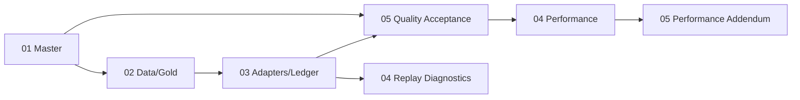

# v1.0 TODO 导航

母计划：[`../v1.0.md`](../v1.0.md)。母计划是唯一规范权威；本目录只分工执行，不重复改写合同。

## 规范引用

| ID | 来源 | 用途 |
|---|---|---|
| R-001 | [`../../todo/golden-and-metrics-spec-v0.4.md`](../../todo/golden-and-metrics-spec-v0.4.md) | Gold/schema/指标合同 |
| R-002 | [`../../research/todo-benchmark-source-review-2026-08-05.md`](../../research/todo-benchmark-source-review-2026-08-05.md) | 公共来源边界 |
| R-003 | [`../../todo/rag-benchmark-catalog-and-layered-evaluation-plan.md`](../../todo/rag-benchmark-catalog-and-layered-evaluation-plan.md) | 分层 benchmark |
| R-004 | [`../../research/specific-rag-bench.md`](../../research/specific-rag-bench.md) | 研究诊断 |

R-001–R-004 是规范/研究引用 ID，不能当作可完成任务依赖。状态：`[ ]` 未开始；`[>]` 进行中；`[x]` 完成；`[!]` 阻塞；`[-]` 不适用（必填 reason）。先读 01，再按任务依赖推进 02/03/04/05；跨项依赖写入 ledger。

禁止声明：不称生产就绪；不静默删除 MOI；不混合默认与调优；不把 Gold/No-context 按平台复制；不做加权总冠军；不从答案/引用反推 trace；未满足公平预算不开 Optimized 榜；pilot 不作正式排名。

文件：[`01-master-execution-plan.md`](01-master-execution-plan.md)、[`02-dataset-gold-and-source-readiness.md`](02-dataset-gold-and-source-readiness.md)、[`03-platform-adapter-and-run-plan.md`](03-platform-adapter-and-run-plan.md)、[`04-diagnostic-and-performance-plan.md`](04-diagnostic-and-performance-plan.md)、[`05-acceptance-and-result-template.md`](05-acceptance-and-result-template.md)。

## 使用顺序与依赖图

## 角色表

| 角色 | 职责 | 必须留下的证据 |
|---|---|---|
| Program owner | 冻结范围、预算、decision log | M IDs、批准记录 |
| Data/Gold owner | manifest、claims、evidence、双审 | D IDs、gold hash |
| Platform operator | 五系统身份、adapter、运行 | A IDs、raw artifact |
| Diagnostic owner | replay、source 分层、性能 | DP IDs、环境 manifest |
| Judge/reviewer | rubric、盲审、adjudication | S IDs、审计表 |

## 更新规则

1. 先检查母计划与 `golden-and-metrics-spec-v0.4.md`，再修改 TODO。
2. 修改 freeze、schema、阈值或 denominator 必须新 decision id；formal 同一 run 不允许混合版本。
3. 每项 checkbox 必须填写 owner、依赖、产物、DoD、估时或触发条件；阻塞项记录责任人和解锁条件。
4. `[ - ]` 仅表示有意不适用，必须附 reason；产品失败不能用它隐藏。

## 证据规则

Raw response、状态、时间戳、配置、引用、context、hash 和错误必须可关联到 `run_id`；外部来源记录 URL、访问日期、license 与用途。N/A 只有结构性零分母或 trace 不可得时允许，并写 reason。

## 禁止声明扩展

- 不把 Stage 0/1 pilot 写成正式排名或总体能力证明。
- 不把 shared Gold/No-context oracle 复制成平台样本。
- 不把 Optimized 条件与 Quick Native 混成一榜。
- 不把 Retrieved-context replay 说成整机成绩。
- 不把 RAGPerf、blogs 或未经启用 gate 的公共数据当排名证据。

## 每次提交前检查

- [ ] ID 未重复，依赖指向已存在任务或母计划 Gate。
- [ ] DoD 可由文件、ledger、hash 或报告复核。
- [ ] Stage1 为同窗新跑 Native 200、独立 Gold Context 40；Stage0 历史 MOI 40 未复用。
- [ ] Formal Quick/Optimized、retrieved replay、Gold、No-context、Noise 均按各自公式独立对账。
- [ ] 所有相对链接可解析，外部链接注明访问日期。
- [ ] 失败、retry、invalid、N/A 分开记录。
- [ ] source 结论没有超出启用 gate 与证据层级。
