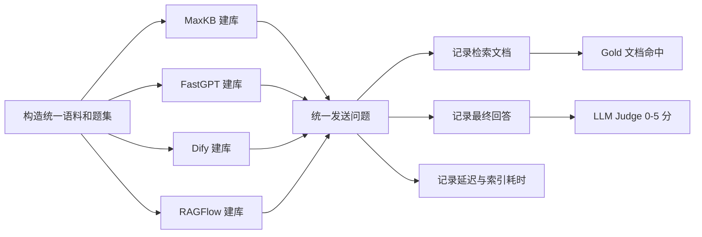
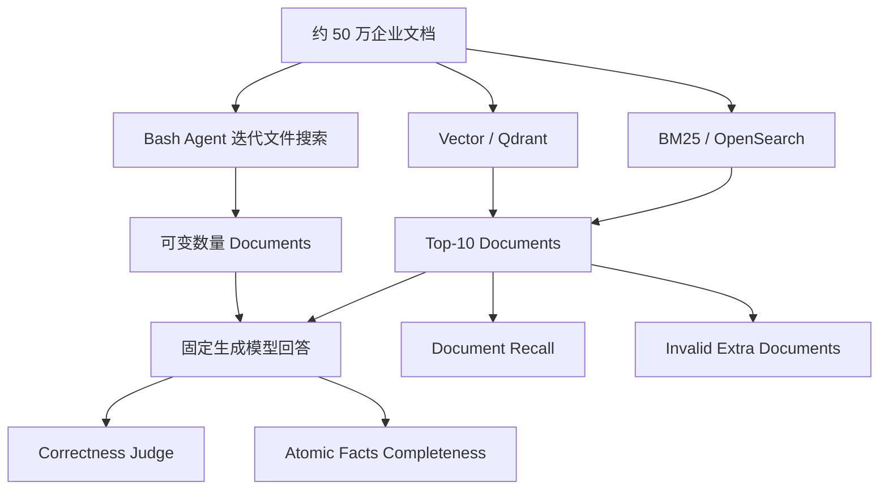
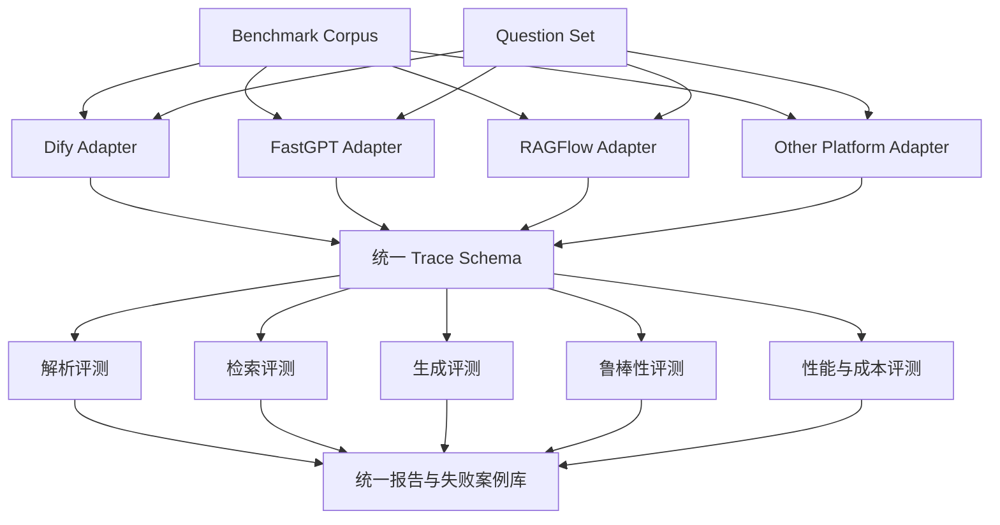

# 面向 Dify、FastGPT、RAGFlow 等低代码 RAG 平台的评测数据集与方法调研

> **版本**：V1.0  
> **整理日期**：2026-08-04  
> **覆盖范围**：2025—2026 年公开的企业级 RAG benchmark、RAG 系统评测框架，以及直接面向 Dify / FastGPT / RAGFlow / MaxKB 的社区横向测试。  
> **核心目标**：回答三个问题——应该用什么数据集、如何搭建评测 Pipeline、应该看哪些指标。

---

## 1. 结论先行

目前公开资料中，**直接把 Dify、FastGPT、RAGFlow、MaxKB 当作统一黑盒平台进行严格学术评测的工作仍然很少**。2026 年已有社区工作尝试在统一模型和统一语料下比较四个平台，但存在 Top-K 不一致、问题数量有限、原始产物未公开、生成模型兼任裁判等限制，因此更适合作为工程参考，而不是稳定排行榜。

2025—2026 年更成熟的工作主要有两类：

1. **企业级 RAG 数据集与 benchmark**  
   例如 EnterpriseRAG-Bench、WixQA、HERB、MIRAGE。它们提供语料库、问题、标准答案、gold documents 或相关 Chunk，可用来比较不同平台的检索与回答效果。

2. **RAG 系统级评测框架**  
   例如 RAGPerf、FAB-Bench。它们不仅评估答案质量，还评估文档解析、检索、重排、上下文窗口、系统性能和资源消耗。

对 Dify、FastGPT、RAGFlow 这类平台，最合理的做法不是只计算一个“回答准确率”，而是建立五层评测：

| 层次 | 核心问题 |
|---|---|
| 文档解析 | 文档是否真的被正确解析、切分并写入索引？ |
| 检索 | 正确文档或 Chunk 是否被召回，排序是否合理？ |
| 生成 | 模型是否利用证据生成正确、完整、忠实的回答？ |
| 鲁棒性 | 面对噪声、冲突、无答案、多跳问题时是否稳定？ |
| 系统工程 | 建库、更新、并发、延迟、成本和可观测性如何？ |

因此，一套较完整的平台评测应该由以下四部分组成：

```text
公开通用数据集
+ 企业级真实/合成数据集
+ 自有领域文档与人工题集
+ 系统性能压力测试
```

---

## 2. 数据集与框架总览

| 名称 | 年份 | 类型 | 规模 | 主要场景 | 最适合测什么 |
|---|---:|---|---:|---|---|
| 91ai 四平台横评 | 2026 | 社区平台测试 | 4 个子数据集，40–50 题/集 | Dify、FastGPT、RAGFlow、MaxKB | 平台接入、PDF/OCR、中文、延迟 |
| EnterpriseRAG-Bench | 2026 | 企业级 RAG benchmark | 约 50 万文档、500 题 | 企业内部知识 | 多源检索、冲突、完整性、规模效应 |
| WixQA | 2025 | 企业客服 RAG benchmark | 6,221 篇文章，6,621 个 QA | 帮助中心、客服、操作指导 | 程序性回答、多文档综合、真实用户问题 |
| HERB | 2025 | 异构企业深度检索 benchmark | 39,190 个对象、1,514 题 | Slack、会议、GitHub、文档 | 跨源多跳、人员/客户/对象检索、拒答 |
| MIRAGE | 2025 | RAG 噪声与组件评测 benchmark | 7,560 题、37,800 Chunk | 通用 QA | 噪声脆弱性、Retriever–LLM 组合 |
| RAGPerf | 2026 | 端到端系统性能框架 | 多模态、多规模工作负载 | 文本、PDF、代码、音频 | 延迟、吞吐、资源、更新、质量—性能权衡 |
| FAB-Bench | 2026 | 垂直领域 benchmark + 框架 | 200 题、半导体语料 | 半导体制造 | 技术深度、多跳、长上下文、跨平台诊断 |
| TechQA | 既有数据集 | 技术支持 QA | 原始规模较大，横评取 646 文档、40 题 | 技术文档 | 基础英文检索与回答 |
| CUAD | 既有数据集 | 合同 QA | 510 份合同，横评取 50 份、50 题 | 复杂文本 PDF | PDF 解析、条款检索 |
| CMRC2018 | 既有数据集 | 中文阅读理解 | 横评取 211 段、40 题 | 中文文本 | 中文分词、Embedding、基础召回 |
| DocVQA | 既有数据集 | 文档视觉问答 | 横评取 50 份、50 题 | 扫描件、表单、图片文档 | OCR、版面分析、图片到文本链路 |

这里需要注意：

- **EnterpriseRAG-Bench、WixQA、HERB、MIRAGE**更接近“可重复使用的数据集”。
- **RAGPerf**更像系统 benchmark harness，不是单一固定题库。
- **FAB-Bench**既包含一套半导体数据集，也提供从私有语料自动构建评测集的方法。
- **91ai 四平台横评**是一次具体工程运行记录，不应当和经过同行评审或完整开源的 benchmark 等价看待。

---

# 3. 直接面向 Dify / FastGPT / RAGFlow / MaxKB 的平台横评

## 3.1 91ai 四大开源知识库平台 RAG 实测

该工作在同一台机器上部署 MaxKB、RAGFlow、FastGPT、Dify，并统一连接：

- 生成模型：`qwen2.5:14b`
- Embedding：`qwen3-embedding:4b`
- 推理服务：本地 Ollama
- 硬件：单机 RTX 3090 24 GB
- 评测日期：2026 年 7 月整理

### 使用的数据集

| 数据集 | 横评中采用的规模 | 文档形态 | 评测目的 |
|---|---:|---|---|
| TechQA | 646 篇文档 + 40 题 | 英文技术文本 | 基础 RAG 能力 |
| CUAD | 50 份 PDF + 50 题 | 有文本层的合同 PDF | PDF 解析和条款检索 |
| CMRC2018 | 211 段文本 + 40 题 | 中文纯文本 | 中文召回 |
| DocVQA | 50 份文档 + 50 题 | 扫描件/图片文档 | OCR 和复杂版面 |

### Pipeline



### 指标

1. `recall@hit%`：golden 文档是否进入平台返回的 Top-K。
2. 回答正确性：由 `qwen2.5:14b` 对最终答案打 0—5 分。
3. 检索延迟。
4. 索引构建耗时。
5. PDF 是否成功解析、是否形成有效 Chunk。
6. 部署、API 自动化和资源占用的工程记录。

### 对这项工作的评价

这项工作非常有参考价值，因为它暴露了平台测试中的真实问题：

- “上传成功”不等于“解析成功”，必须检查 Chunk 数量和内容。
- 文本 PDF 与扫描 PDF 是两种完全不同的能力。
- 平台 API 不一定返回相同数量的检索结果。
- 默认解析器、平台版本和回退逻辑会显著影响结果。
- 平台自动化难度本身也是生产落地指标。

但它不能作为严格排行榜，主要原因是：

- FastGPT 在该测试接口中实际只返回 Top-1，而其他平台按 Top-5 统计。
- 每个子集只有 40—50 个问题，统计稳定性不足。
- 生成模型与裁判模型相同，存在自评和同族偏差。
- 仓库将其标记为 narrative-only，原始脚本、输入快照和结果产物尚未完整公开。
- 没有多随机种子、显著性检验和人工复核。

### 可以借鉴的部分

该工作最值得借鉴的是**测试维度设计**，而不是绝对分数：

```text
英文技术文本
+ 中文文本
+ 有文本层的复杂 PDF
+ 无文本层的扫描件
+ 建库时间
+ 检索延迟
+ API 自动化摩擦
```

对于任何企业级 RAG 平台选型，这套覆盖面比单纯用一个 QA 数据集更合理。

---

# 4. EnterpriseRAG-Bench：最接近企业内部知识库的公开 benchmark

## 4.1 数据集定位

EnterpriseRAG-Bench 于 2026 年发布，目标是模拟真实公司的内部知识环境。它不是把若干独立网页简单放在一起，而是构造一个名为 Redwood Inference 的虚拟企业，使项目、人员、客户、决策和任务在不同系统之间保持关联。

### 数据规模

- 约 50 万份企业文档。
- 500 个问题。
- 9 种企业数据源：
  - Slack
  - Gmail
  - Linear
  - Google Drive
  - HubSpot
  - Fireflies
  - GitHub
  - Jira
  - Confluence

大致文档量中，Slack 和 Gmail 占比最高，另外包括项目工单、CRM、会议转录、PR、支持工单和 Wiki。

### 问题类型

| 类型 | 数量 | 能力 |
|---|---:|---|
| Basic | 175 | 单文档基础事实检索 |
| Semantic | 125 | 低关键词重合的语义检索 |
| Intra-Document Reasoning | 40 | 同一长文档不同位置的信息组合 |
| Project Related | 40 | 同一项目内多个文档综合 |
| Constrained | 30 | 带限定条件的精确筛选 |
| Conflicting Info | 20 | 冲突信息消解 |
| Completeness | 20 | 找全所有相关文档或事实 |
| Miscellaneous | 20 | 非正式、杂乱位置的信息 |
| High Level | 10 | 跨语料高层总结 |
| Info Not Found | 20 | 判断知识库中没有答案 |

### 为什么它重要

传统公开 RAG 数据集往往来自 Wikipedia、网页或新闻，具有以下隐含特点：

- 文档主题边界清晰。
- 信息重复较少。
- 命名规范。
- 时间冲突和版本冲突较少。
- 一道题通常对应一个或少数几个明确证据。

企业内部知识恰好相反：

- 同一个项目会同时出现在邮件、Slack、会议、工单和代码 PR 中。
- 项目代号、缩写、人名和系统字段并不统一。
- 草稿、过期文件和正式结论共存。
- 近重复文件很多。
- 用户常要求“全部列出”“最新状态”“谁参与过”等穷尽性问题。

EnterpriseRAG-Bench 的核心价值，是把这些企业特征显式加入了 benchmark。

## 4.2 评测 Pipeline

论文比较了 BM25、向量检索和 Bash Agent：



BM25 与向量检索固定返回 Top-10；Agent 则可以迭代搜索文件目录。最终将答案质量和文档召回分开计算。

## 4.3 指标

### Correctness

二值判断：候选答案是否与 gold answer 基本一致。允许风格和补充信息不同，但不能与标准答案发生事实冲突。

### Completeness

先把 gold answer 拆成独立的原子事实 `answer_facts`，然后逐条判断候选答案是否覆盖。计算：

\[
Completeness = \frac{\text{候选答案覆盖的 Gold Facts 数量}}
{\text{Gold Facts 总数}}
\]

该指标比单一“正确/错误”更能发现回答漏掉了哪些部分。

### Document Recall

\[
DocumentRecall@K =
\frac{|\text{Retrieved Documents} \cap \text{Gold Documents}|}
{|\text{Gold Documents}|}
\]

默认按 Recall@10 计算。

### Invalid Extra Documents

统计被召回但既不属于 gold document，也不能被判定为“相关但非必需”的文档数量。该指标直接衡量检索噪声。

论文选择报告**无关文档绝对数量**而不是 Precision，原因是对生成模型而言，进入上下文的错误文档数量本身会增加干扰。

### 综合分

每道题只有在 Correctness 通过时，才计入 Completeness；否则该题综合得分为 0。

## 4.4 Gold Set 修正机制

50 万文档下不可能保证人工 Gold Documents 绝对完整。因此该工作将 gold set 看成可修正假设：

1. 合并原始 Gold Documents 和被测系统召回文档。
2. 使用三个独立 Judge 将每个文档分类为：
   - Required：回答问题必需；
   - Valid：相关但非必需；
   - Invalid：无关。
3. 通过多数投票确定分类。
4. Required 进入新的 Gold Set。
5. Valid 不计入 Gold，但也不作为无关文档处罚。
6. Gold 发生变化时，重新生成 gold answer 和 atomic facts。

这个设计非常适合平台比较，因为不同平台可能召回不同但同样有效的证据。若只认一个静态文档 ID，可能错误惩罚合理结果。

## 4.5 对 Dify/FastGPT 平台评测的启发

最值得复用的不是 50 万文档规模，而是以下问题类型：

- Semantic：问题与文档尽量不共享关键词。
- Constrained：同主题下加入时间、部门、版本等限定条件。
- Conflicting Info：同时保留旧文档和新文档。
- Completeness：要求列出所有项目、人员或步骤。
- Info Not Found：知识库中故意没有答案。
- Project Related：答案散落在同一项目的不同文档中。

对于低代码 RAG 平台，应建立类似的分类报表，而不是只报告总体平均分。

---

# 5. WixQA：企业帮助中心和程序性问答 benchmark

## 5.1 数据集定位

WixQA 于 2025 年发布，基于 Wix Help Center 的一个固定知识库快照。它非常适合评估：

- 企业帮助中心；
- 产品文档问答；
- 客服机器人；
- 操作步骤和故障排查；
- 需要引用多篇帮助文章的程序性回答。

### 知识库

- 6,221 篇英文帮助文章。
- 包括普通教程/说明、Feature Request 和 Known Issue。
- 数据集和知识库快照同时公开，避免网页更新导致评测不可重复。

## 5.2 三个子集

### WixQA-ExpertWritten

- 200 个真实用户问题。
- 标准答案由 Wix 领域专家编写。
- 回答通常较长，强调完整的分步操作。
- 27% 的问题需要多篇文章。
- 问题中位长度约 19 Token，回答中位长度约 172 Token。

它最适合评估“真实问题 + 完整解决方案”。

### WixQA-Simulated

- 200 个从用户与客服对话中蒸馏出的单轮 QA。
- 经过专家验证和按步骤模拟执行。
- 14% 需要多篇文章。
- 问题和答案更短，强调直接、简洁、可操作。

它最适合评估“客服回复能否短而准确”。

### WixQA-Synthetic

- 6,221 个自动生成 QA。
- 每篇知识库文章生成一个 QA。
- 每个问题只绑定一篇文章。
- 适合训练 Retriever、快速回归测试和扩大测试规模。

其局限也很明显：由于问题从单篇文章反向生成，往往更容易检索，无法充分代表真实用户提问。

## 5.3 基线 Pipeline

论文使用 FlashRAG 实现统一流水线：

- Retriever：
  - BM25；
  - `e5-large-v2` Dense Retriever。
- Top-K：5 篇文档。
- Generator：
  - Claude 3.7；
  - Gemini 2.0 Flash；
  - GPT-4o；
  - GPT-4o Mini。
- Judge：GPT-4o。

```text
Wix KB Snapshot
      ↓
BM25 / E5 Dense Retrieval
      ↓ Top-5
Retrieved Articles
      ↓
LLM 生成程序性答案
      ↓
文本重叠指标 + LLM Judge
```

## 5.4 指标

- Token-level F1
- BLEU
- ROUGE-1
- ROUGE-2
- Factuality
- Context Recall

### Factuality

Judge 输入：

```text
用户问题
+ 生成答案
+ Gold Answer
```

判断生成答案是否准确保留标准答案中的关键信息，输出 0—1 分数。

### Context Recall

Judge 输入：

```text
用户问题
+ 检索上下文
+ Gold Answer
```

先把标准答案拆成核心信息单元，再判断检索上下文覆盖了多少回答所需信息。

## 5.5 关键认知

WixQA 最重要的实验现象不是哪一个模型得分最高，而是：

> Synthetic 子集明显比真实用户或专家构造的问题更容易。

这说明不能只采用“从每篇文档自动生成一道题”的数据集构建方式。该方式容易产生：

- 问题与源文档关键词高度重合；
- 每题只有一个 Gold Document；
- 缺少信息冲突；
- 缺少无答案问题；
- 缺少用户的模糊表达和上下文省略；
- 缺少跨文档程序性综合。

因此，平台评测中的合成题可以用于大规模回归，但最终选型必须加入真实问题和人工题。

---

# 6. HERB：异构企业数据中的 Deep Search benchmark

## 6.1 数据集定位

HERB 于 2025 年由 Salesforce AI Research 发布。它关注的不是普通“搜索一段文档并回答”，而是 Deep Search：

> 系统不仅要知道搜什么，还要知道应该到哪个企业数据源搜索，并在多次检索中组合证据。

### 数据规模

- 530 名模拟员工。
- 30 个产品。
- 39,190 个企业对象。
- 815 个可回答问题。
- 699 个不可回答问题。
- 总计 1,514 个问题。

### 数据源

- Slack 消息；
- 文档；
- GitHub Pull Request；
- 会议转录；
- 会议聊天；
- URL；
- 客户资料；
- 人员和组织结构数据。

## 6.2 问题类型

| 类型 | 典型目标 |
|---|---|
| Content Search | 找到并总结分散在多个来源中的内容 |
| People Search | 找到参与者、负责人或提供反馈的人 |
| Customer Search | 从客户记录、会议、支持信息中识别客户 |
| Artifact Search | 找到 PR、文档、链接、会议等具体对象 |
| Unanswerable | 判断当前企业数据中不存在充分证据 |

## 6.3 数据构建方式

HERB 不是先随机生成大量独立文档，再从中抽题，而是：

1. 设计软件企业中的规划、开发、部署工作流。
2. 设计员工角色和团队关系。
3. 通过会议、Slack、GitHub 和文档模拟工作流推进。
4. 生成跨数据源相互引用的企业对象。
5. 再根据工作流生成具有保证证据链的问题。
6. 加入近似项目、无关讨论、同名对象等干扰。
7. 将部分问题映射到没有支撑证据的工作流，构造不可回答问题。

这个顺序很重要：先有业务流程，再有文档和问题，比独立生成 QA 更接近真实企业数据。

## 6.4 对比 Pipeline

标准 RAG：

- Zero-shot LLM；
- Vector Retriever；
- Hybrid BM25 + Vector；
- RAPTOR；
- GraphRAG；
- HippoRAG2；
- Proposition-Graph RAG。

Agentic RAG：

- ReAct Agent；
- 多种结构化和非结构化搜索工具；
- 可根据中间结果继续搜索。

Long-context：

- 将某个产品的全部相关对象直接放进上下文；
- 测试“不给 Retriever，纯长上下文推理”能否解决问题。

## 6.5 指标

### Content 类问题

使用 GPT-4o Judge，按 1—100 分评估：

- 事实准确性；
- 与问题的相关性。

### People / Customer / Artifact 类问题

先抽取实体并标准化，再计算 Exact Match F1。

### Unanswerable

评估系统是否能在缺乏证据时正确拒答，而不是根据常识或错误检索结果编造答案。

## 6.6 关键认知

HERB 表明，真实企业 RAG 的瓶颈经常不是 LLM 不会表达，而是：

- 没找到全部必要证据；
- 不知道应该调用哪个搜索源；
- 第一次搜到一个表面相关结果后过早停止；
- 人名、ID、职位和用户名无法正确消歧；
- 工具调用参数错误；
- 没有沿着项目、人员或文档关系继续检索。

因此，对 Dify 或 FastGPT 的高级工作流评测，应当记录：

- 实际调用了哪些检索工具；
- 每一步查询语句；
- 每轮返回的证据；
- 是否进行了二次检索；
- 是否过早结束；
- 失败发生在路由、检索、实体解析还是生成阶段。

只看最终答案无法诊断 Agentic RAG 的问题。

---

# 7. MIRAGE：评估 RAG 对噪声上下文的适应能力

## 7.1 数据集定位

MIRAGE 于 2025 年发布，专门分析 Retriever 与 LLM 之间的相互作用。

### 数据规模

- 7,560 个 QA。
- 37,800 个候选文档 Chunk。
- 每个问题至少有一个正样本 Chunk。
- 同时包含若干语义相近但缺少关键答案信息的负样本。

原始问题来自：

- PopQA
- Natural Questions
- TriviaQA
- IfQA
- DROP

论文排除了专门的多跳数据集，聚焦单跳场景下的上下文利用和噪声过滤。

## 7.2 三种输入条件

### Base

只给问题，不给外部上下文。反映模型参数知识。

### Oracle

只给正确证据 Chunk。反映 LLM 在理想检索条件下能否利用证据。

### Mixed

给一个正确 Chunk 和多个无关或干扰 Chunk。反映真实 RAG 环境中的噪声鲁棒性。

```text
同一道题
 ├─ Base：Question
 ├─ Oracle：Question + Gold Chunk
 └─ Mixed：Question + Gold Chunk + Noise Chunks
```

回答采用 Exact Match 转为二值正确性。

## 7.3 四个适应性指标

### Noise Vulnerability

Oracle 能答对，但 Mixed 答错。

代表加入噪声后被误导，越低越好。

### Context Acceptability

Oracle 与 Mixed 都能答对。

代表模型可以从混合上下文中稳定利用正确证据，越高越好。

### Context Insensitivity

Base 和 Oracle 都答错。

代表即使给出正确证据，模型仍无法利用，越低越好。

### Context Misinterpretation

Base 原本能答对，但加入 Oracle Context 后答错。

代表外部上下文反而使模型误解问题，越低越好。

这四类覆盖 Base、Oracle、Mixed 结果的行为组合，可用于定位问题主要来自 Retriever 还是 Generator。

## 7.4 对平台评测的启发

两个平台可能都有相同的 Recall@5，但最终回答质量不同：

- 平台 A 返回 1 个正确 Chunk + 4 个轻微相关 Chunk；
- 平台 B 返回 1 个正确 Chunk + 4 个与答案冲突的 Chunk。

传统 Recall@5 会认为二者一样，MIRAGE 式评测则能识别平台 B 的 Noise Vulnerability 更高。

因此，应为每个问题额外构造：

1. Gold-only 运行；
2. Gold + Random Noise；
3. Gold + Hard Negative；
4. Gold + Contradictory Evidence；
5. 平台真实检索结果。

这样可以把问题分解为：

```text
检索没找到正确证据
检索找到但噪声太多
生成模型无法利用正确证据
生成模型被冲突证据误导
```

---

# 8. RAGPerf：端到端系统性能评测框架

## 8.1 定位

RAGPerf 于 2026 年发布，核心贡献不是新的 QA 题库，而是把 RAG 系统拆成可配置、可测量的系统组件：

```text
Embedding
→ Indexing / Vector Database
→ Retrieval
→ Reranking
→ Generation
```

它同时考虑质量和系统性能，适合评估平台在生产部署中的表现。

## 8.2 示例工作负载

| 数据集 | 模态 | 规模 |
|---|---|---:|
| Wikipedia | 文本 | 19.3 GB，约 641 万条 |
| ArXiv | PDF | 48 GB，约 3 万篇 |
| GitHub Code | 代码 | 32 GB，约 1,100 万对象 |
| The People’s Speech | 音频 | 35.5 GB，约 30 万条 |

查询包括 Natural Questions、机器学习 QA 和代码助手类问题。

## 8.3 Workload Generator

RAGPerf 可以模拟：

- 查询请求速率；
- Batch Size；
- 查询与更新请求比例；
- 文档插入；
- 文档删除；
- 文档更新；
- Uniform 访问分布；
- Zipfian 热点访问；
- 索引重建；
- 新文档尚未进入主索引时的临时索引。

这非常适合平台评估，因为真实知识库不是一次导入后永久不变，而是持续新增、修改和删除。

## 8.4 质量指标

- Context Recall
- Query Accuracy
- Factual Consistency

其中 Query Accuracy 衡量生成回答和标准答案之间的语义一致性。

## 8.5 系统性能指标

### 数据和索引阶段

- 文档插入时间；
- 索引构建时间；
- 更新和删除时间；
- 索引存储空间；
- 原始向量与索引体积比；
- 更新后到“可被检索”的时间。

### 检索和端到端阶段

- Query Latency；
- End-to-end Throughput；
- QPS；
- 不同负载下的延迟变化；
- 检索、重排、生成各阶段耗时。

### 生成阶段

- TTFT：Time to First Token；
- TPOT：Time per Output Token；
- KV Cache 使用率；
- 请求排队和调度等待时间。

### 资源指标

- Host Memory；
- GPU Memory；
- CPU 利用率；
- GPU 利用率；
- I/O 和存储压力。

## 8.6 对 Dify/FastGPT 的启发

低代码平台之间的差异不仅来自 RAG 算法，还来自：

- 工作流调度层；
- 插件和模型网关；
- 数据库；
- 向量库；
- 任务队列；
- 文档解析服务；
- 多租户隔离；
- 日志和追踪机制。

因此应至少测试三类负载：

1. **离线建库**：固定文档规模，测导入和索引时间。
2. **在线查询**：1、5、10、20、50 并发下测吞吐和 P95/P99。
3. **查询—更新混合**：查询过程中持续新增或替换文档，测新知识生效时间和旧知识残留。

---

# 9. FAB-Bench：半导体垂直领域 RAG 评测

## 9.1 数据和领域知识

FAB-Bench 于 2026 年发布，目标是解决专业垂直领域中以下问题：

- 标准通用指标无法判断技术深度；
- 专家人工评价昂贵；
- 文档长、跨文档关系复杂；
- 上下文窗口增加后可能出现注意力稀释；
- 相同平台在不同领域中的最优配置不同。

### 语料构成

- 150+ 篇 IEDM、ISSCC、VLSI 等会议论文；
- 70+ 项专利；
- SEMI 行业标准；
- 约 3.47 亿 Token；
- 188 个主题；
- 431 个半导体术语，分成 7 类并设置不同精度权重。

### Chunk 方法

- Chunk Size：512 Token；
- Overlap：128 Token；
- 使用 TF-IDF 和领域术语权重进行相似性分析。

## 9.2 三种问题生成策略

### Needle-in-a-Haystack

把一个关键事实放在大量主题不相似的干扰信息中，测试精确信息定位。

### Intra-Document Multi-Topic

从同一篇文档的不同主题段落中抽取证据，要求跨段综合。

### Cross-Document Multi-Hop

从一篇文档选 Seed Chunk，再从另一篇文档寻找语义连接，构造跨来源推理链。

## 9.3 数据集规模

从 1,300 多个候选问题中筛选出 200 道题：

- 59 道 Needle-in-a-Haystack；
- 90 道跨文档 Multi-Hop；
- 51 道同文档多主题深度生成题。

## 9.4 评测方法

- 评估多个 LLM；
- 评估 4K—32K 不同上下文长度；
- 扩展实验达到 64K 和 128K；
- 使用 GPT-4.1-mini；
- 通过 DeepEval 的 G-Eval 实现结构化评分；
- 在 RAGFlow、MaxKB、Metaso 等外部系统上进行跨平台验证；
- 同时提供：
  - `with_kb`：走平台原生知识库；
  - `without_kb`：直接注入 Gold Context，隔离生成能力。

## 9.5 六维指标

论文实际采用的六个维度是：

1. **Factuality**：回答是否事实正确。
2. **Technical Depth**：是否达到专业领域所需的解释深度。
3. **Completeness**：是否覆盖所需事实和推理步骤。
4. **Relevance**：是否直接回应问题。
5. **Context Utilization**：是否有效利用检索上下文。
6. **Support Quality**：结论是否得到充分证据支撑。

## 9.6 对用户场景的特殊价值

如果评测对象是科研、光子芯片、半导体工艺、设备、良率或制造知识库，FAB-Bench 比通用 QA 更有价值。因为专业领域常出现：

- 数字和单位必须精确；
- 不同工艺节点条件不同；
- 论文、专利、标准之间术语不完全一致；
- 一个结论可能需要跨图表、实验条件和多篇文档综合；
- 表面相关但工艺条件不同的文档是强干扰项。

对这类知识库，仅测 Answer Relevance 很容易给出虚高结果。必须加入 Technical Depth、Support Quality、数字一致性、单位一致性和条件约束正确性。

---

# 10. 如何为 Dify / FastGPT / RAGFlow 搭建统一评测 Pipeline

## 10.1 总体架构



## 10.2 建议的标准数据结构

每道题至少包含：

```json
{
  "question_id": "enterprise_conflict_001",
  "category": "conflicting_info",
  "language": "zh",
  "question": "当前版本的设备维护周期是多少？",
  "gold_answer": "根据2026年7月发布的维护规范，周期为90天。",
  "answer_facts": [
    "当前有效规范发布时间为2026年7月",
    "维护周期为90天"
  ],
  "gold_document_ids": [
    "maintenance_policy_v3"
  ],
  "valid_document_ids": [
    "maintenance_change_notice"
  ],
  "contradictory_document_ids": [
    "maintenance_policy_v2"
  ],
  "answerable": true,
  "required_conditions": {
    "version": "latest",
    "effective_date": "2026-07"
  }
}
```

平台运行结果建议统一为：

```json
{
  "platform": "dify",
  "platform_version": "x.y.z",
  "question_id": "enterprise_conflict_001",
  "retrieved_items": [
    {
      "rank": 1,
      "document_id": "maintenance_policy_v2",
      "chunk_id": "chunk_15",
      "score": 0.88,
      "text": "...",
      "reranked_score": 0.61
    }
  ],
  "answer": "...",
  "citations": ["maintenance_policy_v2"],
  "latency_ms": {
    "total": 2150,
    "retrieval": 230,
    "generation": 1800
  },
  "usage": {
    "prompt_tokens": 3200,
    "completion_tokens": 280
  },
  "errors": []
}
```

## 10.3 六个执行阶段

### 阶段一：语料导入

记录：

- 文件数量；
- 成功/失败数量；
- 原始字节数；
- 解析后字符数；
- Chunk 数量；
- 空 Chunk 数量；
- 每个文档的解析耗时；
- OCR 是否启用；
- 表格、图片、公式是否保留。

### 阶段二：索引就绪检查

不能仅等待平台显示“处理完成”，还应自动抽查：

- 每个文档是否至少有一个 Chunk；
- Chunk 是否包含可读文本；
- 文档 ID 与平台内部 ID 的映射；
- 所有文档是否可被搜索；
- 索引是否在测试开始前稳定。

### 阶段三：检索测试

对每道题尽量获取：

- Top-K 原始结果；
- 向量相似度；
- BM25 得分；
- Reranker 得分；
- Chunk 文本；
- 文档 ID；
- 检索耗时。

如果平台不开放检索详情，应明确标为“黑盒模式”，不要假装可以计算完整的 Retrieval 指标。

### 阶段四：端到端回答

固定：

- LLM；
- Temperature；
- Max Tokens；
- System Prompt；
- 是否允许模型使用内部知识；
- 是否要求仅根据上下文回答；
- 是否要求引用。

### 阶段五：自动评测与人工复核

自动：

- Exact Match / F1；
- Recall@K / MRR / nDCG；
- Atomic Fact Completeness；
- Faithfulness；
- Refusal Accuracy；
- Citation Precision / Recall；
- Latency 与 Token。

人工：

- 每个平台随机抽取至少 50—100 道题；
- 对高分但人工看起来错误的题进行核查；
- 对 Judge 分歧最大的题复核；
- 对关键业务类型单独复核。

### 阶段六：统计分析

至少报告：

- 总体均值；
- 按问题类型分组；
- 按文档类型分组；
- 95% Bootstrap 置信区间；
- 成对显著性检验；
- 失败率；
- 解析失败、检索失败、生成失败的占比；
- 平台版本和完整配置。

---

# 11. 推荐指标体系

## 11.1 文档解析层

| 指标 | 说明 |
|---|---|
| File Ingestion Success Rate | 文件是否进入处理流程 |
| Parse Success Rate | 是否形成有效可读内容 |
| Text Coverage | 解析文本覆盖原始文档有效内容的比例 |
| Chunk Yield | 每份文档产生的有效 Chunk 数 |
| Empty Chunk Rate | 空白或无意义 Chunk 比例 |
| OCR Character Accuracy | 扫描件 OCR 字符准确度 |
| Table Preservation | 表格结构或关键单元格是否保留 |
| Figure/Caption Association | 图片和图注是否正确关联 |
| Parsing Latency | 单文档与总体解析耗时 |

## 11.2 检索层

### Hit@K

只判断至少一个 Gold Document 是否进入 Top-K。

\[
Hit@K =
\mathbb{1}
\left[
Retrieved@K \cap Gold \neq \varnothing
\right]
\]

适合单文档问题，但不适合多文档完整性任务。

### Recall@K

\[
Recall@K =
\frac{|Retrieved@K \cap Gold|}
{|Gold|}
\]

### Precision@K

\[
Precision@K =
\frac{|Retrieved@K \cap Gold|}
{K}
\]

### MRR

关注第一个正确结果的位置：

\[
MRR = \frac{1}{N}\sum_{i=1}^{N}\frac{1}{rank_i}
\]

### nDCG@K

考虑多个相关度等级和排序位置，适合把文档分成 Required、Valid、Invalid。

### Invalid Extra Documents

统计进入上下文的无关文档数量，直接反映生成阶段噪声。

### Retrieval Coverage of Atomic Facts

不只看文档 ID，而是看检索到的上下文覆盖了多少标准答案事实。它能缓解 Chunk 切分导致的 Document Recall 与事实覆盖不一致。

## 11.3 生成层

| 指标 | 作用 |
|---|---|
| Answer Correctness | 最终答案是否正确 |
| Atomic Fact Completeness | 覆盖多少必需事实 |
| Faithfulness / Groundedness | 陈述是否有上下文证据 |
| Answer Relevance | 是否直接回应问题 |
| Numerical Accuracy | 数字、单位、范围和符号是否正确 |
| Citation Correctness | 引用是否真正支持对应结论 |
| Citation Completeness | 关键结论是否都有引用 |
| Technical Depth | 是否达到专业解释深度 |
| Support Quality | 证据是否充分、权威和条件匹配 |

## 11.4 鲁棒性层

| 指标 | 测试方式 |
|---|---|
| Unanswerable Accuracy | 故意不给答案，测试是否拒答 |
| False Refusal Rate | 有答案时是否错误拒答 |
| Noise Vulnerability | 加入无关 Chunk 后是否从对变错 |
| Conflict Resolution Accuracy | 新旧、正式/草稿冲突时能否选对 |
| Recency Accuracy | 能否识别最新有效信息 |
| Multi-hop Success Rate | 跨文档链路是否完整 |
| Completeness Query Recall | “全部列出”类问题是否找全 |
| Paraphrase Stability | 同义改写后结果是否稳定 |
| Multi-turn Stability | 对话多轮后是否被历史上下文污染 |

## 11.5 系统性能层

- Indexing Throughput
- Index Build Time
- Update-to-Searchable Delay
- P50 / P95 / P99 Latency
- TTFT
- TPOT
- QPS
- Error Rate
- Timeout Rate
- CPU / GPU / Memory
- Vector DB Storage
- Token Cost per Query
- Judge Cost per Query
- 端到端成本/1000 问题

---

# 12. 公平比较平台时最容易犯的错误

## 12.1 Top-K 不一致

FastGPT、Dify、RAGFlow 的接口和工作流可能返回不同数量的上下文。如果一个平台返回 Top-1，另一个返回 Top-10，Recall 不可直接比较。

建议同时报告：

- 平台实际返回 K；
- 固定 K 的检索指标；
- 进入生成 Prompt 的实际 Chunk 数；
- 总上下文 Token 数。

## 12.2 只统一模型，不统一上下文预算

即使 LLM、Embedding 和 Top-K 一致，不同 Chunk 长度会导致实际输入 Token 相差很大。应同时控制或报告：

- Chunk Size；
- Overlap；
- Top-K；
- Reranker Top-N；
- 最大上下文 Token；
- 文档展开策略。

## 12.3 把平台默认能力和算法能力混在一起

平台默认解析、默认 Chunk、默认 Prompt 和默认 Retriever 本来就是产品能力的一部分，但若目标是比较算法，就必须做控制变量。

因此建议设置三个赛道。

### 赛道 A：开箱即用

各平台采用官方推荐默认配置。

回答：“普通用户直接上传文档，哪个平台效果更好？”

### 赛道 B：控制变量

统一：

- LLM；
- Embedding；
- Reranker；
- Chunk；
- Top-K；
- Prompt；
- Temperature；
- Context Budget。

回答：“基础模型和参数一致时，平台 RAG 实现差异如何？”

### 赛道 C：平台最优能力

允许每个平台使用自己的最佳解析器、混合检索、父子 Chunk、知识图谱和 Agent 工作流。

回答：“经过合理调优后，各平台能达到什么上限？”

这三个赛道不能混成一个总排名。

## 12.4 只看最终回答

回答错误至少可能来自：

```text
文件未解析
→ 没有正确 Chunk
→ Retriever 未召回
→ Reranker 排错
→ Context 被截断
→ LLM 没利用证据
→ LLM 幻觉
→ Judge 误判
```

必须保存完整 Trace，否则无法提出有效优化方案。

## 12.5 过度依赖单一 LLM Judge

LLM Judge 可能有：

- 自我偏好；
- 模型家族偏好；
- 位置偏差；
- 长答案偏好；
- 格式偏好；
- 对专业数字错误不敏感。

建议：

1. Judge 与 Generator 尽量使用不同模型家族。
2. 对系统 A/B 顺序随机交换。
3. 关键指标使用 2—3 个 Judge 或多数投票。
4. 提供结构化 Rubric，不让 Judge 自由发挥。
5. 对 5%—10% 样本做人工标定。
6. 报告 Judge 与人工的一致率。
7. 数值、单位、实体和引用尽量使用规则评测补充。

---

# 13. 推荐的实际数据集组合

如果目标是比较 Dify、FastGPT、RAGFlow、MaxKB 等平台，建议不要只选一个大型 benchmark，而是组合成四个测试包。

## 13.1 基础能力包

- CMRC2018 或自建中文短文本 QA；
- TechQA；
- WixQA-Synthetic 的子集。

目的：

- 快速检查基本检索是否工作；
- 验证中文和英文 Embedding；
- 作为 CI 回归测试。

## 13.2 文档解析包

- CUAD；
- DocVQA；
- 自有 born-digital PDF；
- 自有扫描 PDF；
- 带表格、双栏、公式和图片的技术文档。

目的：

- 区分文本提取、OCR、表格、版面和检索能力；
- 检查“上传成功但零 Chunk”的隐蔽失败。

## 13.3 企业知识包

- WixQA-ExpertWritten；
- WixQA-Simulated；
- EnterpriseRAG-Bench 子集；
- 自有企业 SOP、FAQ、会议纪要和项目文档。

目的：

- 真实用户问题；
- 多文档程序性回答；
- 冲突信息；
- 无答案；
- 完整性问题。

## 13.4 压力与鲁棒性包

- HERB；
- MIRAGE；
- FAB-Bench；
- RAGPerf 工作负载。

目的：

- 多源深度检索；
- 噪声和 Hard Negative；
- 长上下文；
- 动态更新；
- 并发与资源性能。

---

# 14. 一套可落地的自建 Benchmark 建议

如果要建立一个面向中文企业知识库的平台 benchmark，可从 1,000 道题起步：

| 类型 | 建议数量 |
|---|---:|
| 单文档事实查询 | 180 |
| 语义改写查询 | 120 |
| 中文缩写/内部术语 | 80 |
| 程序性步骤问题 | 120 |
| 同文档跨段推理 | 80 |
| 跨文档多跳 | 100 |
| 完整性问题 | 60 |
| 冲突与版本问题 | 60 |
| 无答案问题 | 80 |
| PDF 表格/图示问题 | 60 |
| OCR/扫描件问题 | 40 |
| 多轮对话问题 | 20 |
| 合计 | 1,000 |

建议每道题都保留：

- Question；
- Gold Answer；
- Atomic Facts；
- Required Documents；
- Valid Documents；
- Contradictory Documents；
- Answerable；
- Question Category；
- Difficulty；
- Language；
- Expected Citation；
- 人工审核状态。

题集来源建议：

- 30% 真实历史用户问题；
- 30% 专家人工构造；
- 30% LLM 基于语料生成后人工审核；
- 10% 失败案例回流。

不要让测试集长期静态。生产日志中出现的新失败，应转化为回归题加入 benchmark。

---

# 15. 最终建议的报告结构

一份完整的平台评估报告建议包含：

## 15.1 配置快照

- 平台版本；
- 部署方式；
- LLM / Embedding / Reranker；
- 向量数据库；
- Chunk 参数；
- Top-K；
- Prompt；
- 硬件；
- 测试时间；
- 并发配置。

## 15.2 解析结果

- 各文档类型成功率；
- OCR；
- 表格；
- Chunk 统计；
- 失败文档清单。

## 15.3 检索结果

- Recall@1/3/5/10；
- MRR；
- nDCG；
- Atomic Fact Coverage；
- Invalid Extra Documents；
- 各题型结果。

## 15.4 回答结果

- Correctness；
- Completeness；
- Faithfulness；
- Citation；
- 专业深度；
- 数值准确性；
- 无答案拒答。

## 15.5 鲁棒性结果

- 噪声；
- 冲突；
- 版本；
- 多跳；
- 改写；
- 多轮。

## 15.6 系统结果

- 建库耗时；
- 更新延迟；
- P50/P95/P99；
- QPS；
- 错误率；
- 资源；
- 单问成本。

## 15.7 失败案例

对每个失败案例给出：

```text
问题
Gold Answer
平台回答
召回结果
正确证据是否出现
失败层级
根因判断
建议优化
```

## 15.8 决策结论

不要给一个没有解释力的总分排名，而应回答：

- 哪个平台默认效果最好？
- 哪个平台最适合复杂 PDF？
- 哪个平台最适合中文知识库？
- 哪个平台适合 Agentic 多步检索？
- 哪个平台最容易自动化和持续评测？
- 哪个平台在高并发下最稳定？
- 哪个平台在当前业务约束下性价比最高？

---

# 16. 我的综合判断

## 16.1 公共 benchmark 不能替代自有文档 POC

公开数据集能够保证可复现和横向比较，但无法覆盖企业自身的：

- 文档模板；
- 内部缩写；
- 扫描质量；
- 表格样式；
- 专业术语；
- 权限结构；
- 时间版本；
- 真实提问方式。

因此合理比例是：

```text
公开数据集：用于校准和横向基准
自建数据集：用于最终选型和上线验收
```

## 16.2 数据集应覆盖不同失败机制，而不是只追求规模

1 万道单文档合成题，可能不如 500 道精心构造的问题有价值。真正决定评测质量的是问题是否覆盖：

- 检索难度；
- 多文档关系；
- 噪声；
- 冲突；
- 无答案；
- 解析失败；
- 时间和版本；
- 专业精度。

## 16.3 应把“解析能力”视为 RAG 的第一阶段

低代码平台测评和纯算法论文最大的不同，是平台包含文档导入、OCR、Chunk、索引、工作流和模型网关。若 PDF 没有被正确解析，后续所有 RAG 指标都没有意义。

因此平台 benchmark 应先通过“解析验收门槛”，再进入 Retrieval 和 Generation 排名。

## 16.4 需要同时评估默认配置和统一配置

只测默认配置会混入大量参数差异；只测统一配置又会抹掉产品优势。最佳做法是同时报告：

- Default Score；
- Controlled Score；
- Tuned Score。

## 16.5 不应只使用 RAGAS 四指标

RAGAS 的 Faithfulness、Answer Relevance、Context Precision、Context Recall 很适合作为起点，但平台级评估还需要：

- 文档解析；
- 原始 Retrieval 排名；
- 无答案；
- 冲突；
- 噪声；
- 引用；
- 性能；
- 更新；
- 成本。

## 16.6 最重要的产物不是排行榜，而是失败模式地图

真正可用于平台优化和选型的结果应类似：

```text
Dify：中文与普通文本稳定，但复杂扫描件依赖外部解析链路
FastGPT：知识库和工作流集成方便，但需核查接口 Top-K 和解析回退
RAGFlow：复杂文档解析潜力较强，但资源和配置成本更高
MaxKB：部署简单，但高级检索和可观测能力需结合具体版本验证
```

这些结论必须绑定：

- 版本；
- 配置；
- 数据集；
- 文档类型；
- 模型；
- 测试日期。

不能把一次测试结果外推为平台永久属性。

---

# 17. 推荐优先阅读顺序

1. **EnterpriseRAG-Bench**  
   学习企业语料如何构造、问题如何分类、Gold Set 如何修正。

2. **WixQA**  
   学习真实用户问题、专家答案和合成题之间的难度差异。

3. **HERB**  
   学习跨 Slack、GitHub、会议和文档的 Deep Search 评测。

4. **MIRAGE**  
   学习如何把 Retriever 错误、上下文噪声和 LLM 利用能力分开。

5. **RAGPerf**  
   学习如何把质量评测扩展到延迟、吞吐、更新和资源。

6. **FAB-Bench**  
   学习如何基于自有专业语料生成垂直领域 benchmark，并评估技术深度和长上下文。

7. **91ai 四平台横评**  
   学习平台实际部署、文档导入、接口不一致和工程测试中的坑，但谨慎对待其绝对排名。

---

# 18. 参考资料

## 18.1 2025—2026 主要论文

1. Sun, Y. et al. **EnterpriseRAG-Bench: A RAG Benchmark for Company Internal Knowledge**. arXiv:2605.05253, 2026.  
   Repository: `onyx-dot-app/EnterpriseRAG-Bench`

2. Cohen, D. et al. **WixQA: A Multi-Dataset Benchmark for Enterprise Retrieval-Augmented Generation**. arXiv:2505.08643, 2025.  
   Dataset: `Wix/WixQA`

3. Choubey, P. K. et al. **Benchmarking Deep Search over Heterogeneous Enterprise Data**. arXiv:2506.23139, 2025.  
   Repository: `SalesforceAIResearch/HERB`  
   Dataset: `Salesforce/HERB`

4. Park, C. et al. **MIRAGE: A Metric-Intensive Benchmark for Retrieval-Augmented Generation Evaluation**. arXiv:2504.17137, 2025.  
   Repository: `nlpai-lab/MIRAGE`

5. Li, S. et al. **RAGPerf: An End-to-End Benchmarking Framework for Retrieval-Augmented Generation Systems**. arXiv:2603.10765, 2026.

6. Qian, J. et al. **FAB-Bench: A Framework for Adaptive RAG Benchmarking in Semiconductor Manufacturing**. arXiv:2605.26476, 2026.  
   Repository: `FuturefabAI/FAB-Bench`

## 18.2 平台横评

7. `mindcarver/91ai`：**四大开源知识库平台 RAG 实测：MaxKB / RAGFlow / FastGPT / Dify**，2026-07-03。  
   文件：`docs/evaluation/kb-rag-platform-benchmark.md`  
   注意：仓库标记为 narrative-only，原始评测产物未完整公开。

## 18.3 横评中使用的既有数据集

8. TechQA / `nvidia/TechQA-RAG-Eval`  
9. CUAD / `theatticusproject/cuad`  
10. CMRC2018 / `hfl/cmrc2018`  
11. DocVQA / `nielsr/docvqa_1200_examples`

---

## 附录 A：最小可行评测版本

在资源有限时，可以先做一个 200 题版本：

| 类型 | 数量 |
|---|---:|
| 中文事实检索 | 40 |
| 程序性回答 | 30 |
| PDF 条款/表格 | 30 |
| 扫描件 OCR | 20 |
| 多文档问题 | 25 |
| 冲突/版本 | 15 |
| 无答案 | 20 |
| 噪声鲁棒性 | 20 |

最低指标：

```text
Parse Success Rate
Recall@5
MRR
Answer Correctness
Atomic Fact Completeness
Faithfulness
Unanswerable Accuracy
Noise Vulnerability
P95 Latency
Indexing Time
```

即使只做 200 道题，也应保留完整的检索和生成 Trace。否则测试只能回答“哪个答案看起来更好”，无法回答“为什么更好”。

---

## 附录 B：推荐的核心评分卡

| 维度 | 指标 | 建议权重 |
|---|---|---:|
| 文档解析 | Parse Success、OCR、表格保留 | 15% |
| 检索 | Recall@K、MRR、nDCG、噪声 | 25% |
| 回答 | Correctness、Completeness、Faithfulness | 30% |
| 鲁棒性 | 无答案、冲突、多跳、噪声 | 15% |
| 系统 | P95、QPS、失败率、成本 | 10% |
| 工程 | API、部署、日志、自动化 | 5% |

权重应根据业务调整。例如：

- 扫描文档很多：提高文档解析权重。
- 客服系统：提高正确性、拒答和延迟权重。
- 科研知识库：提高完整性、技术深度和引用权重。
- 多 Agent 平台：提高多跳、工具轨迹和可观测性权重。
- 高并发生产系统：提高 P95/P99、QPS 和失败率权重。
